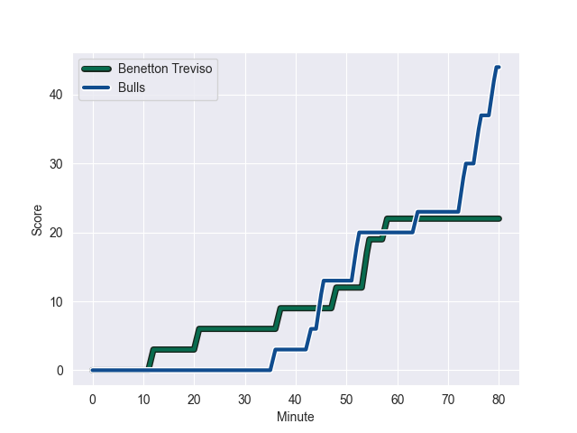
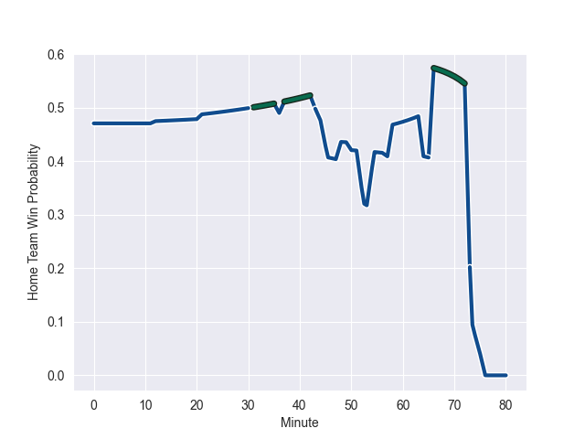

---  
layout: page  
title: Bulls at Benetton Treviso; 44-22  
date: 2022-10-21 18:30:00 18:00:00 -0500  
categories: match review  
---
# Bulls (1094.46) at Benetton Treviso (1043.52); 44-22

# Prediction: Bulls by 0.1

Bulls by 5.1 on a neutral field
## Scores over Time

## Win Probability over Time

# Pre-Match Prediction: Bulls by 0.2

Bulls by 4.8 on a neutral pitch

|   Away Minutes | Away Player             |   Away elo |   Away Percentile |   Number |   Home Percentile |   Home elo | Home Player        |   Home Minutes |
|---------------:|:------------------------|-----------:|------------------:|---------:|------------------:|-----------:|:-------------------|---------------:|
|             57 | Gerhard Steenekamp      |      61.82 |                46 |        1 |                67 |      66.46 | Ivan Nemer         |             50 |
|             66 | Bismarck du Plessis     |     115.02 |                99 |        2 |                50 |      62.59 | Giacomo Nicotera   |             44 |
|             57 | Francois Klopper        |      53.84 |                10 |        3 |                43 |      61.25 | Simone Ferrari     |             64 |
|             50 | Janko Swanepoel         |      62.11 |                43 |        4 |                83 |      76.69 | Scott Scrafton     |             44 |
|             80 | Ruan Nortje             |      67.98 |                70 |        5 |                86 |      81.25 | Federico Ruzza     |             80 |
|             80 | Marcell Coetzee         |      99.18 |                96 |        6 |                41 |      60.42 | Manuel Zuliani     |             80 |
|             67 | Marco van Staden        |      62.55 |                55 |        7 |                80 |      73.76 | Michele Lamaro     |             80 |
|             72 | Elrigh Louw             |      69.91 |                72 |        8 |                67 |      67.2  | Lorenzo Cannone    |             64 |
|             55 | Embrose Papier          |      66    |                64 |        9 |                99 |     110.47 | Dewaldt Duvenage   |             71 |
|             66 | Chris Smith             |      77.31 |                76 |       10 |                67 |      69.21 | Tomas Albornoz     |             80 |
|             80 | Wandisile Simelane      |      69.98 |                74 |       11 |                16 |      56.03 | Mattia Bellini     |             80 |
|             80 | Harold Vorster          |      76.16 |                79 |       12 |                83 |      80.58 | Marco Zanon        |             44 |
|             80 | Stedman-Gee Rivett Gans |      63.78 |                58 |       13 |                66 |      68.82 | Juan Ignacio Brex  |             80 |
|             80 | David Kriel             |      70.86 |                73 |       14 |                61 |      64.76 | Ignacio Mendy      |             80 |
|             80 | Kurt-Lee Arendse        |      78.17 |                78 |       15 |                29 |      58.98 | Giacomo Da Re      |             80 |
|             30 | Walt Steenkamp          |      76.64 |                83 |       16 |                53 |      63.28 | Gianmarco Lucchesi |             36 |
|             25 | Zak Burger              |      72.45 |                79 |       17 |                14 |      55.37 | Niccolo Cannone    |             36 |
|             23 | Simphiwe Matanzima      |      60.91 |                41 |       18 |                73 |      72.62 | Tommaso Menoncello |             36 |
|             23 | Dylan Smith             |      57.14 |                18 |       19 |                55 |      63.23 | Thomas Gallo       |             30 |
|             14 | Morne Steyn             |     100.82 |                94 |       20 |                74 |      69.81 | Tiziano Pasquali   |             16 |
|             14 | Jan Hendrik Wessels     |      50.47 |                 3 |       21 |                86 |      81.24 | Toa Halafihi       |             16 |
|             13 | WJ Steenkamp            |      62.07 |                50 |       22 |                51 |      62.66 | Manfredi Albanese  |              9 |
|              8 | Stravino Jacobs         |      59.04 |                33 |       23 |               nan |     nan    | nan                |            nan |

