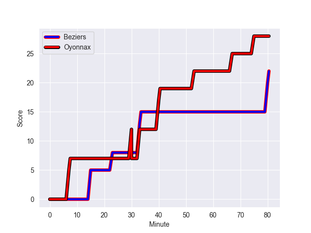
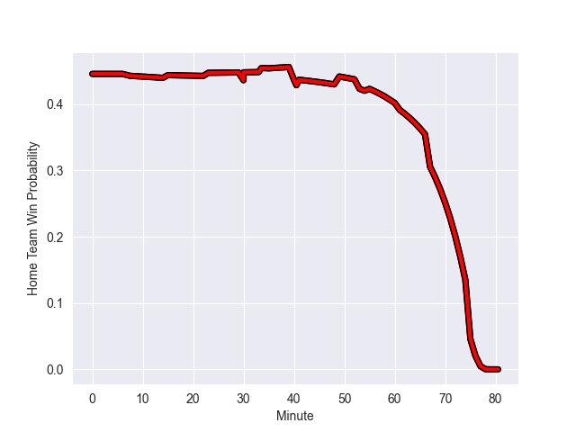

---  
layout: page  
title: Oyonnax at Beziers; 28-20  
date: 2022-10-21 19:00:00 18:00:00 -0500  
categories: match review  
---
# Oyonnax (1092.72) at Beziers (998.12); 28-20

# Prediction: Oyonnax by 4.5

Oyonnax by 9.5 on a neutral field
## Scores over Time

## Win Probability over Time

# Pre-Match Prediction: Oyonnax by 4.9

Oyonnax by 9.9 on a neutral pitch

|   Away Minutes | Away Player             |   Away elo |   Away Percentile |   Number |   Home Percentile |   Home elo | Home Player           |   Home Minutes |
|---------------:|:------------------------|-----------:|------------------:|---------:|------------------:|-----------:|:----------------------|---------------:|
|             59 | Tommy Raynaud           |      52.57 |                 8 |        1 |                78 |      69.96 | Francisco Fernandes   |             61 |
|             41 | Benjamin Geledan        |      86.52 |                92 |        2 |                20 |      57.46 | Clément Esteriola     |             55 |
|             53 | Thomas Laclayat         |      68.91 |                75 |        3 |                17 |      56.55 | Jamie Hagan           |             55 |
|             67 | Tom Murday              |     107.86 |                98 |        4 |                48 |      61.49 | Clément Bitz          |             59 |
|             53 | Phoenix Battye          |     111.09 |                99 |        5 |                78 |      70.53 | John Madigan          |             80 |
|             53 | Wandrille Picault       |      65.05 |                66 |        6 |                41 |      60.3  | William van Bost      |             49 |
|             80 | Loïc Credoz             |      53.13 |                10 |        7 |                90 |      84.08 | Pierrick Gunther      |             80 |
|             80 | Rory Grice              |      82.3  |                90 |        8 |                45 |      61.87 | Sias Koen             |             80 |
|             80 | Charlie Cassang         |      66.13 |                68 |        9 |                59 |      63.61 | Jean Victor Goillot   |             49 |
|             80 | Justin Bouraux          |      63.29 |                51 |       10 |                46 |      62.02 | Romain Uruty          |             80 |
|             80 | Aurelien Callandret     |      75.09 |                85 |       11 |                91 |      83.55 | Nicolas Plazy         |             35 |
|             80 | Gaby Lovobalavu         |      86.69 |                91 |       12 |                70 |      68.55 | Jarrod Poi            |             80 |
|             59 | Florian Vialelle        |      65.46 |                57 |       13 |                38 |      61.06 | James Tofa            |             70 |
|             80 | Darren Sweetnam         |      80.43 |                84 |       14 |                27 |      57.93 | Pierre Courtaud       |             80 |
|             80 | Tony Ensor              |      52.48 |                 6 |       15 |                56 |      65.36 | Gabin Lorre           |             80 |
|             39 | Teddy Durand            |      65.17 |                65 |       16 |                90 |      81.47 | Watisoni Votu         |             45 |
|             27 | Thibault Berthaud       |      57.01 |                12 |       17 |                91 |      89.78 | Josh Valentine        |             31 |
|             27 | Hugo Fabregue           |      72.3  |                80 |       18 |                70 |      66.47 | Jean-Baptiste Barrère |             31 |
|             27 | Filimo Taofifenua       |      90.17 |                93 |       19 |                73 |      68.06 | Marco Pinto Ferrer    |             25 |
|             21 | Antoine Abraham         |      61.78 |                42 |       20 |                44 |      61.05 | Jon Zabala Arrieta    |             25 |
|             21 | Pedro Bettencourt Avila |      60.7  |                37 |       21 |                62 |      64.81 | Yassine Maamry        |             21 |
|             13 | Victor Lebas            |      68.43 |                74 |       22 |               nan |      56.71 | Ferdinand Changel     |             19 |
|            nan | nan                     |     nan    |               nan |       23 |                44 |      61.01 | Victor Dreuille       |             10 |

