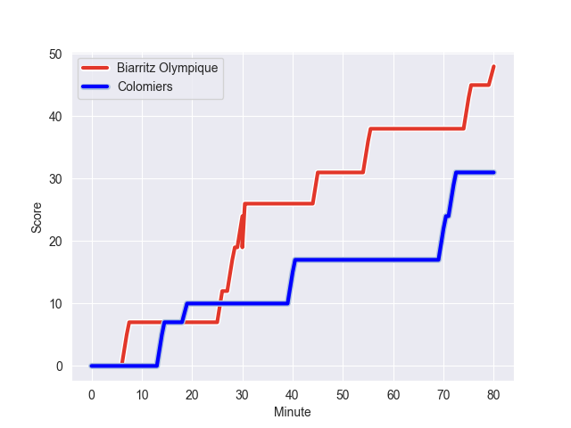
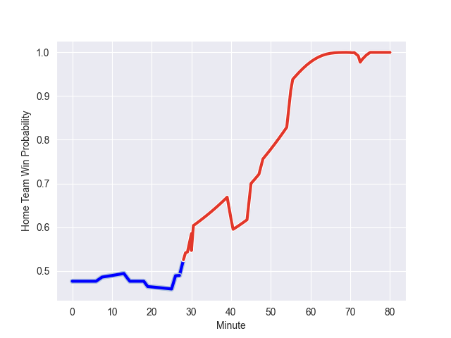

---  
layout: page  
title: Colomiers at Biarritz Olympique; 31-48  
date: 2022-10-21 21:00:00 18:00:00 -0500  
categories: match review  
---
# Colomiers (976.06) at Biarritz Olympique (952.72); 31-48

# Prediction: Biarritz Olympique by 2.7

Colomiers by 2.3 on a neutral field
## Scores over Time

## Win Probability over Time

# Pre-Match Prediction: Colomiers by 2.7

Colomiers by 2.3 on a neutral pitch

|   Away Minutes | Away Player        |   Away elo |   Away Percentile |   Number |   Home Percentile |   Home elo | Home Player         |   Home Minutes |
|---------------:|:-------------------|-----------:|------------------:|---------:|------------------:|-----------:|:--------------------|---------------:|
|             48 | Guillaume Tartas   |      70.88 |                78 |        1 |                31 |      59.07 | Baptiste Erdocio    |             60 |
|             48 | Andrew Ready       |      68.07 |                72 |        2 |                74 |      68.76 | Thomas Sauveterre   |             65 |
|             59 | Robin Bellemand    |      61.19 |               nan |        3 |                25 |      57.81 | Guy Millar          |             80 |
|             80 | Jean Thomas        |      62.84 |                55 |        4 |                 1 |      41.31 | Johnny Dyer         |             80 |
|             48 | Alexandre Ricard   |      65.32 |                65 |        5 |                61 |      63.95 | Josh Tyrell         |             80 |
|             80 | Anthony Coletta    |      47.52 |                 5 |        6 |                42 |      60.42 | Simon Augry         |             55 |
|             52 | Aldric Lescure     |      62.54 |                50 |        7 |                53 |      62.08 | Thomas Hebert       |             80 |
|             80 | Yann Peysson       |      55.16 |                17 |        8 |                18 |      56.1  | Charlie Francoz     |             55 |
|             59 | Ugo Seguela        |      70.5  |                77 |        9 |                 7 |      52.2  | Kerman Aurrekoetxea |             60 |
|             56 | Maxime Javaux      |      58.74 |                29 |       10 |                12 |      54.85 | Baptiste Germain    |             80 |
|             80 | Peni Rokoduguni    |      62.75 |                46 |       11 |                48 |      62.11 | Baptiste Fariscot   |             80 |
|             80 | Michele Campagnaro |      73.49 |                77 |       12 |                56 |      64.51 | Auguste Cadot       |             71 |
|             80 | Grégoire Maurino   |      77.44 |                83 |       13 |                77 |      73.45 | Ilian Perraux       |             80 |
|             52 | Victor Moro        |      54.26 |                12 |       14 |                99 |     116.07 | Henry Speight       |             60 |
|             80 | Thomas Girard      |      66.54 |                60 |       15 |                42 |      60.53 | Joe Jonas           |             80 |
|             32 | Thomas Dubois      |      56.61 |                22 |       16 |                75 |      71.68 | Tornike Jalagonia   |             25 |
|             32 | Maxime Granouillet |      55.6  |                18 |       17 |                77 |      70.15 | Dave O'Callaghan    |             25 |
|             32 | Hika Elliot        |     104.9  |                98 |       18 |                20 |      57.19 | Luka Tchelidze      |             20 |
|             28 | Alexis Palisson    |      92.13 |                95 |       19 |                11 |      54.82 | Barnabe Couilloud   |             20 |
|             28 | Jorick Dastugue    |      67.19 |                67 |       20 |                87 |      78.41 | Yohann Artru        |             20 |
|             24 | Simon Delas        |      59.63 |               nan |       21 |                32 |      58.88 | Clement Renaud      |             15 |
|             21 | Edoardo Gori       |      61.54 |                48 |       22 |                93 |      88.31 | Joe Tomane          |              9 |
|             21 | Marco Fepulea'i    |      64.54 |                64 |       23 |               nan |     nan    | nan                 |            nan |

