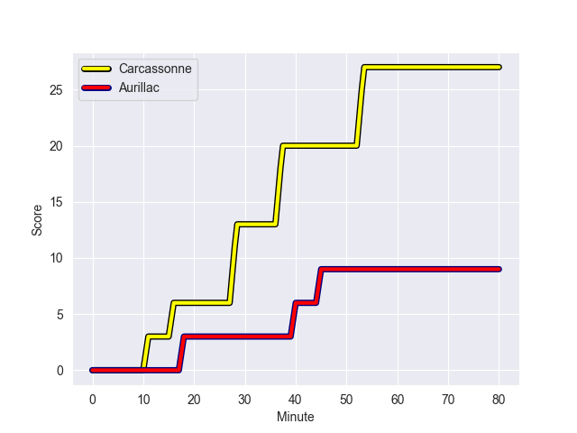
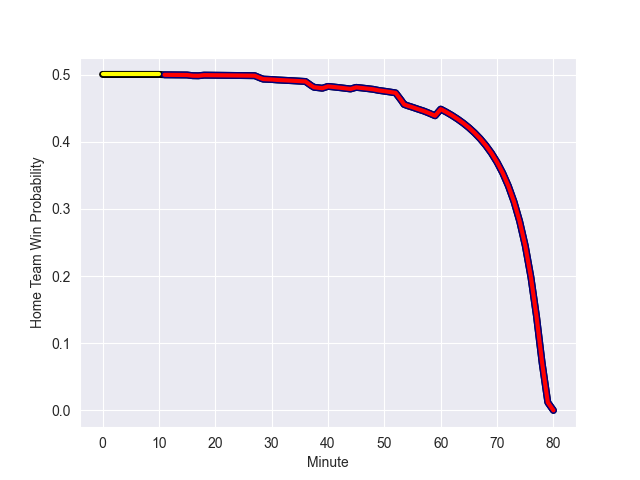

---  
layout: page  
title: Aurillac at Carcassonne; 9-27  
date: 2022-10-21 19:30:00 18:00:00 -0500  
categories: match review  
---
# Aurillac (942.72) at Carcassonne (941.61); 9-27

# Prediction: Carcassonne by 4.9

Aurillac by 0.1 on a neutral field
## Scores over Time

## Win Probability over Time

# Pre-Match Prediction: Aurillac by 5.2

Carcassonne by 0.2 on a neutral pitch

|   Away Minutes | Away Player           |   Away elo |   Away Percentile |   Number |   Home Percentile |   Home elo | Home Player              |   Home Minutes |
|---------------:|:----------------------|-----------:|------------------:|---------:|------------------:|-----------:|:-------------------------|---------------:|
|             49 | Jean-Jacques Gymael   |      61.3  |                45 |        1 |                14 |      53.76 | Youssef Amrouni          |             60 |
|             53 | Theo Lachaud          |      55.9  |                12 |        2 |                46 |      61.08 | Raphael Carbou           |             60 |
|             45 | Giorgi Kartvelishvili |      73.39 |                85 |        3 |                15 |      55.52 | Soso Bekoshvili          |             60 |
|             80 | Eoghan Masterson      |      83.29 |                90 |        4 |                98 |     107.34 | Rob Harley               |             80 |
|             31 | Mosa'ati Moala        |      57.53 |                26 |        5 |                61 |      64.17 | Rynard Ligtoring Landman |             69 |
|             57 | Beka Shvangiradze     |      59.48 |                37 |        6 |                46 |      61.25 | Simon Meka               |             66 |
|             80 | Théo Cambon           |      57.97 |                29 |        7 |                34 |      58.68 | Etienne Herjean          |             80 |
|             57 | Dylan Cretin          |      72.23 |                74 |        8 |                17 |      55.04 | Tim Agaba                |             80 |
|             80 | David Delarue         |      51.76 |                 4 |        9 |                63 |      64.56 | Samuel Marques           |             80 |
|             54 | Marc Palmier          |      66.21 |                61 |       10 |                19 |      56.88 | Damien Añon              |             60 |
|             80 | AJ Coertzen           |      74.02 |                83 |       11 |                20 |      56.65 | Léo Darrelatour          |             80 |
|             80 | Christa Powell        |      55.35 |                12 |       12 |                15 |      55.99 | Nick Grigg               |             80 |
|             80 | Jimmy Yobo            |      62.59 |                47 |       13 |                84 |      74.72 | Martin Dulon             |             71 |
|             80 | Dachi Papunashvili    |      60    |               nan |       14 |                 4 |      48.96 | Maxime Marty             |             80 |
|             80 | Giorgi Gogoladze      |      64.79 |                66 |       15 |                41 |      60.3  | Maxime Gianet            |             66 |
|             35 | Henzo Kiteau          |      59.9  |               nan |       16 |                84 |      73.15 | Sami Mavinga             |             20 |
|             31 | Robert Rodgers        |      57.61 |               nan |       17 |                34 |      58.22 | Connor Sa                |             20 |
|             23 | Latuka Maituku        |      46.76 |                 4 |       18 |                84 |      71.93 | Jérémy Boyadjis          |             20 |
|             27 | Luka Nioradze         |      72.71 |                83 |       19 |                68 |      69.07 | Dorian Jones             |             20 |
|             26 | Antoine Aucagne       |      56.76 |                18 |       20 |                43 |      59.93 | Stephane Onambele        |             14 |
|             23 | Maxime Profit         |      61.81 |                45 |       21 |                29 |      57.99 | Clément Clavières        |             14 |
|             49 | Tim Daniel-Meissen    |      54.75 |                 9 |       22 |               nan |      59.16 | Come Clayver Joussain    |             11 |
|            nan | nan                   |     nan    |               nan |       23 |                 3 |      45.68 | Brieuc Plessis-Couillaud |              9 |

