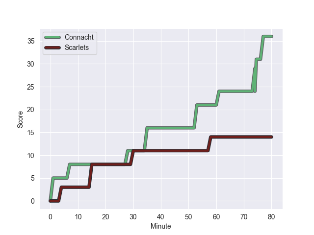
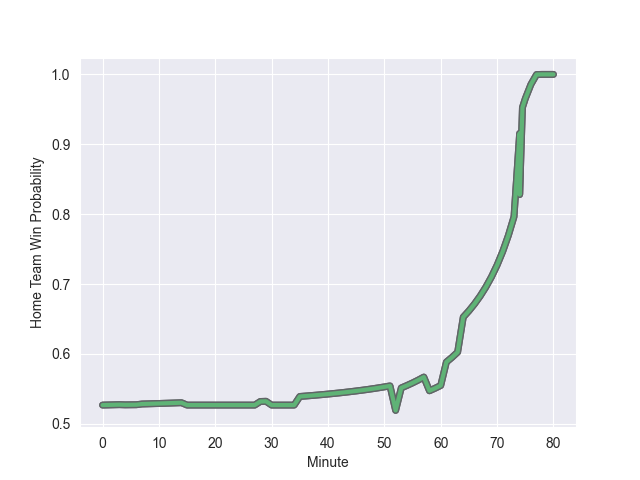

---  
layout: page  
title: Scarlets at Connacht; 14-36  
date: 2022-10-21 20:35:00 18:00:00 -0500  
categories: match review  
---
# Scarlets (1011.29) at Connacht (1058.7); 14-36

# Prediction: Connacht by 9.7

Connacht by 4.7 on a neutral field
## Scores over Time

## Win Probability over Time

# Pre-Match Prediction: Connacht by 14.5

Connacht by 9.5 on a neutral pitch

|   Away Minutes | Away Player      |   Away elo |   Away Percentile |   Number |   Home Percentile |   Home elo | Home Player          |   Home Minutes |
|---------------:|:-----------------|-----------:|------------------:|---------:|------------------:|-----------:|:---------------------|---------------:|
|             64 | Steffan Thomas   |      56.46 |                14 |        1 |                98 |     108.37 | Denis Buckley        |             64 |
|             52 | Ken Owens        |      92.29 |                93 |        2 |                58 |      64.1  | Dave Heffernan       |             55 |
|             64 | Harri O'Connor   |      56.5  |                23 |        3 |                87 |      78.16 | Finlay Bealham       |             52 |
|             52 | Jac Price        |      58.82 |                33 |        4 |                39 |      60.31 | Niall Murray         |             80 |
|             80 | Tom Price        |      42.18 |                 1 |        5 |                64 |      65.84 | Leva Fifita          |             52 |
|             80 | Josh MacLeod     |      60.35 |                41 |        6 |                 3 |      48.42 | Cian Prendergast     |             80 |
|             80 | Daniel Thomas    |      78.05 |                85 |        7 |                77 |      72.31 | Conor Oliver         |             80 |
|             80 | Sione Kalamafoni |      79.14 |                83 |        8 |                70 |      69.12 | Paul Boyle           |             58 |
|             50 | Kieran Hardy     |      64.41 |                59 |        9 |                91 |      90.97 | Kieran Marmion       |             52 |
|             52 | Sam Costelow     |      48.64 |                 1 |       10 |                91 |      93.35 | Jack Carty           |             80 |
|             80 | Ryan Conbeer     |      58.53 |                29 |       11 |                81 |      73.96 | Mack Hansen          |             80 |
|             80 | Jonathan Davies  |     106.99 |                98 |       12 |                55 |      64.91 | David Hawkshaw       |             80 |
|             80 | Steffan Evans    |      76.29 |                84 |       13 |                 0 |      33.12 | Byron Ralston        |             64 |
|             80 | Corey Baldwin    |      54.5  |                11 |       14 |                77 |      71.3  | John Porch           |             80 |
|             80 | Johnny McNicholl |      68.77 |                72 |       15 |                92 |      91.56 | Tiernan O'Halloran   |             69 |
|             30 | Dane Blacker     |      49.31 |                 4 |       16 |                26 |      58.2  | Oisin Dowling        |             28 |
|             28 | Rhys Patchell    |     112.86 |                98 |       17 |                43 |      62.3  | Jack Aungier         |             28 |
|             28 | Ryan Elias       |      73.24 |                78 |       18 |                48 |      62.36 | Colm Reilly          |             28 |
|             28 | Morgan Jones     |      47.12 |                 4 |       19 |                19 |      57.84 | Dylan Tierney-Martin |             25 |
|             16 | Kemsley Mathias  |      60    |               nan |       20 |                65 |      66.74 | Jarrad Butler        |             22 |
|             16 | WillGriff John   |      69.62 |                75 |       21 |                23 |      57.91 | Jordan Duggan        |             16 |
|            nan | nan              |     nan    |               nan |       22 |               nan |      60    | Cathal Forde         |             16 |
|            nan | nan              |     nan    |               nan |       23 |                88 |      80.47 | Alex Wootton         |             11 |

