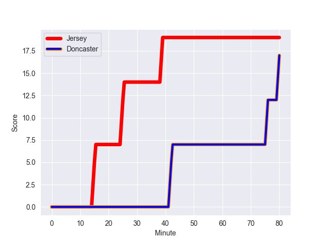
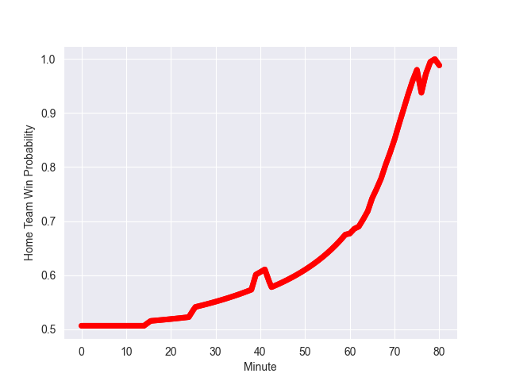

---  
layout: page  
title: Doncaster at Jersey; 17-19  
date: 2022-10-21 20:15:00 18:00:00 -0500  
categories: match review  
---
# Doncaster (1007.55) at Jersey (1018.49); 17-19

# Prediction: Jersey by 6.1

Jersey by 1.1 on a neutral field
## Scores over Time

## Win Probability over Time

# Pre-Match Prediction: Jersey by 7.2

Jersey by 2.2 on a neutral pitch

|   Away Minutes | Away Player    |   Away elo |   Away Percentile |   Number |   Home Percentile |   Home elo | Home Player                 |   Home Minutes |
|---------------:|:---------------|-----------:|------------------:|---------:|------------------:|-----------:|:----------------------------|---------------:|
|             65 | Ben Carlile    |      58    |                26 |        1 |                50 |      62.26 | Samuel Alexander Grahamslaw |             71 |
|             65 | George Edgson  |      76.94 |                86 |        2 |                71 |      67.04 | Antonio TJ Harris           |             62 |
|             76 | Jake Armstrong |      65.32 |                66 |        3 |                62 |      64.21 | Steven Longwell             |             60 |
|             61 | Ehize Ehizode  |      53.14 |                11 |        4 |                83 |      75.56 | Sean O'Connor               |             60 |
|             80 | Ben Murphy     |      61.84 |                50 |        5 |                98 |     107.74 | Macauley Cook               |             80 |
|             76 | Thom Smith     |      71.26 |                78 |        6 |                14 |      53.87 | James Dun                   |             80 |
|             65 | Martin Molina  |      61.16 |                41 |        7 |                65 |      64.75 | Lewis Wynne                 |             80 |
|             80 | John Kelly     |      73.45 |                78 |        8 |                51 |      62.75 | Alun Lawrence               |             71 |
|             76 | Alex Dolly     |      77.98 |                85 |        9 |                70 |      67.04 | James Mitchell              |             61 |
|             80 | Sam Olver      |      68.14 |                68 |       10 |                44 |      61.69 | Russell Bennett             |             80 |
|             80 | Maliq Holden   |      72.23 |                81 |       11 |                84 |      74.72 | Will Brown                  |             62 |
|             80 | Connor Edwards |      62.09 |                43 |       12 |                48 |      62.73 | Jordan Holgate              |             80 |
|             76 | Joe Margetts   |      71.04 |                73 |       13 |                32 |      59.45 | Alex McHenry                |             68 |
|             80 | George Simpson |      63.43 |                60 |       14 |                62 |      63.93 | Ben Woollett                |             80 |
|             80 | Harry Davey    |      75.34 |                78 |       15 |                78 |      75.19 | Scott Van Breda             |             80 |
|             19 | Evan Mintern   |      62.94 |                56 |       16 |                39 |      59.87 | Adam Nicol                  |             20 |
|             15 | Will Holling   |      58.32 |               nan |       17 |                59 |      62.8  | Hamish Bain                 |             20 |
|             15 | Sam Daly       |      59.42 |                37 |       18 |                79 |      71.75 | James Elliott               |             19 |
|             15 | Kai Owen       |      60    |               nan |       19 |                64 |      64.62 | Eoghan Clarke               |             18 |
|              4 | Mak Wilson     |      57.77 |                24 |       20 |                40 |      60.16 | Ryan Hutler                 |             18 |
|              4 | Robbie Smith   |      57.01 |                20 |       21 |                73 |      70.4  | Dan Barnes                  |             12 |
|              4 | Joe Green      |      60.49 |                34 |       22 |                27 |      58.34 | Greg McGrath                |              9 |
|              4 | Jared Cardew   |      56.56 |                20 |       23 |                82 |      74.46 | Max Argyle                  |              9 |

