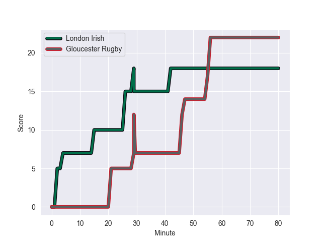
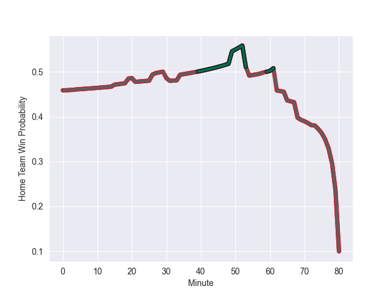

---  
layout: page  
title: Gloucester Rugby at London Irish; 22.0-21.0  
date: 2022-10-21 14:45:00 18:00:00 -0500  
categories: match review  
---
# Gloucester Rugby (1159.82) at London Irish (1088.32); 22.0-21.0

# Prediction: Gloucester Rugby by 2.2

Gloucester Rugby by 7.2 on a neutral field
## Scores over Time

## Win Probability over Time

# Pre-Match Prediction: Gloucester Rugby by 1.7

Gloucester Rugby by 6.7 on a neutral pitch

|   Away Minutes | Away Player       |   Away elo |   Away Percentile |   Number |   Home Percentile |   Home elo | Home Player                |   Home Minutes |
|---------------:|:------------------|-----------:|------------------:|---------:|------------------:|-----------:|:---------------------------|---------------:|
|             80 | Val Rapava-Ruskin |      75.14 |                84 |        1 |                57 |      63.39 | Danilo Fischetti           |             53 |
|             61 | Santiago Socino   |      79.66 |                87 |        2 |               100 |     118.18 | Agustin Creevy             |             68 |
|             80 | Fraser Balmain    |      74.55 |                83 |        3 |                37 |      60.11 | Lovejoy Chawatama          |             68 |
|             80 | Freddie Clarke    |      76.8  |                83 |        4 |                51 |      62.41 | Api Ratuniyarawa           |             80 |
|             80 | Matias Alemanno   |      86.32 |                90 |        5 |                96 |      97.77 | Rob Simmons                |             65 |
|             61 | Jordy Reid        |      73.85 |                80 |        6 |                45 |      61.32 | Juan Martin Gonzalez       |             74 |
|             80 | Lewis Ludlow      |      78.11 |                85 |        7 |                83 |      76.95 | Tom Pearson                |             80 |
|             80 | Ruan Ackermann    |      80.44 |                84 |        8 |                72 |      70.02 | So'otala Fa'aso'o          |             61 |
|             73 | Charlie Chapman   |      65.61 |                61 |        9 |                82 |      76.26 | Ben White                  |             58 |
|             80 | Adam Hastings     |      90    |                88 |       10 |                93 |      97.47 | Paddy Jackson              |             80 |
|             27 | Jonny May         |      89.1  |                93 |       11 |                39 |      60.25 | Ollie Hassell-Collins      |             80 |
|             58 | Giorgi Kveseladze |      75.83 |                78 |       12 |                44 |      62.22 | Benhard Janse van Rensburg |             80 |
|             80 | Chris Harris      |      75.06 |                76 |       13 |                60 |      64.26 | Lucio Cinti                |             69 |
|             80 | Louis Rees-Zammit |      64.91 |                62 |       14 |                55 |      63.13 | Ben Loader                 |             80 |
|             80 | Santiago Carreras |      85.46 |                87 |       15 |                46 |      62.6  | Henry Arundell             |             19 |
|             19 | Jack Singleton    |      66.8  |                68 |       16 |                29 |      58.7  | Isaac Miller               |             12 |
|              0 | Harry Elrington   |      65.78 |                66 |       17 |                54 |      63.01 | Will Goodrick-Clarke       |             27 |
|              0 | Ciaran Knight     |      60.99 |                42 |       18 |               nan |      63.69 | Ciaran Parker              |             18 |
|              0 | Cameron Jordan    |      57.07 |               nan |       19 |                64 |      64.98 | Chunya Munga               |             15 |
|             19 | Albert Tuisue     |      71.13 |                75 |       20 |                44 |      61.4  | Chandler Cunningham-South  |             19 |
|              7 | Stephen Varney    |      56    |                13 |       21 |               nan |      62.21 | Caolan Englefield          |             22 |
|             22 | Jack Reeves       |      59.83 |               nan |       22 |                40 |      61.78 | Will Joseph                |             11 |
|             53 | Lloyd Evans       |      85.97 |                88 |       23 |                80 |      79.27 | Tom Parton                 |             61 |

