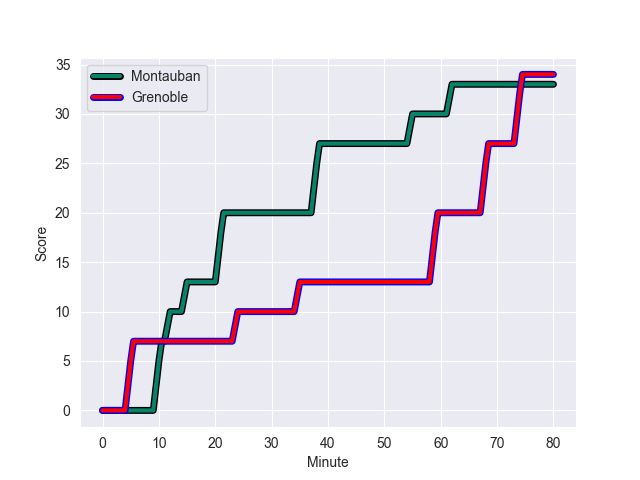
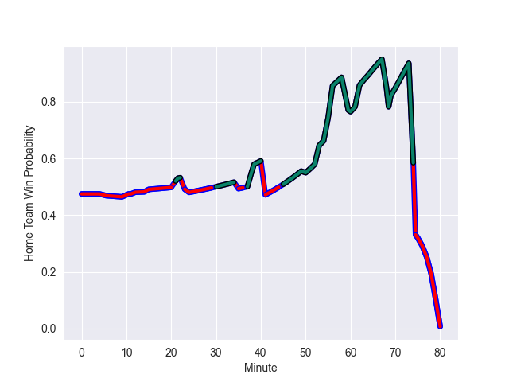

---  
layout: page  
title: Grenoble at Montauban; 34-33  
date: 2022-10-21 19:30:00 18:00:00 -0500  
categories: match review  
---
# Grenoble (947.05) at Montauban (903.73); 34-33

# Prediction: Montauban by 0.7

Grenoble by 4.3 on a neutral field
## Scores over Time

## Win Probability over Time

# Pre-Match Prediction: Grenoble by 1.4

Grenoble by 3.6 on a neutral pitch

|   Away Minutes | Away Player                 |   Away elo |   Away Percentile |   Number |   Home Percentile |   Home elo | Home Player        |   Home Minutes |
|---------------:|:----------------------------|-----------:|------------------:|---------:|------------------:|-----------:|:-------------------|---------------:|
|             23 | Eli Eglaine                 |      47.32 |                 3 |        1 |                 1 |      43.9  | Lucas Seyrolle     |             50 |
|             23 | Enzo Camilleri              |      51.79 |                 5 |        2 |                 5 |      51.37 | Cyril Deligny      |             41 |
|             23 | Toma Taufa                  |      60.73 |                43 |        3 |                12 |      54.67 | Mirian Burduli     |             59 |
|             80 | José Duarte Madeira         |      61.03 |                46 |        4 |                19 |      56.13 | Tjuee Uanivi       |             80 |
|             80 | Tanginoa Halaifonua         |      67.59 |                71 |        5 |                74 |      68.66 | Alexandre Manukula |             50 |
|             80 | Marnus Schoeman             |      66.46 |                70 |        6 |                30 |      58.68 | Frédéric Quercy    |             80 |
|             56 | Clement Ancely              |      75.19 |                82 |        7 |                 7 |      52.04 | Stéphane Munoz     |             80 |
|             53 | Talalelei Gray              |      86.05 |                92 |        8 |                70 |      66.66 | Otar Giorgadze     |             62 |
|             56 | Felipe Ezcurra              |      64.78 |                64 |        9 |               nan |      44.24 | Anthony Meric      |             53 |
|             64 | Thomas Fortunel             |      66.29 |                64 |       10 |                64 |      66.87 | Tedo Abzhandadze   |             80 |
|             80 | Atunaisa Taulanga Vaka Manu |      47.23 |                 3 |       11 |                37 |      59.45 | Bastien Guillemin  |             80 |
|             56 | Bautista Ezcurra            |      56.08 |                16 |       12 |                71 |      69.69 | Maxime Mathy       |             80 |
|             80 | Romain Fusier               |      62.08 |                55 |       13 |                91 |      86.74 | Paul Bonnefond     |             60 |
|             80 | Karim Qadiri                |      53.9  |                10 |       14 |                92 |      86.26 | Semesa Rokoduguni  |             80 |
|             80 | Julien Farnoux              |      61.22 |                43 |       15 |                 1 |      41.26 | Segundo Tuculet    |             69 |
|             57 | Zack Gauthier               |      67.23 |                73 |       16 |                 5 |      51.16 | Arnaud Feltrin     |             39 |
|             57 | Lilian Rossi                |      69.23 |                75 |       17 |                 3 |      45.25 | Dimitri Vaotoa     |             30 |
|             57 | Regis Montagne              |      57.36 |                33 |       18 |                84 |      72.01 | Nicolas Agnesi     |             30 |
|             27 | Pio Muarua                  |      68.83 |                77 |       19 |                 2 |      46.81 | Quentin Delord     |             27 |
|             24 | Terrence Hepetema           |      65.14 |                59 |       20 |                75 |      71.58 | Taleta Tupuola     |             20 |
|             24 | Thibaut Martel              |      49.88 |                 4 |       21 |                 4 |      49.15 | Simon Renaud       |             21 |
|             24 | Eric Escande                |      81.91 |                87 |       22 |                 3 |      46.36 | Epeli Momo         |             18 |
|             16 | Corentin Glenat             |      69.56 |                69 |       23 |                75 |      73.09 | Jérôme Bosviel     |             11 |

