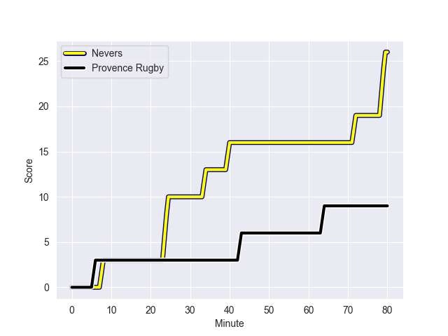
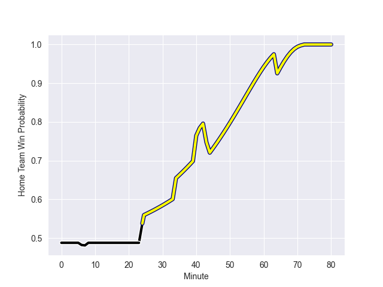

---  
layout: page  
title: Provence Rugby at Nevers; 9-26  
date: 2022-10-21 19:30:00 18:00:00 -0500  
categories: match review  
---
# Provence Rugby (967.73) at Nevers (946.54); 9-26

# Prediction: Nevers by 2.9

Provence Rugby by 2.1 on a neutral field
## Scores over Time

## Win Probability over Time

# Pre-Match Prediction: Provence Rugby by 1.8

Provence Rugby by 3.2 on a neutral pitch

|   Away Minutes | Away Player           |   Away elo |   Away Percentile |   Number |   Home Percentile |   Home elo | Home Player              |   Home Minutes |
|---------------:|:----------------------|-----------:|------------------:|---------:|------------------:|-----------:|:-------------------------|---------------:|
|             51 | Julius Nostadt        |      56.74 |                17 |        1 |                10 |      55.26 | Tomike Mataradze         |             80 |
|             51 | Loick Jammes          |      49.43 |                 1 |        2 |                80 |      74.88 | Issam Hamel              |             57 |
|             44 | David Lolohea         |      55.09 |                12 |        3 |                28 |      58.79 | Cleopas Kundiona         |             57 |
|             80 | Clément Chartier      |      56.95 |                22 |        4 |                32 |      58.71 | Lasha Jaiani             |             80 |
|             51 | Hans N'kinsi          |      59.85 |                33 |        5 |                10 |      53.05 | Christiaan van der Merwe |             53 |
|             80 | Jessy Jegerlehner     |      41.53 |                 1 |        6 |                 4 |      49.69 | Luka Plataret            |             80 |
|             41 | Bilel Taieb           |      54.99 |                14 |        7 |                21 |      56.7  | Julien Kazubek           |             80 |
|             80 | Carl Axtens           |      87.53 |                90 |        8 |                16 |      55.5  | Maka Polutele            |             41 |
|             44 | Joris Cazenave        |      64.84 |                60 |        9 |                70 |      68.34 | Guillaume Manevy         |             51 |
|             44 | Johnny McPhillips     |      67.13 |                60 |       10 |                23 |      57.74 | Yohan Le Bourhis         |             71 |
|             80 | Eroni Sau             |      71.77 |                77 |       11 |                83 |      75.42 | Lucas Blanc              |             80 |
|             80 | Hugo Navizet          |      58.43 |                28 |       12 |                69 |      69.99 | Rudy Derrieux            |             80 |
|             51 | Peter Betham          |      97.81 |                95 |       13 |                 4 |      48.19 | Alifereti Loaloa         |             80 |
|             80 | Kevin Bly             |      80.19 |                87 |       14 |                79 |      72.72 | Andrzej Charlat          |             80 |
|             80 | Adrien Lapegue-Lafaye |      51.3  |                 6 |       15 |                92 |      93.47 | Kylian Jaminet           |             75 |
|             39 | Nicolas Mousties      |      62.91 |                54 |       16 |                68 |      67.78 | Shaun Adendorff          |             39 |
|             36 | Jonathan Ruru         |      77.2  |                82 |       17 |                68 |      67.59 | Yoan Cottin              |             29 |
|             36 | Luke Tagi             |      62.38 |                50 |       18 |                 8 |      53.94 | Shaun Reynolds           |              9 |
|             36 | Enzo Selponi          |      87.05 |                85 |       19 |                24 |      57.66 | Lado Chachanidze         |             27 |
|             29 | Lucas Martin          |      59.3  |                33 |       20 |                17 |      57.18 | Aselo Ikahehegi          |             23 |
|             29 | Jérôme Dufour         |      68.38 |                71 |       21 |                 7 |      53.86 | Quentin Beaudaux         |             23 |
|             29 | Thomas Vernet         |      53.17 |                 8 |       22 |                25 |      57.79 | Thomas Zenon             |              5 |
|             29 | Adrian Sanday         |      62.22 |                44 |       23 |               nan |     nan    | nan                      |            nan |

