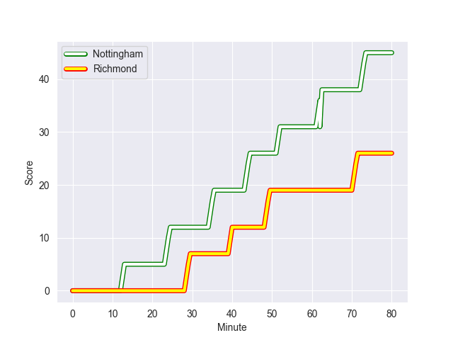
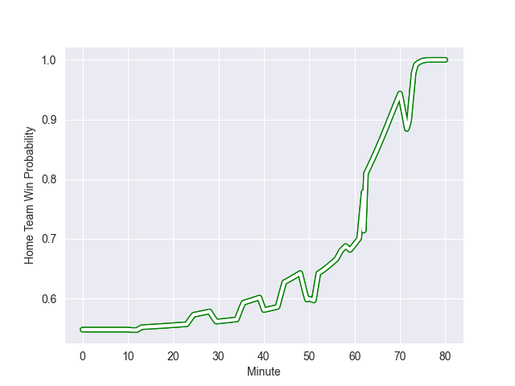

---  
layout: page  
title: Richmond at Nottingham; 26-45  
date: 2022-10-21 20:45:00 18:00:00 -0500  
categories: match review  
---
# Richmond (845.74) at Nottingham (928.75); 26-45

# Prediction: Nottingham by 13.3

Nottingham by 8.3 on a neutral field
## Scores over Time

## Win Probability over Time

# Pre-Match Prediction: Nottingham by 13.3

Nottingham by 8.3 on a neutral pitch

|   Away Minutes | Away Player        |   Away elo |   Away Percentile |   Number |   Home Percentile |   Home elo | Home Player               |   Home Minutes |
|---------------:|:-------------------|-----------:|------------------:|---------:|------------------:|-----------:|:--------------------------|---------------:|
|             11 | Conor Maguire      |      57.46 |                20 |        1 |                59 |      63.99 | Aniseko Sio               |             51 |
|             44 | Alexander Post     |      55.2  |                 9 |        2 |                45 |      61.07 | Harry Clayton             |             51 |
|             44 | Jimmy Litchfield   |      53.65 |                 9 |        3 |                56 |      63.44 | Dan Richardson            |             51 |
|             64 | Will Carrick-Smith |      60.66 |                41 |        4 |                39 |      61    | Callum Allen              |             59 |
|             80 | Sam Collingridge   |      50.77 |                 6 |        5 |                61 |      64.13 | Iosefa Danny Wayne Fiaola |             80 |
|             80 | Ethan Benson       |      54.66 |                13 |        6 |                70 |      67.59 | George Cox                |             80 |
|             53 | Miles Wakeling     |      57.25 |                27 |        7 |                68 |      66.5  | Nathan Tweedy             |             59 |
|             80 | Mark Bright        |      43.72 |                 2 |        8 |                33 |      59.47 | Josh Poullet              |             80 |
|             57 | James Lennon       |      68.21 |                70 |        9 |                52 |      62.85 | Liam Slatem               |             59 |
|             80 | Bill Johnston      |      57.67 |                22 |       10 |                 7 |      53.33 | Sam Hollingsworth         |             62 |
|             44 | Tom Mills          |      56.08 |                16 |       11 |                40 |      60.45 | Ryan Olowofela            |             80 |
|             80 | Paul Kiernan       |      56.13 |                16 |       12 |                62 |      67.14 | Javiah Pohe               |             51 |
|             80 | Alexander O'Meara  |      58.51 |                29 |       13 |                65 |      67.94 | Charlie Thacker           |             80 |
|             80 | Hamish Graham      |      61.43 |                45 |       14 |                 9 |      53.46 | David Williams            |             80 |
|             71 | Ted Landray        |      53.78 |                10 |       15 |                65 |      68.82 | Jordan Olowofela          |             80 |
|             36 | Ntinga Mpiko       |      55.94 |                18 |       16 |                13 |      55.02 | Toby Williams             |             29 |
|             36 | Callum Torpey      |      56.83 |                15 |       17 |                66 |      66.42 | Jack Dickinson            |             29 |
|             36 | James Little       |      57.48 |                21 |       18 |                30 |      60.29 | Ben Betts                 |             29 |
|             27 | David Massey       |      58.7  |                34 |       19 |                41 |      61.28 | Jack Neville              |             29 |
|             23 | Stephen Kerins     |      53.88 |                 9 |       20 |                 3 |      46.38 | Scott Hall                |             21 |
|             16 | Jake Monson        |      60    |               nan |       21 |                14 |      55.62 | Carl Kirwan               |             21 |
|              9 | Zuriel Makele      |      59.46 |               nan |       22 |                10 |      54.72 | Micheal Stronge           |             21 |
|             69 | Luke Spring        |      58.96 |               nan |       23 |                15 |      57.64 | Morgan Bunting            |             18 |

