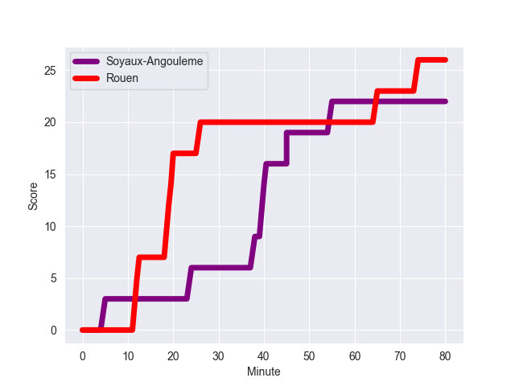
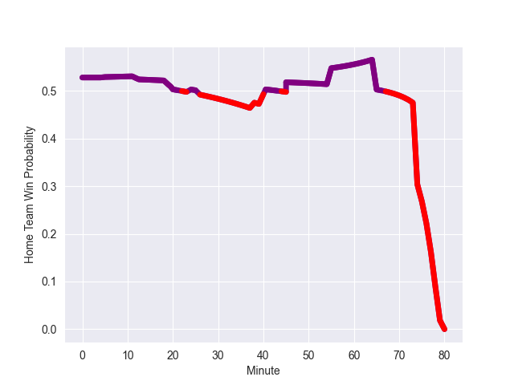

---  
layout: page  
title: Rouen at Soyaux-Angouleme; 26-22  
date: 2022-10-21 19:30:00 18:00:00 -0500  
categories: match review  
---
# Rouen (970.32) at Soyaux-Angouleme (1034.11); 26-22

# Prediction: Soyaux-Angouleme by 11.4

Soyaux-Angouleme by 6.4 on a neutral field
## Scores over Time

## Win Probability over Time

# Pre-Match Prediction: Soyaux-Angouleme by 1.9

Rouen by 6.9 on a neutral pitch

|   Away Minutes | Away Player           |   Away elo |   Away Percentile |   Number |   Home Percentile |   Home elo | Home Player            |   Home Minutes |
|---------------:|:----------------------|-----------:|------------------:|---------:|------------------:|-----------:|:-----------------------|---------------:|
|             59 | Antoine Fournier      |      98.54 |                95 |        1 |                85 |      75.63 | Khatchik Vartanov      |             80 |
|             66 | Mathieu Bonnot        |      75.16 |                81 |        2 |                35 |      60.3  | Patxi Bidart           |             80 |
|             61 | Cody Thomas           |      63.83 |                59 |        3 |                90 |      86.61 | Yassine Boutemane      |             80 |
|             80 | John-Charles Astle    |      33.07 |                 0 |        4 |                76 |      71.28 | Sikeli Nabou           |             80 |
|             80 | Toby Salmon           |      68.32 |                71 |        5 |                53 |      62.6  | Janse Roux             |             80 |
|             59 | Lucas Costa           |      64.12 |                60 |        6 |                50 |      62.1  | Matt Beukeboom         |             80 |
|             41 | Jean Leleu            |      69.29 |                73 |        7 |                66 |      65.9  | Germain Burgaud        |             80 |
|             80 | Valentino Mapapalangi |      61.34 |                41 |        8 |                77 |      75.51 | Clement Ancely         |             80 |
|             69 | Florent Campeggia     |      47.32 |                 1 |        9 |                67 |      67.11 | Adrien Bau             |             80 |
|             66 | Thibault Olender      |      60.1  |                33 |       10 |                63 |      67.53 | Jacob Botica           |             80 |
|             80 | Malcolm Bertschy      |      63.05 |                55 |       11 |                13 |      54.94 | Marvin Lestremau       |             80 |
|             40 | Taylor Gontineac      |      61.48 |                37 |       12 |                38 |      61.42 | Ledua Mau              |             80 |
|             80 | Opetera Peleseuma     |      62.11 |                43 |       13 |                81 |      78.69 | Nasoni Naqiri Kunavore |             80 |
|             80 | Paul Surano           |      63.22 |                56 |       14 |                71 |      68.49 | Maxime Laforgue        |             80 |
|             80 | Peter Lydon           |      81.51 |                83 |       15 |                75 |      75.97 | Pierre Lafitte         |             80 |
|             40 | Alex Luatua           |      67.49 |                64 |       16 |               nan |     nan    | nan                    |            nan |
|             39 | Tienie Burger         |      75.85 |                82 |       17 |               nan |     nan    | nan                    |            nan |
|             21 | Soulemane Camara      |      62.56 |                52 |       18 |               nan |     nan    | nan                    |            nan |
|             21 | Abdelkarim Fofana     |      46.13 |                 3 |       19 |               nan |     nan    | nan                    |            nan |
|             19 | Mohamed Boughanmi     |      94.22 |                93 |       20 |               nan |     nan    | nan                    |            nan |
|             14 | Jean-Étienne Lesueur  |      58.17 |                22 |       21 |               nan |     nan    | nan                    |            nan |
|             14 | Marius Marty          |      59.43 |                35 |       22 |               nan |     nan    | nan                    |            nan |
|             11 | Joris Lezat           |      59.65 |                35 |       23 |               nan |     nan    | nan                    |            nan |

