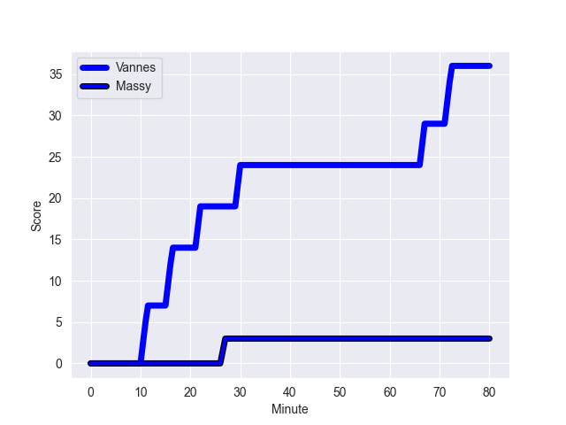
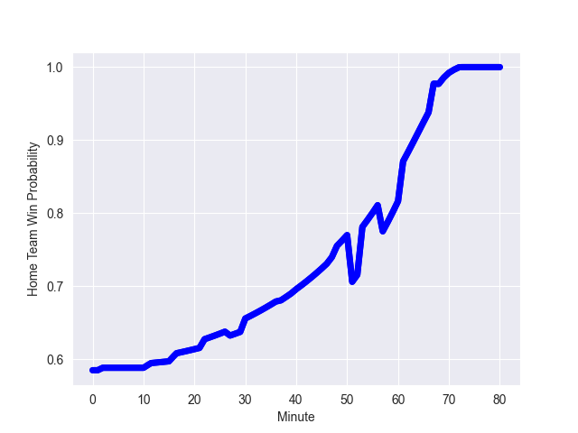

---  
layout: page  
title: Massy at Vannes; 3-36  
date: 2022-10-21 19:30:00 18:00:00 -0500  
categories: match review  
---
# Massy (873.35) at Vannes (1022.5); 3-36

# Prediction: Vannes by 19.9

Vannes by 14.9 on a neutral field
## Scores over Time

## Win Probability over Time

# Pre-Match Prediction: Vannes by 19.9

Vannes by 14.9 on a neutral pitch

|   Away Minutes | Away Player          |   Away elo |   Away Percentile |   Number |   Home Percentile |   Home elo | Home Player            |   Home Minutes |
|---------------:|:---------------------|-----------:|------------------:|---------:|------------------:|-----------:|:-----------------------|---------------:|
|             48 | Robin Poipy          |      58.65 |                37 |        1 |                40 |      59.46 | Charles-Henri Berguet  |             57 |
|             53 | Mamoudou Meite       |      59.3  |                41 |        2 |                81 |      71.6  | Pat Leafa              |             47 |
|             37 | Corentin Chabeaudie  |      54.6  |                 7 |        3 |                90 |      82.99 | Paga Tafili            |             47 |
|             80 | Andrew Chauveau      |      55    |                16 |        4 |                45 |      60.99 | Joe Edwards            |             80 |
|             40 | Ewan Coetzee         |      56.31 |                18 |        5 |                60 |      63.83 | Ewan Thomas Johnson    |             57 |
|             80 | Tony Tissot          |      60    |               nan |        6 |                91 |      86.01 | Francisco Gorrissen    |             68 |
|             48 | Clement Lanen        |      61.14 |                42 |        7 |                 1 |      41.83 | Gregoire Bazin         |             80 |
|              2 | Maxime Danton        |      59.81 |               nan |        8 |                79 |      73.67 | Léon Boulier           |             80 |
|             61 | Samuel Boissinot     |      58.69 |                30 |        9 |                26 |      58.09 | Hugo Zabalza           |             68 |
|             40 | Tom Deleuze          |      59.13 |               nan |       10 |                 7 |      51.61 | Maxime Lafage          |             57 |
|             80 | Yanis Dit Robaglia   |      59.48 |                37 |       11 |                73 |      72.06 | Romaric Camou          |             80 |
|             80 | Mathieu Guillomot    |      59.63 |                33 |       12 |                74 |      70.64 | Andres Vilaseca Hontou |             80 |
|             80 | JJ Taulagi           |      59.45 |                32 |       13 |                69 |      66.06 | Nicolas Freitas        |             80 |
|             80 | Kimani Sitauti       |      64.83 |                66 |       14 |                88 |      79.32 | Matthys Gratien        |             80 |
|             80 | Romain Clouté        |      58.26 |                21 |       15 |                96 |      95.33 | Nick Abendanon         |             51 |
|             78 | Abongile Nonkontwana |      53.86 |                11 |       16 |                49 |      61.52 | Théo Beziat            |             33 |
|             43 | Julien Brosse        |      60    |               nan |       17 |                95 |      97.96 | John Afoa              |             33 |
|             40 | Tom Cusson           |      59.48 |               nan |       18 |                58 |      63.09 | Nathanael Hulleu       |             29 |
|             40 | Louis Bruinsma       |      54.28 |                14 |       19 |                67 |      67.47 | Branden Holder         |             23 |
|             32 | Ushangi Tcheishvili  |      40.26 |                 1 |       20 |                12 |      52.61 | Myles Edwards          |             23 |
|             32 | Mehdi Tlili          |      59.78 |               nan |       21 |                40 |      60.21 | Ximun Bessonart        |             23 |
|             27 | Randy Grelleaud      |      60.53 |                43 |       22 |               nan |      58.42 | Alexandre Gouaux       |             12 |
|             19 | Kilian Marion        |      60    |               nan |       23 |                69 |      66.57 | Remi Leroux            |             12 |

