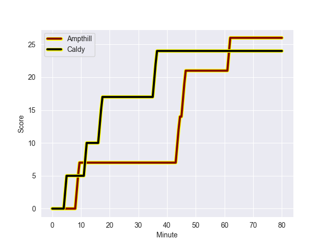
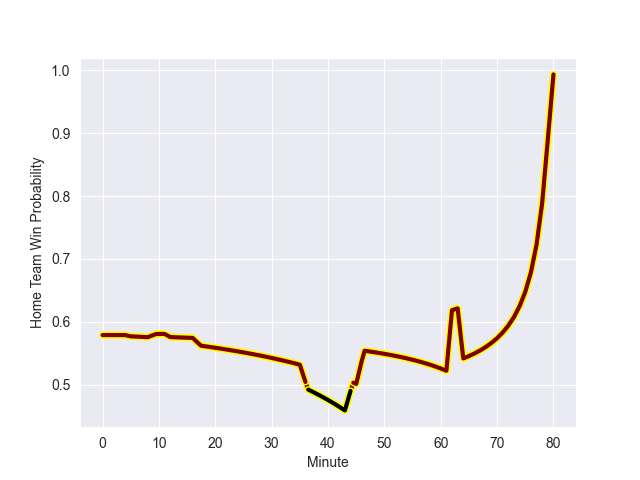

---  
layout: page  
title: Caldy at Ampthill; 24-26  
date: 2022-10-22 15:00:00 18:00:00 -0500  
categories: match review  
---
# Caldy (837.17) at Ampthill (974.67); 24-26

# Prediction: Ampthill by 18.8

Ampthill by 13.8 on a neutral field
## Scores over Time

## Win Probability over Time

# Pre-Match Prediction: Ampthill by 17.8

Ampthill by 12.8 on a neutral pitch

|   Away Minutes | Away Player         |   Away elo |   Away Percentile |   Number |   Home Percentile |   Home elo | Home Player      |   Home Minutes |
|---------------:|:--------------------|-----------:|------------------:|---------:|------------------:|-----------:|:-----------------|---------------:|
|             59 | Adam Aigbokhae      |      57.29 |                21 |        1 |               nan |      59.02 | Dominic Hardman  |             72 |
|             59 | Oliver Hearn        |      55.55 |                12 |        2 |               nan |      63.23 | Matt Gallagher   |             40 |
|             51 | Andrew Darlington   |      42.33 |                 1 |        3 |                48 |      61.77 | Joe Sproston     |             40 |
|             80 | Sam Dickinson       |      61.03 |                46 |        4 |                87 |      79.44 | Charlie Beckett  |             80 |
|             64 | Thomas Sanders      |      55.04 |                16 |        5 |                60 |      63.46 | Harry Wilson     |             80 |
|             80 | Martin Gerrard      |      57.65 |                26 |        6 |                35 |      59.58 | Caleb Montgomery |             61 |
|             72 | Callum Ridgway      |      55.3  |                17 |        7 |                44 |      60.96 | James Tunney     |             40 |
|             80 | Josiah Dickinson    |      54.35 |                15 |        8 |               nan |      60    | Morgan Strong    |             80 |
|             51 | Chris Pilgrim       |      58.16 |                27 |        9 |                39 |      60.04 | Peter White      |             72 |
|             80 | Ezra Hinchcliffe    |      55.16 |                13 |       10 |                57 |      64.29 | Gwyn Parks       |             80 |
|             51 | Michael Cartmill    |      54.43 |                12 |       11 |                69 |      65.98 | Ben Cambriani    |             80 |
|             80 | Michael Barlow      |      57.56 |                23 |       12 |                74 |      71.09 | Joshua Bragman   |             80 |
|             80 | Dan Bibby           |      54.44 |                12 |       13 |                45 |      62.68 | Charlie Hudson   |             72 |
|             80 | Nick Royle          |      53.61 |                10 |       14 |                55 |      62.62 | Conor Rankin     |             80 |
|             64 | Elliott Gourlay     |      57.76 |                28 |       15 |                45 |      62.16 | Tomas Bacon      |             64 |
|             29 | Anerin (Nye) Thomas |      58.46 |                29 |       16 |                95 |      95.8  | 'Aleki Lutui     |             40 |
|             29 | Benjamin Jones      |      56.98 |                27 |       17 |                60 |      63.55 | Joe Bercis       |             40 |
|             29 | Ryan Higginson      |      57.63 |                34 |       18 |               nan |      59.24 | Beck Cutting     |             40 |
|             21 | Ethan Caine         |      59.35 |               nan |       19 |                67 |      66.63 | Cai Devine       |             19 |
|             21 | Nathan Rushton      |      57.55 |                25 |       20 |                49 |      62.71 | Will Partington  |             16 |
|             16 | Harrison Crowe      |      54.8  |                14 |       21 |               nan |      60    | Stevie Awah      |              8 |
|             16 | Rhys Hayes          |      55.78 |                16 |       22 |                54 |      63.97 | Tom Hudson       |              8 |
|              8 | Thomas Parry        |      58.6  |               nan |       23 |                38 |      60.38 | Lewis Finlay     |              8 |

