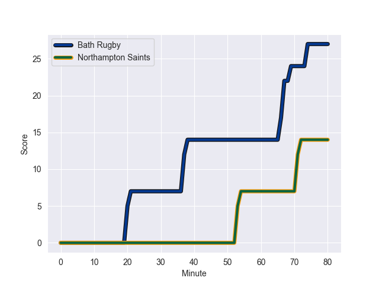
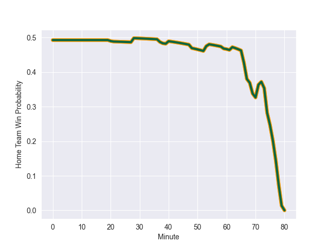

---  
layout: page  
title: Northampton Saints at Bath Rugby; 14.0-27.0  
date: 2022-10-22 10:00:00 18:00:00 -0500  
categories: match review  
---
# Northampton Saints (1128.51) at Bath Rugby (1099.47); 14.0-27.0

# Prediction: Bath Rugby by 2.1

Northampton Saints by 2.9 on a neutral field
## Scores over Time

## Win Probability over Time

# Pre-Match Prediction: Northampton Saints by 6.1

Bath Rugby by 1.1 on a neutral pitch

|   Away Minutes | Away Player          |   Away elo |   Away Percentile |   Number |   Home Percentile |   Home elo | Home Player           |   Home Minutes |
|---------------:|:---------------------|-----------:|------------------:|---------:|------------------:|-----------:|:----------------------|---------------:|
|             48 | Alex Waller          |     117.98 |                99 |        1 |                90 |      85.48 | Juan Schoeman         |             62 |
|             78 | Sam Matavesi         |      74.62 |                80 |        2 |                88 |      82.4  | Tom Dunn              |             59 |
|             59 | Paul Hill            |      74.02 |                83 |        3 |                97 |     105.22 | Aranos Coetzee        |             28 |
|             80 | Lukhan Salakaia-Loto |      61.42 |                47 |        4 |                98 |     110.91 | Dave Attwood          |             80 |
|             66 | David Ribbans        |      76.1  |                82 |        5 |                98 |     110.22 | Quinn Roux            |             40 |
|             80 | Alex Coles           |      59.42 |                37 |        6 |                 5 |      50.56 | Josh Bayliss          |             80 |
|             60 | Lewis Ludlam         |      77.62 |                85 |        7 |                32 |      58.6  | Miles Reid            |             80 |
|             80 | Juarno Augustus      |      59.76 |                34 |        8 |                93 |      91.89 | Richard de Carpentier |             62 |
|             66 | Alex Mitchell        |      84.8  |                86 |        9 |                96 |     103.64 | Louis Schreuder       |             70 |
|             66 | James Grayson        |      78.6  |                76 |       10 |                38 |      61.27 | George Worboys        |             80 |
|             80 | Ollie Sleightholme   |      74.18 |                82 |       11 |                10 |      53.55 | Will Butt             |             80 |
|             80 | Fraser Dingwall      |      71.39 |                71 |       12 |                43 |      62.04 | Cameron Redpath       |             77 |
|             70 | Matt Proctor         |      75.43 |                79 |       13 |                24 |      57.95 | Ollie Lawrence        |             80 |
|             80 | Tom Collins          |      99.83 |                97 |       14 |                82 |      74.61 | Joe Cokanasiga        |             80 |
|             80 | George Furbank       |      80.93 |                82 |       15 |                90 |      88.36 | Matt Gallagher        |             80 |
|              2 | Robbie Smith         |      56.15 |               nan |       16 |                89 |      84.52 | Niall Annett          |             21 |
|             32 | Emmanuel Iyogun      |      63.93 |                59 |       17 |                20 |      54.98 | Arthur Cordwell       |             18 |
|             21 | Alfie Petch          |      52.82 |                 9 |       18 |                 1 |      44.25 | D'Arcy Rae            |             52 |
|             14 | Alex Moon            |      75.49 |                82 |       19 |                 0 |      35.56 | Fergus Lee-Warner     |             40 |
|             20 | Sam Graham           |      81.73 |                85 |       20 |                16 |      54.94 | Ted Hill              |             18 |
|             14 | Tom James            |      51.39 |                 3 |       21 |               nan |      60.23 | Tom Carr-Smith        |             10 |
|             10 | Tom Litchfield       |      60.87 |               nan |       22 |                 0 |      46.63 | Billy Searle          |              0 |
|             14 | George Hendy         |      60.26 |               nan |       23 |                13 |      55.81 | Max Ojomoh            |              3 |

