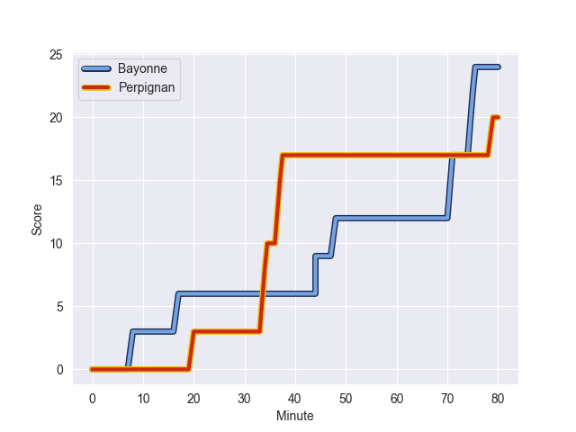
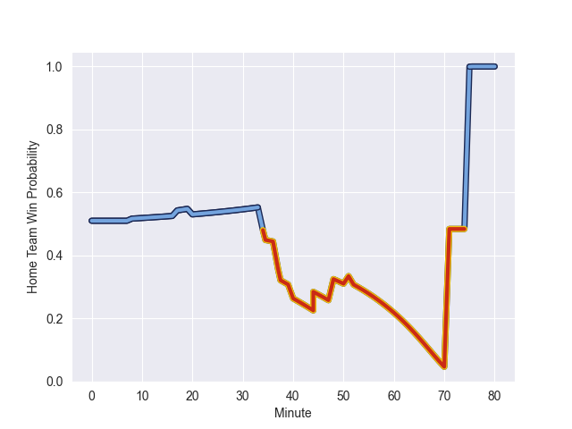

---  
layout: page  
title: Perpignan at Bayonne; 20-24  
date: 2022-10-22 17:00:00 18:00:00 -0500  
categories: match review  
---
# Perpignan (1087.43) at Bayonne (1104.63); 20-24

# Prediction: Bayonne by 6.7

Bayonne by 1.7 on a neutral field
## Scores over Time

## Win Probability over Time

# Pre-Match Prediction: Bayonne by 4.6

Perpignan by 0.4 on a neutral pitch

|   Away Minutes | Away Player         |   Away elo |   Away Percentile |   Number |   Home Percentile |   Home elo | Home Player             |   Home Minutes |
|---------------:|:--------------------|-----------:|------------------:|---------:|------------------:|-----------:|:------------------------|---------------:|
|             51 | Xavier Chiocci      |      78.46 |                87 |        1 |                 8 |      52.1  | Matis Perchaud          |             54 |
|             54 | Seilala Lam         |      57.23 |                15 |        2 |                77 |      71.42 | Facundo Bosch           |             66 |
|             57 | Arthur Joly         |     103.98 |                97 |        3 |                29 |      58.88 | Pascal Cotet            |             61 |
|             54 | Will Witty          |      54.82 |                14 |        4 |                77 |      71.8  | Manuel Leindekar        |             40 |
|             80 | Piula Faasalele     |      88.34 |                91 |        5 |                91 |      87.35 | Thomas Ceyte            |             40 |
|             62 | Lucas Bachelier     |      68.19 |                71 |        6 |                93 |      92.36 | Afaesetiti Amosa        |             80 |
|             80 | Kelian Galletier    |      74.69 |                80 |        7 |                67 |      66.01 | Pierre Huguet           |             80 |
|             69 | Lucas Velarte       |      57.91 |                37 |        8 |                64 |      66.44 | Uzair Cassiem           |             80 |
|             60 | Tom Ecochard        |      90.63 |                91 |        9 |                87 |      86.31 | Maxime Machenaud        |             62 |
|             80 | Jake McIntyre       |      73.67 |                72 |       10 |                98 |     113.35 | Camille Lopez           |             80 |
|             80 | Mathieu Acebes      |      98.25 |                96 |       11 |                19 |      56.78 | Remy Baget              |             80 |
|             61 | George Tilsley      |      79.85 |                83 |       12 |                78 |      76.31 | Guillaume Martocq       |             52 |
|             80 | Afusipa Taumoepeau  |      77.97 |                81 |       13 |                33 |      60.1  | Sireli Maqala           |             80 |
|             80 | Lucas Dubois        |      55.92 |                14 |       14 |                54 |      65.16 | Martin Gabriel Bogado   |             80 |
|             80 | Tristan Tedder      |      49.62 |                 2 |       15 |                91 |      90.01 | Gaetan Germain          |             80 |
|             29 | Giorgi Tetrashvili  |      61.15 |                44 |       16 |                95 |      98.9  | Torsten van Jaarsveld   |             14 |
|             26 | Mike Tadjer Barbosa |      63.12 |                53 |       17 |                 3 |      48.32 | Mateaki Kafatolu        |             40 |
|             26 | Victor Moreaux      |      46.59 |                 3 |       18 |                93 |      90.77 | Denis Marchois          |             40 |
|             23 | Ma'afu Fia          |      80.34 |                87 |       19 |                59 |      66.41 | Eneriko Buliruarua      |             28 |
|             20 | Sadek Deghmache     |      47.25 |                 1 |       20 |                24 |      57.79 | Chris Talakai           |             26 |
|             19 | Dorian Laborde      |      72.52 |                72 |       21 |                75 |      70.93 | Guillaume Rouet Piffard |             18 |
|             18 | Joaquin Oviedo      |      65.51 |                57 |       22 |                44 |      61.36 | Pieter Scholtz          |             19 |
|             11 | Alan Brazo          |      93.63 |                94 |       23 |               nan |     nan    | nan                     |            nan |

