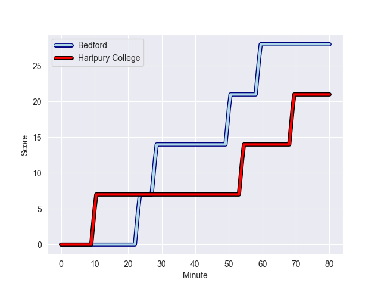
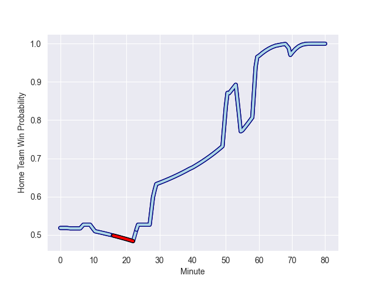

---  
layout: page  
title: Hartpury College at Bedford; 21-28  
date: 2022-10-22 16:00:00 18:00:00 -0500  
categories: match review  
---
# Hartpury College (905.71) at Bedford (936.77); 21-28

# Prediction: Bedford by 8.1

Bedford by 3.1 on a neutral field
## Scores over Time

## Win Probability over Time

# Pre-Match Prediction: Bedford by 3.4

Hartpury College by 1.6 on a neutral pitch

|   Away Minutes | Away Player             |   Away elo |   Away Percentile |   Number |   Home Percentile |   Home elo | Home Player          |   Home Minutes |
|---------------:|:------------------------|-----------:|------------------:|---------:|------------------:|-----------:|:---------------------|---------------:|
|              3 | Harry Fry               |      59.29 |                33 |        1 |                 8 |      52.91 | Joey Conway          |             59 |
|             51 | Ethan Hunt              |      65.1  |                63 |        2 |                68 |      65.99 | James Fish           |             80 |
|             40 | Sam Rodman              |      59.33 |                36 |        3 |                84 |      72.7  | Ehren Painter        |             66 |
|             80 | Jack Davies             |      57.74 |                22 |        4 |                52 |      62.22 | Robin Williams       |             80 |
|             80 | Dale Lemon              |      62.93 |                56 |        5 |                11 |      53.03 | Jordan Onojaife      |             59 |
|             66 | Samuel Lewis            |      59.95 |                40 |        6 |                 5 |      50.21 | Luke Frost           |             80 |
|             60 | Jake Polledri           |      62.3  |                53 |        7 |               nan |      58.68 | Kayde Sylvester      |             55 |
|             51 | Mitch Eadie             |      50.52 |                 7 |        8 |                30 |      58.03 | Jac Arthur           |             80 |
|             51 | Jean-Baptiste Bruzulier |      66.46 |                68 |        9 |                80 |      72.15 | Alex Day             |             80 |
|             80 | James Williams          |      62.82 |                48 |       10 |                61 |      65.99 | William Maisey       |             80 |
|             29 | Sam Smith               |      66.37 |               nan |       11 |                47 |      61.34 | Dean Adamson         |             80 |
|             80 | William Butler          |      56.98 |               nan |       12 |                25 |      57.98 | Joel Matavesi        |             80 |
|             80 | Matthew McNab           |      58.75 |                33 |       13 |                53 |      63.63 | Ethan Grayson        |             28 |
|             80 | Bradley Denty           |      58.86 |                34 |       14 |                17 |      55.77 | Sean French          |              7 |
|             80 | Tommy Mathews           |      59.61 |                37 |       15 |                66 |      67.21 | Michael Le Bourgeois |             80 |
|             77 | Mikey Summerfield       |      60    |               nan |       16 |                52 |      61.68 | Patrick Tapley       |             73 |
|             51 | Jack Lloyd              |      57.14 |                20 |       17 |                87 |      81.36 | Jamie Elliott        |             52 |
|             40 | Tom Sims                |      59.89 |               nan |       18 |                21 |      56.67 | Tui Uru              |             25 |
|             29 | Matty Jones             |      65.2  |                61 |       19 |               nan |      60    | Tom Lockett          |             21 |
|             29 | Jack Bartlett           |      61.57 |               nan |       20 |                69 |      65.67 | Lewis Holsey         |             21 |
|             29 | James Benjamin          |      62.34 |                52 |       21 |                26 |      58.16 | Corrie Barrett       |             14 |
|             20 | Harry Short             |      66.36 |                65 |       22 |               nan |     nan    | nan                  |            nan |
|             14 | Joe Howard              |      60.32 |                42 |       23 |               nan |     nan    | nan                  |            nan |

