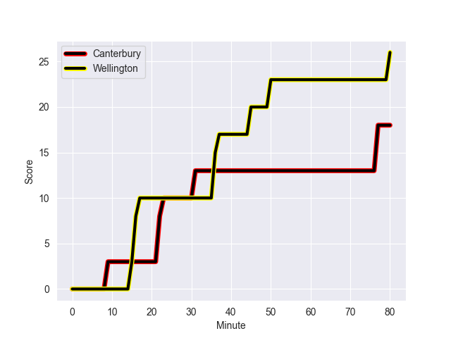
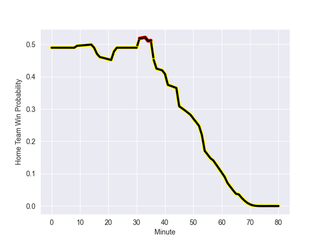

---  
layout: page  
title: Wellington at Canterbury; 26.0-18.0  
date: 2022-10-22 02:05:00 18:00:00 -0500  
categories: match review  
---
# Wellington (1070.51) at Canterbury (1047.74); 26.0-18.0

# Prediction: Canterbury by 2.7

Wellington by 2.3 on a neutral field
## Scores over Time

## Win Probability over Time

# Pre-Match Prediction: Wellington by 5.0

Wellington by 0.0 on a neutral pitch

|   Away Minutes | Away Player           |   Away elo |   Away Percentile |   Number |   Home Percentile |   Home elo | Home Player        |   Home Minutes |
|---------------:|:----------------------|-----------:|------------------:|---------:|------------------:|-----------:|:-------------------|---------------:|
|             76 | Xavier Numia          |      73.1  |                81 |        1 |                63 |      65.84 | Finlay Brewis      |             53 |
|             80 | Asafo Aumua           |      81.86 |                88 |        2 |                70 |      68.54 | Brodie McAlister   |             73 |
|             66 | PJ Sheck              |      62.99 |                43 |        3 |                94 |      94.24 | Owen Franks        |             41 |
|             80 | James Blackwell       |      63.29 |                55 |        4 |                51 |      62.39 | Zach Gallagher     |             80 |
|             76 | Dominic Bird          |      71.43 |                77 |        5 |                45 |      61.51 | Dom Gardiner       |             50 |
|             62 | Caleb Delany          |      50.94 |                 6 |        6 |                46 |      61.48 | Corey Kellow       |             50 |
|             80 | Du'Plessis Kirifi     |      81.69 |                87 |        7 |                78 |      72.69 | Tom Christie       |             80 |
|             80 | Peter Lakai           |      56.61 |                21 |        8 |                70 |      69.27 | Billy Harmon       |             80 |
|             68 | TJ Perenara           |      99    |                94 |        9 |                94 |      98.54 | Willi Heinz        |             54 |
|             57 | Jackson Garden-Bachop |      61.27 |                40 |       10 |                23 |      58.04 | Fergus Burke       |             80 |
|             69 | Pepesana Patafilo     |      58.98 |                33 |       11 |                93 |      89.35 | George Bridge      |             80 |
|             80 | Riley Higgins         |      64.67 |                53 |       12 |                34 |      60.24 | Rameka Poihipi     |             80 |
|             80 | Billy Proctor         |      66.26 |                59 |       13 |                57 |      65.65 | Dallas McLeod      |             66 |
|             78 | Julian Savea          |     112.8  |                99 |       14 |                66 |      65.88 | Manasa Mataele     |             40 |
|             80 | Ruben Love            |      71.72 |                71 |       15 |                70 |      71.58 | Chay Fihaki        |             80 |
|              0 | James O'Reilly        |      55.54 |                10 |       16 |                40 |      61.14 | George Bell        |              7 |
|             14 | Siale Lauaki          |      60    |               nan |       17 |                 8 |      52.26 | Dan Lienert-Brown  |             27 |
|              4 | Tietie Tuimauga       |      71.39 |                78 |       18 |                36 |      59.74 | Tamaiti Williams   |             39 |
|              4 | Taine Plumtree        |      58.6  |                30 |       19 |                97 |     103.01 | Luke Romano        |             30 |
|             18 | Keelan Whitman        |      61.02 |                36 |       20 |                84 |      76.89 | Reed Prinsep       |             30 |
|             14 | Richard Judd          |      70.41 |                74 |       21 |                55 |      63.44 | Mitchell Drummond  |             26 |
|             23 | Aidan Morgan          |      54.19 |                 8 |       22 |                30 |      59.49 | Isaiah Punivai     |             14 |
|             11 | Connor Garden-Bachop  |      60.82 |                42 |       23 |                20 |      57.27 | Ngatungane Punivai |             40 |

