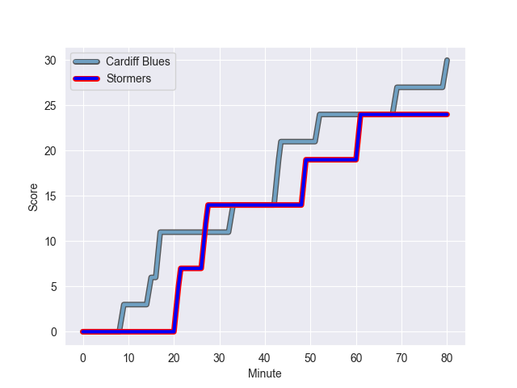
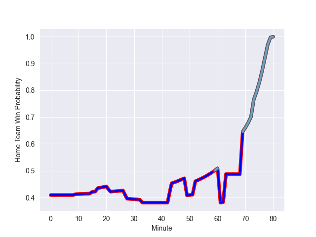

---  
layout: page  
title: Stormers at Cardiff Blues; 24-30  
date: 2022-10-22 20:35:00 18:00:00 -0500  
categories: match review  
---
# Stormers (1165.63) at Cardiff Blues (1005.26); 24-30

# Prediction: Stormers by 11.0

Stormers by 16.0 on a neutral field
## Scores over Time

## Win Probability over Time

# Pre-Match Prediction: Stormers by 8.3

Stormers by 13.3 on a neutral pitch

|   Away Minutes | Away Player                      |   Away elo |   Away Percentile |   Number |   Home Percentile |   Home elo | Home Player       |   Home Minutes |
|---------------:|:---------------------------------|-----------:|------------------:|---------:|------------------:|-----------:|:------------------|---------------:|
|             73 | Steven Kitshoff                  |     113.68 |                99 |        1 |                15 |      56.09 | Rhys Carré        |             62 |
|             54 | Joseph Dweba                     |      66.19 |                67 |        2 |                91 |      86.26 | Kristian Dacey    |             33 |
|             66 | Frans Malherbe                   |     105.21 |                97 |        3 |                83 |      74.31 | Dillon Lewis      |             62 |
|             55 | Adre Smith                       |      67.78 |                69 |        4 |                73 |      69.59 | Josh Turnbull     |             80 |
|             80 | Marvin Orie                      |      62.65 |                52 |        5 |                16 |      54.78 | Rory Thornton     |             69 |
|             58 | Kuyenzeka Kwenama Praisegod Xaba |      52.97 |                 9 |        6 |                69 |      67.5  | James Botham      |             80 |
|             63 | Ernst van Rhyn                   |      82.59 |                87 |        7 |                93 |      91.63 | Thomas Young      |             62 |
|             80 | Hacjivah Dayimani                |      83.21 |                88 |        8 |                20 |      56.59 | James Ratti       |             52 |
|             42 | Godlen Masimla                   |      58.75 |                23 |        9 |                84 |      80.29 | Tomos Williams    |             80 |
|             80 | Manie Libbok                     |      80.41 |                78 |       10 |                87 |      84.42 | Rhys Priestland   |             80 |
|             80 | Leolin Zas                       |      83.37 |                89 |       11 |                 2 |      46.13 | Theo Cabango      |             80 |
|             80 | Daniel du Plessis                |      83.92 |                87 |       12 |                95 |      97.81 | Uilisi Halaholo   |              5 |
|             55 | Alapati Leiua                    |      82.25 |                86 |       13 |                 6 |      50.6  | Max Llewellyn     |             80 |
|             80 | SuleimanHartzenberg              |      67.18 |                69 |       14 |                64 |      65.59 | Jason Harries     |             80 |
|             80 | Clayton Blommetjies              |      76.1  |                76 |       15 |                86 |      82.92 | Ben Thomas        |             80 |
|             38 | Albertus Paul de Wet             |      60.06 |                38 |       16 |                11 |      54.09 | Mason Grady       |             75 |
|             26 | JJ Kotze                         |      63.41 |                54 |       17 |                76 |      71.61 | Kirby Myhill      |             47 |
|             25 | Ben-Jason Dixon                  |      66.48 |                67 |       18 |                49 |      62.2  | Lopeti Timani     |             28 |
|             25 | Sacha Mngomezulu                 |      62.98 |                48 |       19 |                13 |      53.65 | Corey Domachowski |             18 |
|             22 | Junior Pokomela                  |      75.23 |                81 |       20 |                26 |      58.43 | Dimitri Arhip     |             18 |
|             17 | Willie Engelbrecht               |      83.17 |                88 |       21 |               nan |      60.29 | Teddy Williams    |             11 |
|             14 | Brok Harris                      |     130.95 |               100 |       22 |               nan |      54.88 | Gwilym Bradley    |             18 |
|              7 | Kwenzokuhle Ndumiso Blose        |      60.52 |                35 |       23 |               nan |     nan    | nan               |            nan |

