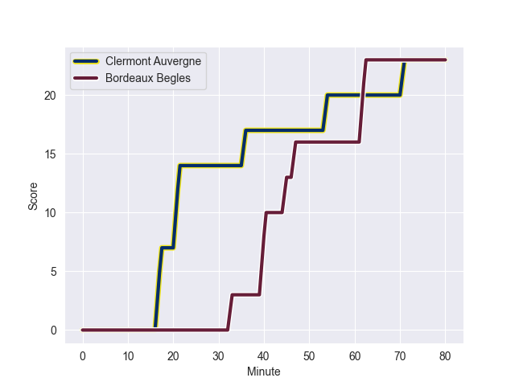
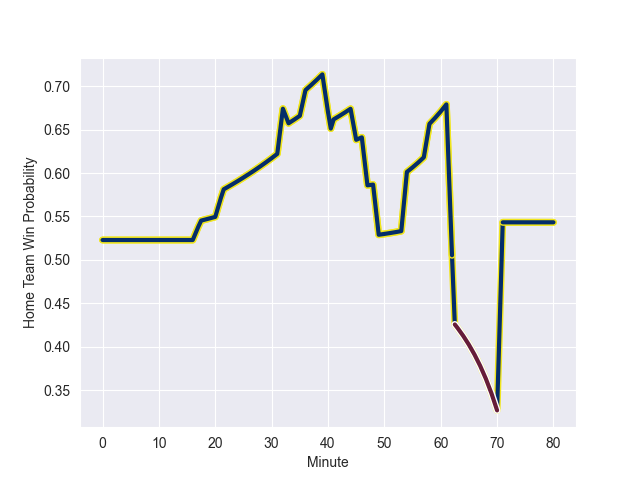

---  
layout: page  
title: Bordeaux Begles at Clermont Auvergne; 23-23  
date: 2022-10-22 21:05:00 18:00:00 -0500  
categories: match review  
---
# Bordeaux Begles (1123.81) at Clermont Auvergne (1164.84); 23-23

# Prediction: Clermont Auvergne by 9.1

Clermont Auvergne by 4.1 on a neutral field
## Scores over Time

## Win Probability over Time

# Pre-Match Prediction: Clermont Auvergne by 7.5

Clermont Auvergne by 2.5 on a neutral pitch

|   Away Minutes | Away Player               |   Away elo |   Away Percentile |   Number |   Home Percentile |   Home elo | Home Player           |   Home Minutes |
|---------------:|:--------------------------|-----------:|------------------:|---------:|------------------:|-----------:|:----------------------|---------------:|
|             49 | Ben Tameifuna             |      81.26 |                88 |        1 |                73 |      69.08 | Etienne Falgoux       |             54 |
|             63 | Maxime Lamothe            |      61.48 |                44 |        2 |                58 |      64    | Yohan Beheregaray     |             59 |
|             49 | Sipili Falatea            |      68.14 |                71 |        3 |                75 |      69.59 | Cristian Ojovan       |             32 |
|             49 | Thomas Jolmes             |      51.78 |                 8 |        4 |                29 |      58.31 | Paul Jedrasiak        |             58 |
|             80 | Cyril Cazeaux             |      76.35 |                83 |        5 |                95 |      96.29 | Sebastien Vahaamahina |             80 |
|             63 | Jandré Marais             |     112.1  |                98 |        6 |                80 |      74.82 | Arthur Iturria        |             80 |
|             80 | Mahamadou Diaby           |      71.41 |                76 |        7 |                21 |      56.6  | Jacobus van Tonder    |             41 |
|             80 | Bastien Vergnes Taillefer |      68.77 |                69 |        8 |                74 |      71.61 | Loic Godener          |             80 |
|             80 | Maxime Lucu               |      84    |                86 |        9 |                90 |      88.88 | Sebastien Bezy        |             80 |
|             80 | Matthieu Jalibert         |      82.03 |                80 |       10 |                76 |      78.04 | Anthony Belleau       |             80 |
|             80 | Madosh Tambwe             |      82.15 |                88 |       11 |                90 |      84.95 | Alivereti Raka        |             80 |
|             58 | Tani Vili                 |      55.73 |                15 |       12 |                75 |      73.72 | Irae Simone           |             80 |
|             80 | Yoram Moefana             |      70.6  |                70 |       13 |                92 |      90.04 | Damian Penaud         |             80 |
|             80 | Santiago Cordero          |      67.01 |                69 |       14 |                83 |      76.3  | Bautista Delguy       |             58 |
|             47 | Romain Buros              |      67.09 |                59 |       15 |                65 |      68.79 | Cheikh Tiberghien     |             74 |
|             33 | Zack Holmes               |      77.67 |                75 |       16 |                61 |      64.67 | Killian Tixeront      |             39 |
|             31 | Kane Douglas              |      85.18 |                89 |       17 |                99 |     112.95 | Davit Kubriashvili    |             48 |
|             31 | Christopher Vaotoa        |      75.34 |                84 |       18 |                68 |      67.38 | Giorgi Beria          |             26 |
|             31 | Jefferson Poirot          |      92.29 |                92 |       19 |                92 |      89.82 | George Moala          |             22 |
|             22 | Pablo Uberti              |      66.91 |                61 |       20 |                89 |      85.39 | Tomas Lavanini        |             22 |
|             17 | Remi Lamerat              |      97.34 |                95 |       21 |                71 |      69.04 | Adrien Pelissie       |             21 |
|             17 | Pablo Dimcheff            |      59.6  |                30 |       22 |                92 |      94.74 | Jules Plisson         |              6 |

