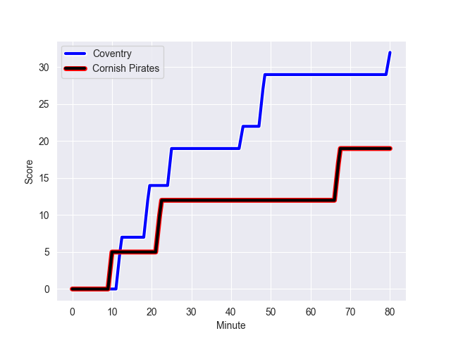
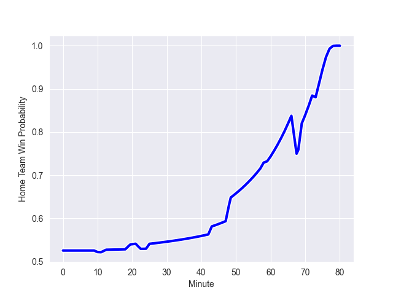

---  
layout: page  
title: Cornish Pirates at Coventry; 19-32  
date: 2022-10-22 16:00:00 18:00:00 -0500  
categories: match review  
---
# Cornish Pirates (906.25) at Coventry (950.67); 19-32

# Prediction: Coventry by 9.4

Coventry by 4.4 on a neutral field
## Scores over Time

## Win Probability over Time

# Pre-Match Prediction: Coventry by 6.1

Coventry by 1.1 on a neutral pitch

|   Away Minutes | Away Player            |   Away elo |   Away Percentile |   Number |   Home Percentile |   Home elo | Home Player           |   Home Minutes |
|---------------:|:-----------------------|-----------:|------------------:|---------:|------------------:|-----------:|:----------------------|---------------:|
|             59 | Marlen Walker          |      55.52 |                14 |        1 |                57 |      63.64 | Toby Trinder          |             80 |
|             60 | William Crane          |      63.57 |                56 |        2 |                31 |      59.27 | Suva Ma'asi           |             80 |
|             59 | Harvey Beaton          |      58.59 |                27 |        3 |                53 |      62.7  | Harry Seward          |             65 |
|             80 | Cory Teague            |      50.76 |                 6 |        4 |                 6 |      49.57 | James Tyas            |             80 |
|             80 | Will Britton           |      52.67 |                10 |        5 |                12 |      54.11 | Fred Betteridge       |             80 |
|             80 | Alex Everett           |      58.42 |                31 |        6 |                66 |      67.04 | Thomas Dodd           |             65 |
|             80 | John Stevens           |      67.26 |                69 |        7 |                42 |      60.7  | Josh Bainbridge       |             80 |
|             60 | Rusiate Tuima          |      54.79 |                15 |        8 |                53 |      63.13 | Senitiki Nayalo       |             44 |
|             69 | Ruaridh Dawson         |      57.99 |                24 |        9 |                99 |     122.95 | Will Chudley          |             80 |
|             80 | Arwel Robson           |      60.04 |                33 |       10 |                36 |      60.71 | Patrick Pellegrini    |             80 |
|             59 | Tom Wyatt              |      59.42 |                35 |       11 |               nan |      60.35 | Shea Cornish          |             55 |
|             80 | Joe Elderkin           |      58.97 |                29 |       12 |                22 |      58.42 | Ollie Betteridge      |             80 |
|             58 | Rory Parata            |      70.92 |                71 |       13 |                31 |      59.38 | Will Rigg             |             73 |
|             80 | Callum Sirker          |      51.62 |                 6 |       14 |                 9 |      53.25 | William Talbot-Davies |             80 |
|             80 | Alexander AJ Cant      |      80.86 |                82 |       15 |                22 |      57.37 | Louis Brown           |             80 |
|             22 | Shae Tucker            |      62.59 |                46 |       16 |                54 |      62.87 | Adam Peters           |             36 |
|             21 | Jack Andrew            |      73.39 |                84 |       17 |                58 |      63.98 | Tom Ball              |             15 |
|             21 | Carwyn Penny           |      60.05 |                34 |       18 |                39 |      60.18 | James Martin          |             25 |
|             21 | Ollie Adkins           |      60    |               nan |       19 |               nan |      60.21 | Ollie Andrews         |             15 |
|             20 | Max Norey              |      59.44 |               nan |       20 |                 5 |      51.37 | Evan Mitchell         |              7 |
|             20 | Sebastian Nagle-Taylor |      60.81 |                38 |       21 |               nan |     nan    | nan                   |            nan |
|             11 | Tom Kessell            |      68.53 |                69 |       22 |               nan |     nan    | nan                   |            nan |

