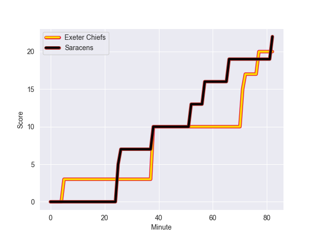
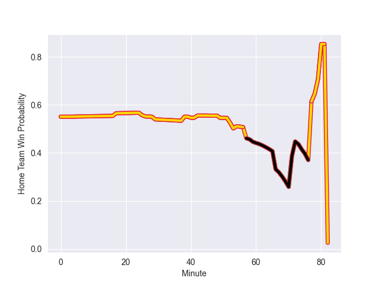

---  
layout: page  
title: Saracens at Exeter Chiefs; 22.0-20.0  
date: 2022-10-22 10:00:00 18:00:00 -0500  
categories: match review  
---
# Saracens (1122.95) at Exeter Chiefs (1210.76); 22.0-20.0

# Prediction: Exeter Chiefs by 13.8

Exeter Chiefs by 8.8 on a neutral field
## Scores over Time

## Win Probability over Time

# Pre-Match Prediction: Exeter Chiefs by 14.9

Exeter Chiefs by 9.9 on a neutral pitch

|   Away Minutes | Away Player        |   Away elo |   Away Percentile |   Number |   Home Percentile |   Home elo | Home Player          |   Home Minutes |
|---------------:|:-------------------|-----------:|------------------:|---------:|------------------:|-----------:|:---------------------|---------------:|
|             82 | Mako Vunipola      |      99.07 |                95 |        1 |                64 |      65.72 | Alec Hepburn         |             46 |
|             61 | Kapeli Pifeleti    |      52.63 |                 5 |        2 |                98 |     107.95 | Luke Cowan-Dickie    |             40 |
|             67 | Christian Judge    |      65.32 |                65 |        3 |                86 |      76.56 | Harry Williams       |             59 |
|             82 | Maro Itoje         |      72.09 |                78 |        4 |                86 |      80.99 | Ruben van Heerden    |             57 |
|             52 | Hugh Tizard        |      64.48 |                59 |        5 |                68 |      67.02 | Jonny Gray           |             82 |
|             64 | Theo McFarland     |      63.8  |                59 |        6 |                99 |     118.63 | Dave Ewers           |             53 |
|             74 | Ben Earl           |      85.84 |                90 |        7 |                29 |      58.08 | Christ Tshiunza      |             82 |
|             82 | Billy Vunipola     |      94.06 |                94 |        8 |                81 |      75.13 | Jacques Vermeulen    |             82 |
|             82 | Ivan van Zyl       |      64.49 |                60 |        9 |                38 |      60.12 | Jack Maunder         |             66 |
|             61 | Owen Farrell       |     107.84 |                96 |       10 |                16 |      57.31 | Harvey Skinner       |             82 |
|             75 | Alex Lewington     |      78.95 |                86 |       11 |                97 |     101.1  | Olly Woodburn        |             82 |
|             82 | Nick Tompkins      |      77.52 |                80 |       12 |                95 |      95.89 | Ian Whitten          |             82 |
|             82 | Alex Lozowski      |      68.33 |                66 |       13 |                94 |      94.7  | Henry Slade          |             82 |
|             82 | Max Malins         |      67.15 |                69 |       14 |                98 |     103.58 | Jack Nowell          |             82 |
|             82 | Elliot Daly        |      68.17 |                65 |       15 |                62 |      68.16 | Stuart Hogg          |             42 |
|             21 | Theo Dan           |      60.45 |               nan |       16 |                95 |      99.16 | Jack Yeandle         |             42 |
|              7 | James Flynn        |      60.44 |               nan |       17 |                60 |      64.85 | Josh Iosefa-Scott    |             36 |
|             15 | Alec Clarey        |      59.52 |                30 |       18 |                61 |      65.8  | Patrick Schickerling |             23 |
|             30 | Callum Hunter-Hill |      51.33 |                 7 |       19 |                53 |      62.7  | Jack Dunne           |             25 |
|             18 | Andy Christie      |      63.58 |                56 |       20 |                76 |      74.32 | Sam Simmonds         |             29 |
|              8 | Jackson Wray       |     100.98 |                96 |       21 |                 7 |      52.67 | Sam Maunder          |             16 |
|              0 | Ruben de Haas      |      54.01 |               nan |       22 |                88 |      89.51 | Joe Simmonds         |             40 |
|             21 | Alex Goode         |      97.03 |                95 |       23 |                84 |      81.36 | Rory O'Loughlin      |              0 |

