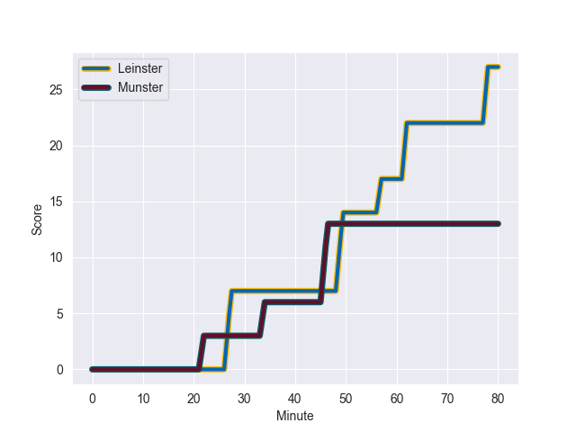
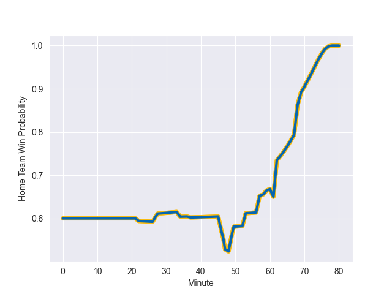

---  
layout: page  
title: Munster at Leinster; 13-27  
date: 2022-10-22 18:15:00 18:00:00 -0500  
categories: match review  
---
# Munster (1066.04) at Leinster (1243.02); 13-27

# Prediction: Leinster by 22.7

Leinster by 17.7 on a neutral field
## Scores over Time

## Win Probability over Time

# Pre-Match Prediction: Leinster by 23.7

Leinster by 18.7 on a neutral pitch

|   Away Minutes | Away Player      |   Away elo |   Away Percentile |   Number |   Home Percentile |   Home elo | Home Player       |   Home Minutes |
|---------------:|:-----------------|-----------:|------------------:|---------:|------------------:|-----------:|:------------------|---------------:|
|             80 | Jeremy Loughman  |      74.36 |                84 |        1 |                98 |     109.19 | Cian Healy        |             47 |
|             80 | Diarmuid Barron  |      72.34 |                78 |        2 |                70 |      67.54 | Dan Sheehan       |             79 |
|             61 | Keynan Knox      |      60.43 |                39 |        3 |                82 |      73.33 | Michael Alaalatoa |             70 |
|             48 | Jean Kleyn       |      65.52 |                62 |        4 |                83 |      76.89 | Jason Jenkins     |             66 |
|             80 | Thomas Ahern     |      68.52 |                70 |        5 |                88 |      83.13 | James Ryan        |             80 |
|             80 | Jack O'Donoghue  |      75.46 |                81 |        6 |                80 |      75.94 | Max Deegan        |             53 |
|             68 | John Hodnett     |      65.63 |                66 |        7 |                71 |      68.13 | Scott Penny       |             80 |
|             53 | Gavin Coombes    |      70.29 |                73 |        8 |                92 |      90.56 | Caelan Doris      |             80 |
|             69 | Conor Murray     |     104.15 |                96 |        9 |                88 |      87.99 | Luke McGrath      |             72 |
|             53 | Joey Carbery     |      64.6  |                57 |       10 |                99 |     119.88 | Johnny Sexton     |             80 |
|             80 | Liam Coombes     |      62.93 |                55 |       11 |                49 |      63.23 | Jamie Osborne     |             37 |
|             80 | Rory Scannell    |      74.45 |                77 |       12 |                99 |     112.43 | Robbie Henshaw    |             80 |
|             80 | Dan Goggin       |      72.69 |                73 |       13 |                82 |      79.29 | Garry Ringrose    |             80 |
|             80 | Shane Daly       |      79.79 |                82 |       14 |                77 |      76.64 | Jimmy O'Brien     |             80 |
|             80 | Jack Crowley     |      60.53 |                32 |       15 |                67 |      68.92 | Ciaran Frawley    |             59 |
|             21 | Jack O'Sullivan  |      69.87 |                72 |       16 |                31 |      58.71 | Rob Russell       |             43 |
|             27 | Patrick Campbell |      54.2  |                11 |       17 |                69 |      67.28 | Andrew Porter     |             33 |
|             27 | Ben Healy        |      53.37 |                 7 |       18 |                97 |     102.4  | Jack Conan        |             27 |
|             19 | Dave Kilcoyne    |     103.34 |                96 |       19 |                78 |      80.38 | Ross Byrne        |             21 |
|             12 | Ruadhan Quinn    |      59.76 |               nan |       20 |                91 |      87.77 | Ross Molony       |             14 |
|             11 | Paddy Patterson  |      59.24 |                39 |       21 |               nan |      60    | Tom Clarkson      |             10 |
|             11 | Scott Buckley    |      60.44 |                49 |       22 |                61 |      63.48 | Nick McCarthy     |              8 |
|            nan | nan              |     nan    |               nan |       23 |               nan |      59.28 | John McKee        |              1 |

