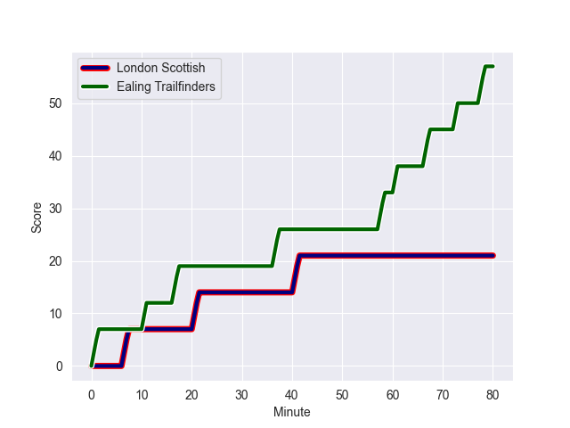
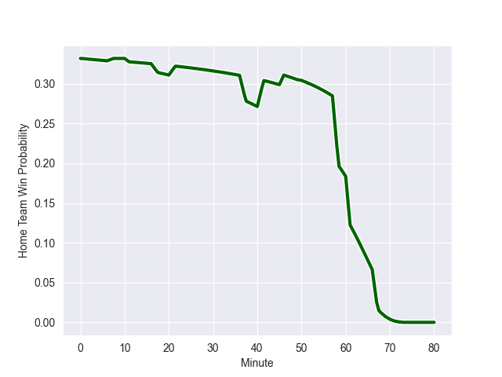

---  
layout: page  
title: Ealing Trailfinders at London Scottish; 57-21  
date: 2022-10-22 16:00:00 18:00:00 -0500  
categories: match review  
---
# Ealing Trailfinders (1087.32) at London Scottish (791.31); 57-21

# Prediction: Ealing Trailfinders by 24.6

Ealing Trailfinders by 29.6 on a neutral field
## Scores over Time

## Win Probability over Time

# Pre-Match Prediction: Ealing Trailfinders by 22.3

Ealing Trailfinders by 27.3 on a neutral pitch

|   Away Minutes | Away Player         |   Away elo |   Away Percentile |   Number |   Home Percentile |   Home elo | Home Player       |   Home Minutes |
|---------------:|:--------------------|-----------:|------------------:|---------:|------------------:|-----------:|:------------------|---------------:|
|             50 | Kyle John Whyte     |      74.94 |                86 |        1 |                36 |      59.37 | Jordan Els        |             59 |
|             74 | Shaun Malton        |      84.96 |                92 |        2 |                 7 |      53.22 | Austin Wallis     |             69 |
|             50 | Ross Kane           |      60    |               nan |        3 |                 0 |      37.64 | Joe Rees          |             46 |
|             80 | Bobby de Wee        |      90.21 |                94 |        4 |                42 |      60.25 | Angus Southon     |             62 |
|             62 | Barney Maddison     |      67.45 |                71 |        5 |                12 |      53.45 | Matt Wilkinson    |             80 |
|             46 | Callum Chick        |      51.65 |                 9 |        6 |                 3 |      45.35 | Brian Tuilagi     |             80 |
|             46 | Carlo Tizzano       |      63.17 |                59 |        7 |                16 |      54.14 | Will Trenholm     |             80 |
|             80 | Ryan Smid           |      86.18 |                92 |        8 |                 2 |      43.97 | Cameron King      |             73 |
|             50 | Ollie Fox           |      46.06 |                 1 |        9 |                 4 |      50.95 | Luca Petrozzi     |             73 |
|             80 | Craig Willis        |      86.11 |                87 |       10 |                 1 |      49.54 | Harry Sheppard    |             80 |
|             80 | Luke Daniels        |      68.16 |                74 |       11 |               nan |      60    | Olufemi Sofolarin |             59 |
|             80 | Steve Shingler      |      70.2  |                72 |       12 |                29 |      58.5  | Bryn Bradley      |             55 |
|             69 | Reuben Bird-Tulloch |      45.97 |                 3 |       13 |                 9 |      51.53 | Theo Manihera     |             80 |
|             80 | Jonah Holmes        |     100.73 |                97 |       14 |                40 |      59.84 | Cassius Cleaves   |             80 |
|             80 | David Johnston      |      77.06 |                78 |       15 |                 5 |      50.24 | Cameron Anderson  |             80 |
|             34 | Rob Farrar          |      60.21 |                42 |       16 |                44 |      59.43 | William Hobson    |             34 |
|             34 | Simon Uzokwe        |      73.68 |                82 |       17 |                56 |      62.84 | Oscar Beard       |             25 |
|             30 | George Davis        |      62.17 |                47 |       18 |                 0 |      34.26 | Noah Ferdinand    |             21 |
|             30 | Jordan Burns        |      71.63 |                77 |       19 |                 9 |      52.38 | Maurice Nwakor    |             21 |
|             30 | Jimmy Roots         |      59.18 |                22 |       20 |               nan |      59.84 | Daniel Lewis      |             18 |
|             18 | Daniel Cutmore      |      66.25 |                68 |       21 |               nan |      60    | Calum Scott       |             11 |
|             11 | Max Bodilly         |      74.34 |                79 |       22 |                13 |      54.4  | Dan Cuthbert      |              7 |
|              6 | Cameron Terry       |      61.8  |                44 |       23 |                 1 |      45.74 | Ed Hoadley        |              7 |

