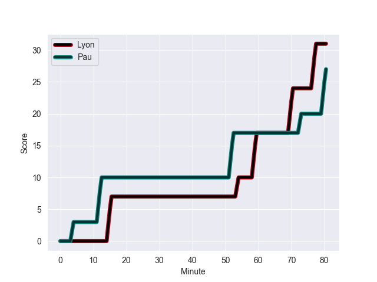
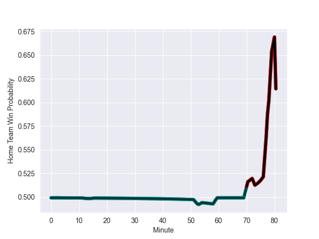

---  
layout: page  
title: Pau at Lyon; 27-31  
date: 2022-10-22 17:00:00 18:00:00 -0500  
categories: match review  
---
# Pau (1104.61) at Lyon (1103.14); 27-31

# Prediction: Lyon by 4.9

Pau by 0.1 on a neutral field
## Scores over Time

## Win Probability over Time

# Pre-Match Prediction: Pau by 4.7

Pau by 0.3 on a neutral pitch

|   Away Minutes | Away Player         |   Away elo |   Away Percentile |   Number |   Home Percentile |   Home elo | Home Player            |   Home Minutes |
|---------------:|:--------------------|-----------:|------------------:|---------:|------------------:|-----------:|:-----------------------|---------------:|
|             53 | Siegfried Fisi'ihoi |      73.28 |                81 |        1 |                 0 |      40.15 | Jerome Rey             |             49 |
|             69 | Youri Delhommel     |      70.59 |                75 |        2 |                97 |     106.61 | Liam Coltman           |             49 |
|             56 | Siate Tokolahi      |      77.58 |                86 |        3 |                56 |      63.43 | Feao Fotuaika          |             47 |
|             80 | Steven Cummins      |      59.4  |                37 |        4 |                68 |      68.04 | Killian Geraci         |             47 |
|             53 | Fabrice Metz        |      83.1  |                88 |        5 |                58 |      64.03 | Temo Mayanavanua       |             80 |
|             41 | Thibault Hamonou    |      50.34 |                 6 |        6 |                74 |      71.35 | Dylan Cretin           |             60 |
|             80 | Luke Whitelock      |      94.78 |                95 |        7 |                99 |     113.4  | Arno Botha             |             80 |
|             80 | Beka Gorgadze       |      64.64 |                57 |        8 |                89 |      84.25 | Jordan Taufua          |             53 |
|             56 | Thibault Daubagna   |      83.94 |                86 |        9 |                87 |      85.98 | Baptiste Couilloud     |             53 |
|             78 | Zack Henry          |      89.41 |                87 |       10 |                51 |      63.46 | Leo Berdeu             |             80 |
|             80 | Clement Laporte     |      86.76 |                89 |       11 |                80 |      72.99 | Ethan Dumortier        |             80 |
|             80 | Jale Vatubua        |      65.19 |                56 |       12 |                65 |      68.13 | Kyle Godwin            |             80 |
|             80 | Émilien Gailleton   |      71.57 |                72 |       13 |                26 |      58.22 | Thibault Regard        |             80 |
|             74 | Daniel Ikpefan      |      70.31 |                75 |       14 |                46 |      61.37 | Tavite Veredamu        |             41 |
|             80 | Jack Maddocks       |      68.8  |                72 |       15 |                54 |      65.06 | Davit Niniashvili      |             80 |
|             39 | Martin Puech        |      79.04 |                86 |       16 |                97 |     101.17 | Josua Tuisova Ratulevu |             39 |
|             27 | Lekima Tagitagivalu |      65.27 |                66 |       17 |                24 |      60.42 | Paulo Tafili           |             33 |
|             27 | Remi Seneca         |      72.69 |                83 |       18 |                96 |     100.94 | Romain Taofifenua      |             33 |
|             24 | Guram Papidze       |      50.02 |                 5 |       19 |                16 |      57.18 | Guillaume Marchand     |             31 |
|             24 | Clovis Le bail      |      71.17 |                77 |       20 |                 4 |      50.37 | Hamza Kaabeche         |             31 |
|             11 | Ignacio Calles      |      74.24 |                80 |       21 |                98 |     105.18 | Jean-Marc Doussain     |             27 |
|              2 | Thibault Debaes     |      63.56 |                54 |       22 |                29 |      60.27 | Maxime Gouzou          |             27 |
|              6 | Yvan Reilhac        |      61.94 |                42 |       23 |                85 |      78.28 | Felix Lambey           |             20 |

