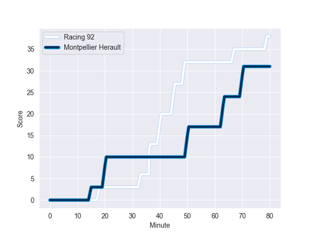
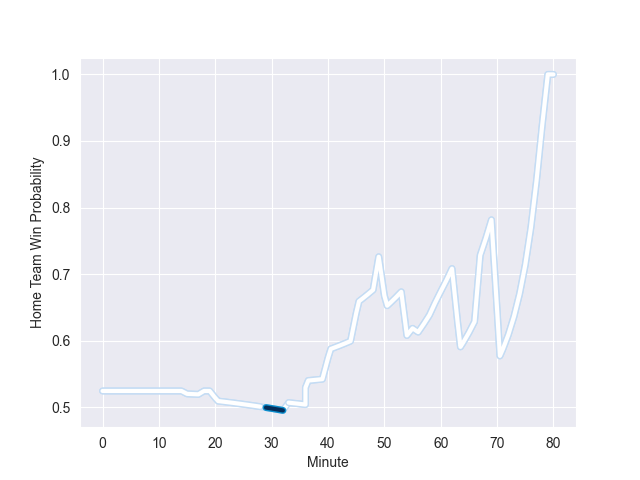

---  
layout: page  
title: Montpellier Herault at Racing 92; 31-38  
date: 2022-10-22 15:00:00 18:00:00 -0500  
categories: match review  
---
# Montpellier Herault (1094.05) at Racing 92 (1136.71); 31-38

# Prediction: Racing 92 by 9.3

Racing 92 by 4.3 on a neutral field
## Scores over Time

## Win Probability over Time

# Pre-Match Prediction: Racing 92 by 7.4

Racing 92 by 2.4 on a neutral pitch

|   Away Minutes | Away Player          |   Away elo |   Away Percentile |   Number |   Home Percentile |   Home elo | Home Player         |   Home Minutes |
|---------------:|:---------------------|-----------:|------------------:|---------:|------------------:|-----------:|:--------------------|---------------:|
|             59 | Simon-Pierre Chauvac |      69.93 |                75 |        1 |                97 |     105.55 | Eddy Ben Arous      |             50 |
|             50 | Vincent Giudicelli   |      64.73 |                63 |        2 |                10 |      55.23 | Janick Tarrit       |             50 |
|             50 | Mohamed Haouas       |      68.93 |                76 |        3 |                61 |      64.65 | Cedate Gomes Sa     |             50 |
|             80 | Florian Verhaeghe    |      72.15 |                78 |        4 |                67 |      66.41 | Boris Palu          |             50 |
|             72 | Paul Willemse        |      96.49 |                95 |        5 |                 1 |      41.62 | Fabien Sanconnie    |             80 |
|             56 | Romain Macurdy       |      54.84 |                14 |        6 |                93 |      92.49 | Wenceslas Lauret    |             80 |
|             80 | Yacouba Camara       |      78.22 |                85 |        7 |                69 |      67.48 | Baptiste Chouzenoux |             73 |
|             80 | Zach Mercer          |      63.88 |                55 |        8 |                77 |      74.84 | Kitione Kamikamica  |             80 |
|             54 | Cobus Reinach        |      96.06 |                93 |        9 |                56 |      63.9  | Nolann Le Garrec    |             73 |
|             80 | Louis Carbonel       |      74.44 |                73 |       10 |                80 |      82.52 | Finn Russell        |             80 |
|             60 | Ben Lam              |      84.46 |                90 |       11 |                97 |     101.62 | Juan Imhoff         |             80 |
|             80 | Paolo Garbisi        |      67.95 |                65 |       12 |                97 |     103.78 | Gael Fickou         |             80 |
|             73 | Thomas Darmon        |      44.23 |                 2 |       13 |                93 |      91.37 | Francis Saili       |             59 |
|             80 | Gabriel Ngandebe     |      58.04 |                27 |       14 |                39 |      60.03 | Donovan Taofifenua  |             80 |
|             80 | Anthony Bouthier     |      96.71 |                94 |       15 |                27 |      57.99 | Max Spring          |             80 |
|             30 | Brandon Paenga-Amosa |      73.15 |                79 |       16 |                82 |      72.24 | Guram Gogichashvili |             30 |
|             30 | Titi Lamositele      |      72.66 |                81 |       17 |                94 |      96.03 | Trevor Nyakane      |             30 |
|             26 | Léo Coly             |      73.83 |                80 |       18 |                71 |      68.68 | Camille Chat        |             30 |
|             24 | Clément Doumenc      |      82.69 |                88 |       19 |                73 |      69.57 | Cameron Woki        |             30 |
|             21 | Enzo Forletta        |      71.71 |                79 |       20 |                97 |     100.07 | Henry Chavancy      |             21 |
|             20 | Julien Tisseron      |      81.59 |                84 |       21 |                50 |      62.23 | Antoine Gibert      |              7 |
|              8 | Tyler Duguid         |      53.33 |                13 |       22 |                49 |      62.79 | Maxime Baudonne     |              7 |
|              7 | Pierre Lucas         |      65.8  |                59 |       23 |               nan |     nan    | nan                 |            nan |

