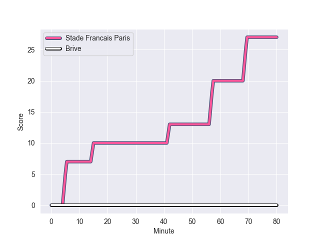
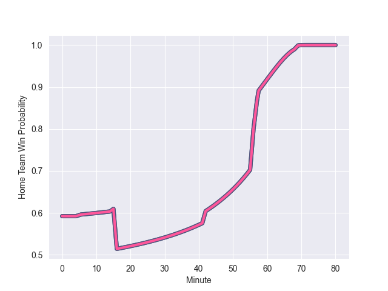

---  
layout: page  
title: Brive at Stade Francais Paris; 0-27  
date: 2022-10-22 17:00:00 18:00:00 -0500  
categories: match review  
---
# Brive (962.88) at Stade Francais Paris (1124.72); 0-27

# Prediction: Stade Francais Paris by 21.2

Stade Francais Paris by 16.2 on a neutral field
## Scores over Time

## Win Probability over Time

# Pre-Match Prediction: Stade Francais Paris by 16.9

Stade Francais Paris by 11.9 on a neutral pitch

|   Away Minutes | Away Player           |   Away elo |   Away Percentile |   Number |   Home Percentile |   Home elo | Home Player             |   Home Minutes |
|---------------:|:----------------------|-----------:|------------------:|---------:|------------------:|-----------:|:------------------------|---------------:|
|             48 | Malino Vanai          |      72.53 |                81 |        1 |                55 |      65.3  | Moses Alo-Emile         |             55 |
|             43 | Lucas da Silva        |      64    |                62 |        2 |                84 |      77.11 | Mickael Ivaldi          |             59 |
|             48 | Pietro Ceccarelli     |      69.46 |                74 |        3 |                66 |      67.96 | Nemo Roelofse           |             20 |
|             80 | Andres Zafra Tarazona |      49.5  |                 8 |        4 |                70 |      68.02 | Paul Gabrillagues       |             55 |
|              3 | Lucas Paulos          |      68.91 |                72 |        5 |                37 |      62.98 | JJ van der Mescht       |             43 |
|             80 | Esteban Abadie        |      53.49 |                11 |        6 |                50 |      63.42 | Julien Ory              |             16 |
|             80 | Sasha Gue             |      56.99 |                22 |        7 |                55 |      62.95 | Romain Briatte          |             80 |
|             50 | Abraham Papali'i      |      67.61 |                66 |        8 |                87 |      81.29 | Sekou Macalou           |             80 |
|             80 | Leo Carbonneau        |      60    |               nan |        9 |                46 |      61.7  | Arthur Coville          |             49 |
|             56 | Tom Raffy             |      59.41 |                33 |       10 |                90 |      92.51 | Joris Segonds           |             80 |
|             80 | Axel Muller           |      82.22 |                88 |       11 |                94 |      90.76 | Harry Glover            |             80 |
|             56 | Sammy Arnold          |      71.89 |                72 |       12 |                77 |      75.86 | Julien Delbouis         |             80 |
|             80 | Seta Tuicuvu          |      64.15 |                60 |       13 |                93 |      92.52 | Sefa Naivalu            |             57 |
|             80 | Aaron Grandidier      |      63.75 |                58 |       14 |                35 |      59.36 | Nadir Megdoud           |             80 |
|             49 | Joris Jurand          |      67.99 |                65 |       15 |                64 |      67.77 | Leo Barre               |             80 |
|             77 | Oskar Rixen           |      60.78 |                42 |       16 |                96 |     102.43 | Giovanni Habel-Kueffner |             64 |
|             24 | Guillaume Galletier   |      58.55 |                27 |       17 |                82 |      73.75 | Giorgi Melikidze        |             60 |
|             32 | Wesley Tapueluelu     |      62.35 |                54 |       18 |                74 |      70.32 | Baptiste Pesenti        |             37 |
|             32 | Marcel van der Merwe  |      95.9  |                94 |       19 |                83 |      79.67 | James Hall              |             31 |
|             31 | Mathis Ferté          |      53.07 |               nan |       20 |                76 |      70.24 | Clement Castets         |             25 |
|             30 | Mesu Kunavula         |      57.28 |                23 |       21 |                63 |      65.73 | Mathieu de Giovanni     |             25 |
|             24 | Tanguy Lacoste        |      56.01 |               nan |       22 |                48 |      63.18 | Laurent Panis           |             21 |
|             37 | Florian Dufour        |      79.09 |                86 |       23 |                55 |      65.12 | Jeremy Ward             |             23 |

