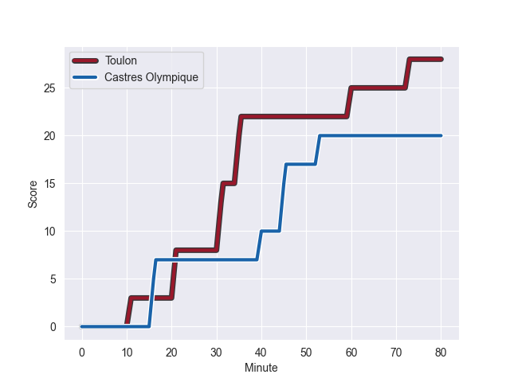
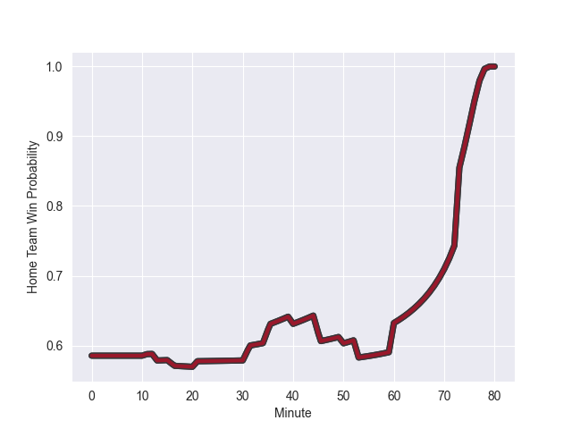

---  
layout: page  
title: Castres Olympique at Toulon; 20-28  
date: 2022-10-22 17:00:00 18:00:00 -0500  
categories: match review  
---
# Castres Olympique (1052.54) at Toulon (1197.56); 20-28

# Prediction: Toulon by 19.5

Toulon by 14.5 on a neutral field
## Scores over Time

## Win Probability over Time

# Pre-Match Prediction: Toulon by 20.2

Toulon by 15.2 on a neutral pitch

|   Away Minutes | Away Player                |   Away elo |   Away Percentile |   Number |   Home Percentile |   Home elo | Home Player                    |   Home Minutes |
|---------------:|:---------------------------|-----------:|------------------:|---------:|------------------:|-----------:|:-------------------------------|---------------:|
|             50 | Antoine Tichit             |      63.5  |                59 |        1 |                91 |      84.9  | Jean-Baptiste Gros             |             13 |
|             50 | Paula Ngauamo              |      99.54 |                97 |        2 |                19 |      57.36 | Teddy Baubigny                 |             54 |
|             50 | Wilfrid Hounkpatin         |      69.03 |                75 |        3 |                78 |      70.27 | Beka Gigashvili                |             54 |
|             50 | Florent Vanverberghe       |      66.3  |                65 |        4 |                60 |      63.44 | Swan Rebbadj                   |             80 |
|             50 | Theo Hannoyer              |      58.93 |                36 |        5 |                87 |      80.22 | Brian Alainu'uese              |             80 |
|             80 | Mathieu Babillot           |      61.32 |                46 |        6 |                98 |     104.61 | Raphael Lakafia                |             65 |
|             50 | Josaia Raisuqe             |      69.14 |                78 |        7 |                90 |      84.11 | Facundo Isa                    |             54 |
|             80 | Nick Champion de Crespigny |      63.48 |                60 |        8 |                97 |     105.99 | Sergio Parisse                 |             80 |
|             58 | Santiago Arata             |      66.6  |                68 |        9 |                94 |      94.67 | Benoit Paillaugue              |             54 |
|             60 | Louis Le Brun              |      58.29 |                26 |       10 |                71 |      70.16 | Ihaia West                     |             80 |
|             80 | Antoine Zeghdar            |      60.67 |                60 |       11 |                19 |      56.52 | Jiuta Wainiqolo                |             80 |
|             80 | Adrien Seguret             |      55.8  |                15 |       12 |                71 |      68.88 | Duncan Paia'aua                |             80 |
|             80 | Thomas Combezou            |      95.72 |                95 |       13 |                93 |      89.12 | Waisea Nayacalevu Vuidravuwalu |             79 |
|             80 | Geoffrey Palis             |      92.18 |                95 |       14 |                99 |     116.3  | Cheslin Kolbe                  |             80 |
|             80 | Thomas Larregain           |      64.67 |                65 |       15 |                60 |      66.59 | Aymeric Luc                    |             70 |
|             30 | Aurélien Azar              |      56.83 |                19 |       16 |                51 |      62.19 | Dany Priso                     |             67 |
|             30 | Teariki Ben-Nicholas       |      76.1  |                83 |       17 |                95 |      99.33 | Mathieu Bastareaud             |             26 |
|             30 | Leone Nakarawa             |     103.66 |                97 |       18 |                89 |      78.42 | Anthony Etrillard              |             26 |
|             30 | Kevin Kornath              |      51.56 |                 9 |       19 |                84 |      71.18 | Emerick Setiano                |             26 |
|             30 | Quentin Walcker            |      55.82 |                15 |       20 |                78 |      70.82 | Baptiste Serin                 |             26 |
|             30 | Pierre Colonna             |      59.93 |               nan |       21 |                97 |      97.33 | Sitaleki Timani                |             15 |
|             22 | Julien Blanc               |      76.89 |                84 |       22 |                76 |      73.24 | Thomas Salles                  |             10 |
|             20 | Ben Botica                 |     110.28 |                98 |       23 |                39 |      61.02 | Jérémy Sinzelle                |              1 |

