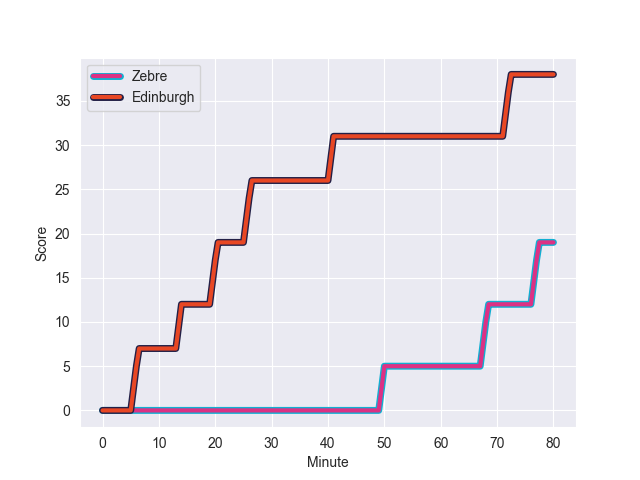
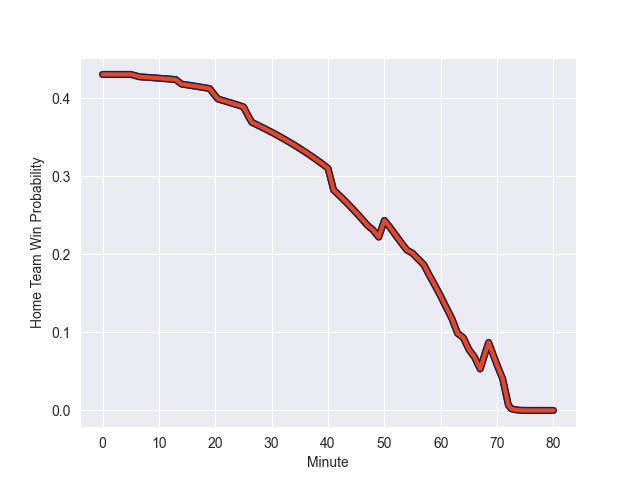

---  
layout: page  
title: Edinburgh at Zebre; 38-19  
date: 2022-10-22 14:00:00 18:00:00 -0500  
categories: match review  
---
# Edinburgh (1031.81) at Zebre (911.29); 38-19

# Prediction: Edinburgh by 7.1

Edinburgh by 12.1 on a neutral field
## Scores over Time

## Win Probability over Time

# Pre-Match Prediction: Edinburgh by 5.0

Edinburgh by 10.0 on a neutral pitch

|   Away Minutes | Away Player       |   Away elo |   Away Percentile |   Number |   Home Percentile |   Home elo | Home Player            |   Home Minutes |
|---------------:|:------------------|-----------:|------------------:|---------:|------------------:|-----------:|:-----------------------|---------------:|
|             53 | Boan Venter       |      71.13 |                78 |        1 |                40 |      60.7  | Juan Manuel Pitinari   |             52 |
|             61 | Adam McBurney     |      59.49 |                33 |        2 |                 2 |      49.55 | Marco Manfredi         |             57 |
|             53 | Luan de Bruin     |      65.57 |                64 |        3 |                33 |      59.31 | Ion Neculai            |             54 |
|             80 | Jamie Hodgson     |      61.53 |                46 |        4 |                80 |      74.01 | David Sisi             |             63 |
|             80 | Sam Skinner       |      82.82 |                88 |        5 |                26 |      57.71 | Leonard Krumov         |             80 |
|             66 | Nick Haining      |      81.76 |                87 |        6 |                40 |      59.72 | Luca Andreani          |             80 |
|             55 | Luke Crosbie      |      80.25 |                86 |        7 |                 9 |      52.97 | MJ Pelser              |             80 |
|             80 | Viliame Mata      |      67.9  |                67 |        8 |                54 |      63.34 | Taina Fox-Matamua      |             61 |
|             80 | Charlie Shiel     |      68.67 |                74 |        9 |                35 |      59.37 | Alessandro Fusco       |             80 |
|             56 | Jaco van der Walt |      79.92 |                78 |       10 |                56 |      64.82 | Tiff Eden              |             58 |
|             56 | Emiliano Boffelli |      54.36 |                12 |       11 |                37 |      59.96 | Jacopo Trulla          |             80 |
|             80 | Chris Dean        |      64.81 |                62 |       12 |                 4 |      48.98 | Damiano Mazza          |             80 |
|             80 | Matt Currie       |      63.35 |                49 |       13 |                48 |      63.14 | Tommaso Boni           |             64 |
|             80 | Wes Goosen        |      73.5  |                81 |       14 |                58 |      63.78 | Pierre Bruno           |             80 |
|             80 | Henry Immelman    |      63.43 |                49 |       15 |                50 |      63.57 | Lorenzo Pani           |             48 |
|             27 | Angus Williams    |      65.97 |                66 |       16 |                68 |      70.45 | Richard Kriel          |             32 |
|             27 | Nick Auterac      |      94.37 |               nan |       17 |                29 |      58.93 | Luca Rizzoli           |             28 |
|             25 | Ben Muncaster     |      61.61 |                55 |       18 |                45 |      61.49 | Muhamed Hasa           |             26 |
|             24 | Charlie Savala    |      61.02 |                52 |       19 |                53 |      63.35 | Giampietro Ribaldi     |             23 |
|             24 | Damien Hoyland    |      61.98 |                49 |       20 |                40 |      61.27 | Geronimo Prisciantelli |             22 |
|             19 | Harrison Courtney |      60    |               nan |       21 |                51 |      61.91 | Gabriele Venditti      |             19 |
|             14 | Pierce Phillips   |      49.94 |                 6 |       22 |                17 |      55.31 | Andrea Zambonin        |             17 |
|            nan | nan               |     nan    |               nan |       23 |                98 |     107.41 | Chris Cook             |             16 |

