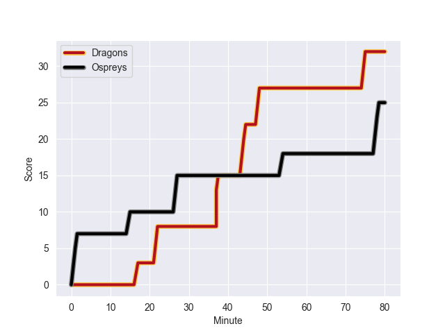
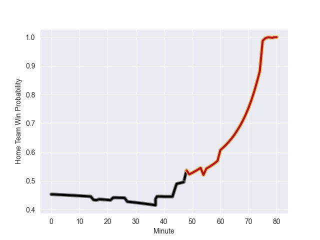

---  
layout: page  
title: Ospreys at Dragons; 25-32  
date: 2022-10-23 16:00:00 18:00:00 -0500  
categories: match review  
---
# Ospreys (1053.23) at Dragons (997.33); 25-32

# Prediction: Ospreys by 0.6

Ospreys by 5.6 on a neutral field
## Scores over Time

## Win Probability over Time

# Pre-Match Prediction: Ospreys by 0.4

Ospreys by 5.4 on a neutral pitch

|   Away Minutes | Away Player            |   Away elo |   Away Percentile |   Number |   Home Percentile |   Home elo | Home Player       |   Home Minutes |
|---------------:|:-----------------------|-----------:|------------------:|---------:|------------------:|-----------:|:------------------|---------------:|
|             49 | Gareth Thomas          |      50.67 |                 5 |        1 |               nan |      87.27 | Rhodri Jones      |             59 |
|             15 | Dewi Lake              |      57.69 |                18 |        2 |                14 |      56.82 | Bradley Roberts   |             68 |
|             60 | Tomas Francis          |      86.74 |                91 |        3 |                80 |      71.89 | Lloyd Fairbrother |             63 |
|             80 | Adam Beard             |      65.57 |                62 |        4 |                34 |      58.98 | Ben Carter        |             80 |
|             60 | Alun Wyn Jones         |      90.86 |                93 |        5 |                19 |      56.26 | Will Rowlands     |             77 |
|             49 | Ethan Roots            |      55.67 |                17 |        6 |                81 |      76.15 | Aaron Wainwright  |             80 |
|             60 | Jac Morgan             |      69.91 |                74 |        7 |                 0 |      30.24 | Harrison Keddie   |             66 |
|             80 | Morgan Morris          |      44.14 |                 2 |        8 |                69 |      69.28 | Ross Moriarty     |             80 |
|             40 | Rhys Webb              |      89.5  |                91 |        9 |                60 |      64.48 | Gonzalo Bertranou |             60 |
|             80 | Jack Walsh             |      58.63 |                21 |       10 |                90 |      91.83 | JJ Hanrahan       |             80 |
|             80 | Luke Morgan            |      51.5  |                 6 |       11 |                21 |      56.98 | Jared Rosser      |             80 |
|             80 | Michael Collins        |      76.8  |                79 |       12 |                87 |      84.09 | Jack Dixon        |             63 |
|             80 | Owen Watkin            |      85.29 |                89 |       13 |                71 |      69.37 | Steffan Hughes    |             77 |
|             55 | George North           |     105.82 |                98 |       14 |                 3 |      47.46 | Rio Dyer          |             80 |
|             80 | Max Nagy               |      63.62 |                50 |       15 |                73 |      74.82 | Sam Davies        |             80 |
|             65 | Scott Baldwin          |      89.85 |                92 |       16 |                60 |      64.47 | Aki Seiuli        |             21 |
|             40 | Reuben Morgan-Williams |      60.67 |                41 |       17 |                93 |      95.46 | Rhodri Williams   |             20 |
|             31 | Nicky Smith            |      66.48 |                67 |       18 |                27 |      58.03 | Chris Coleman     |             17 |
|             31 | Justin Tipuric         |      86.28 |                90 |       19 |                67 |      68.86 | Max Clark         |             17 |
|             25 | Joe Hawkins            |      60.93 |                36 |       20 |                 6 |      51.35 | Sean Lonsdale     |             14 |
|             20 | Dan Lydiate            |      78.37 |                83 |       21 |                77 |      71.53 | Elliot Dee        |             12 |
|             20 | Rhys Davies            |      61.52 |                45 |       22 |                56 |      65.22 | Aneurin Owen      |              3 |
|             20 | Tom Botha              |      48.23 |                 3 |       23 |                29 |      58.17 | Joseph Davies     |              3 |

