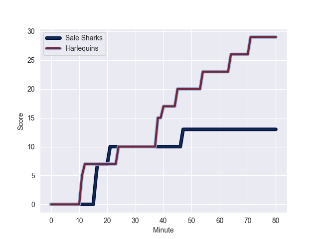
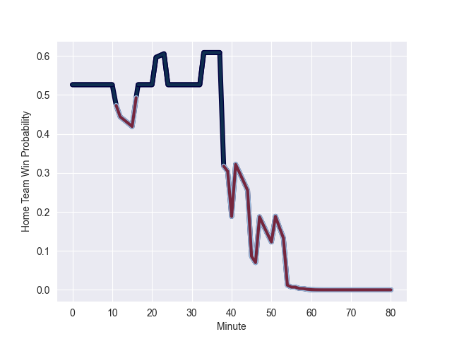

---  
layout: page  
title: Harlequins at Sale Sharks; 29.0-13.0  
date: 2022-10-23 10:00:00 18:00:00 -0500  
categories: match review  
---
# Harlequins (1140.51) at Sale Sharks (1186.09); 29.0-13.0

# Prediction: Sale Sharks by 9.6

Sale Sharks by 4.6 on a neutral field
## Scores over Time

## Win Probability over Time

# Pre-Match Prediction: Sale Sharks by 9.1

Sale Sharks by 4.1 on a neutral pitch

|   Away Minutes | Away Player           |   Away elo |   Away Percentile |   Number |   Home Percentile |   Home elo | Home Player       |   Home Minutes |
|---------------:|:----------------------|-----------:|------------------:|---------:|------------------:|-----------:|:------------------|---------------:|
|             75 | Joe Marler            |      98.33 |                95 |        1 |                86 |      76.36 | Bevan Rodd        |             51 |
|             66 | Jack Musk             |      67.17 |                69 |        2 |                34 |      59.8  | Ewan Ashman       |             51 |
|             66 | Wilco Louw            |      87.77 |                91 |        3 |                30 |      59.07 | Nic Schonert      |             65 |
|             33 | Dino Lamb             |      70.63 |                75 |        4 |                81 |      74.88 | Cobus Wiese       |             80 |
|             80 | Irne Herbst           |      71.64 |                77 |        5 |                69 |      67.36 | Jonny Hill        |             80 |
|             70 | Jack Kenningham       |      75.94 |                83 |        6 |                98 |     104.72 | Jono Ross         |             51 |
|             80 | Will Evans            |      62.41 |                52 |        7 |                77 |      71.85 | Tom Curry         |             65 |
|             58 | Archie White          |      60.46 |                37 |        8 |                92 |      89.18 | Daniel du Preez   |             80 |
|             79 | Danny Care            |     119.83 |                99 |        9 |                65 |      66.54 | Raffi Quirke      |             80 |
|             80 | Marcus Smith          |      88.04 |                86 |       10 |                68 |      70.3  | Robert du Preez   |             80 |
|             80 | Cadan Murley          |      65.51 |                64 |       11 |                93 |      89.92 | Tom O'Flaherty    |             71 |
|             80 | Andre Esterhuizen     |      72.79 |                74 |       12 |                99 |     112.32 | Manu Tuilagi      |             74 |
|             80 | Joe Marchant          |      81.16 |                88 |       13 |                95 |      97.23 | Sam James         |             80 |
|             80 | Nick David            |      61.98 |                54 |       14 |                61 |      64.98 | Tom Roebuck       |             80 |
|             71 | Tommaso Allan         |      81.09 |                79 |       15 |                52 |      64.12 | Joe Carpenter     |             80 |
|             14 | Sam Riley             |      56.12 |                12 |       16 |                93 |      91.12 | Tommy Taylor      |             29 |
|              5 | Santiago Garcia Botta |      70.78 |                77 |       17 |                96 |     104.15 | Simon McIntyre    |             29 |
|             14 | Simon Kerrod          |      65.92 |                61 |       18 |               nan |      63.66 | James Harper      |             15 |
|             47 | George Hammond        |      58.26 |                32 |       19 |               nan |      83.98 | Josh Beaumont     |             15 |
|             32 | Matas Jurevicius      |      47.65 |                 4 |       20 |                95 |      96.41 | Jean-Luc du Preez |             29 |
|              1 | Lewis Gjaltema        |      63.78 |                57 |       21 |                34 |      59.85 | Gus Warr          |              0 |
|              0 | Will Edwards          |      67.03 |                60 |       22 |                86 |      81.79 | Sam Hill          |              6 |
|              9 | Lennox Anyanwu        |      65.6  |                57 |       23 |                78 |      74    | Arron Reed        |              9 |

