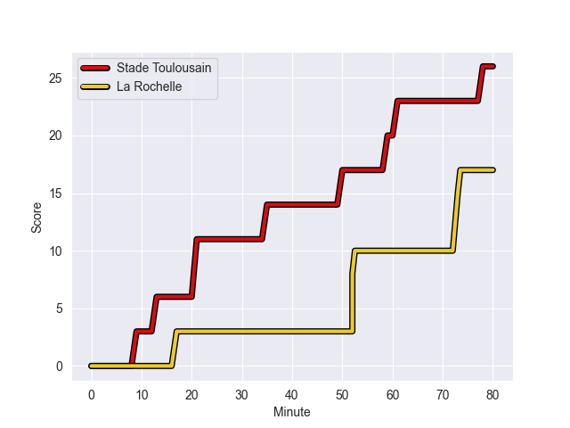
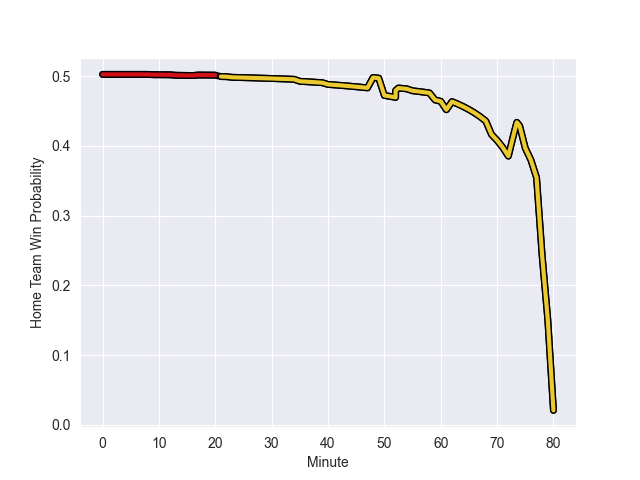

---  
layout: page  
title: La Rochelle at Stade Toulousain; 17-26  
date: 2022-10-23 21:05:00 18:00:00 -0500  
categories: match review  
---
# La Rochelle (1179.2) at Stade Toulousain (1183.5); 17-26

# Prediction: Stade Toulousain by 5.4

Stade Toulousain by 0.4 on a neutral field
## Scores over Time

## Win Probability over Time

# Pre-Match Prediction: Stade Toulousain by 3.7

La Rochelle by 1.3 on a neutral pitch

|   Away Minutes | Away Player           |   Away elo |   Away Percentile |   Number |   Home Percentile |   Home elo | Home Player          |   Home Minutes |
|---------------:|:----------------------|-----------:|------------------:|---------:|------------------:|-----------:|:---------------------|---------------:|
|             80 | Reda Wardi            |      73.48 |                82 |        1 |                 6 |      51.17 | David Ainu'u         |             69 |
|             23 | Samuel Lagrange       |      68    |                62 |        2 |                87 |      80.03 | Peato Mauvaka        |             48 |
|             50 | Uini Atonio           |      82.38 |                89 |        3 |                85 |      75.87 | Dorian Aldegheri     |             62 |
|             17 | Remi Picquette        |      73.71 |                82 |        4 |                21 |      56.94 | Richie Arnold        |             62 |
|             80 | Will Skelton          |      76.67 |                83 |        5 |                73 |      71.24 | Emmanuel Meafou      |             80 |
|             55 | Ultan Dillane         |      70.54 |                73 |        6 |                89 |      85.84 | Thibaud Flament      |             48 |
|             75 | Yoan Tanga            |      70.53 |                75 |        7 |                98 |     103.83 | Rynhardt Elstadt     |             80 |
|             80 | Gregory Alldritt      |      92.38 |                93 |        8 |                84 |      77.02 | Anthony Jelonch      |             80 |
|             75 | Tawera Kerr-Barlow    |     120.55 |                99 |        9 |                96 |     103.09 | Antoine Dupont       |             80 |
|             80 | Ulupano Seuteni       |      62.41 |                47 |       10 |                92 |      95.8  | Thomas Ramos         |             80 |
|             80 | Dillyn Leyds          |      66.62 |                58 |       11 |                94 |      90.67 | Matthis Lebel        |             80 |
|             80 | Jonathan Danty        |     100.94 |                97 |       12 |                94 |      93.17 | Sofiane Guitoune     |             69 |
|             69 | Raymond Rhule         |      73.09 |                74 |       13 |                54 |      64.79 | Pierre-Louis Barassi |             80 |
|             40 | Teddy Thomas          |      81.17 |                88 |       14 |                65 |      65.91 | Arthur Retiere       |             65 |
|             80 | Brice Dulin           |      95.51 |                94 |       15 |                66 |      70.11 | Juan Cruz Mallia     |             80 |
|             63 | Leo Aouf              |      61.74 |                46 |       16 |                90 |      85.91 | Alexandre Roumat     |             32 |
|             57 | Pierre Bourgarit      |      63.98 |                58 |       17 |                91 |      88.62 | Julien Marchand      |             14 |
|             40 | Antoine Hastoy        |      65.71 |                60 |       18 |                38 |      60.28 | Yannick Youyoutte    |             18 |
|             30 | Georges-Henri Colombe |      53.95 |                12 |       19 |                49 |      65.58 | Maxime Duprat        |             18 |
|             25 | Thomas Lavault        |      77.36 |                82 |       20 |                61 |      65.03 | Joshua Brennan       |             18 |
|             11 | Levani Botia Veivuke  |      99.65 |                96 |       21 |                86 |      83.55 | Ange Capuozzo        |             15 |
|              5 | Thomas Berjon         |      68.53 |                72 |       22 |                70 |      70.08 | Lucas Tauzin         |             11 |
|              5 | Noé Della Schiava     |      60.49 |               nan |       23 |               nan |      60.59 | Marco Trauth         |             11 |

