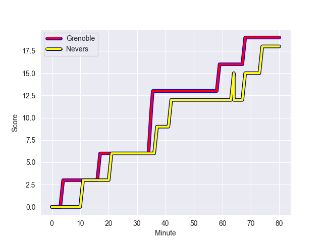
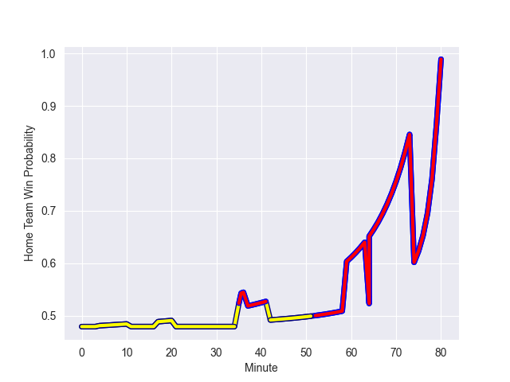

---  
layout: page  
title: Nevers at Grenoble; 18-19  
date: 2022-10-27 21:00:00 18:00:00 -0500  
categories: match review  
---
# Nevers (985.8) at Grenoble (949.3); 18-19

# Prediction: Grenoble by 1.3

Nevers by 3.7 on a neutral field
## Scores over Time

## Win Probability over Time

# Pre-Match Prediction: Nevers by 3.6

Nevers by 1.4 on a neutral pitch

|   Away Minutes | Away Player              |   Away elo |   Away Percentile |   Number |   Home Percentile |   Home elo | Home Player                 |   Home Minutes |
|---------------:|:-------------------------|-----------:|------------------:|---------:|------------------:|-----------:|:----------------------------|---------------:|
|             69 | Tomike Mataradze         |      57.87 |                23 |        1 |                69 |      67.6  | Zack Gauthier               |             54 |
|             49 | Quentin Beaudaux         |      54.61 |                 7 |        2 |                33 |      57.98 | Mathis Sarragallet          |             54 |
|             52 | Cleopas Kundiona         |      59.72 |                36 |        3 |                48 |      60.95 | Regis Montagne              |             54 |
|             80 | Lado Chachanidze         |      58.1  |                25 |        4 |                70 |      67.61 | Pio Muarua                  |             80 |
|             44 | Will Skelton             |      75.93 |                82 |        5 |                63 |      65.58 | Tanginoa Halaifonua         |             80 |
|             80 | Luka Plataret            |      52.3  |                 8 |        6 |                76 |      71.11 | Marnus Schoeman             |              7 |
|             80 | Hugues Bastide           |     101.28 |                97 |        7 |                81 |      72.63 | Clement Ancely              |             40 |
|             80 | Hugues Bastide           |     101.28 |                97 |        7 |                75 |      72.63 | Clement Ancely              |             40 |
|             52 | Maka Polutele            |      56.83 |                21 |        8 |                 3 |      47.85 | Thibaut Martel              |             80 |
|             49 | Yoan Cottin              |      68.53 |                68 |        9 |                90 |      88.58 | Eric Escande                |             59 |
|             52 | Shaun Reynolds           |      54.24 |                 8 |       10 |                81 |      83.96 | Romain Barthelemy           |             66 |
|             80 | Christian Erasmus        |      69.85 |                74 |       11 |                 2 |      45.63 | Atunaisa Taulanga Vaka Manu |             80 |
|             54 | Mattéo Faucher           |      61.05 |                40 |       12 |                12 |      54.89 | Bautista Ezcurra            |             80 |
|             80 | Emmanuel Vaitulukina     |      61.9  |                42 |       13 |                40 |      61.79 | Romain Fusier               |             58 |
|             80 | Christian Ambadiang      |      59.15 |                34 |       14 |                 7 |      51.71 | Karim Qadiri                |             80 |
|             80 | Kylian Jaminet           |      95.91 |                94 |       15 |                71 |      71.35 | Julien Farnoux              |             80 |
|             36 | Christiaan van der Merwe |      54.78 |                14 |       16 |                76 |      71.15 | Steeve Blanc-Mappaz         |             73 |
|             31 | Elia Elia                |      54.47 |                 8 |       17 |                17 |      55.53 | Levi Douglas                |             40 |
|             31 | Arthurs Barbier          |      60.02 |               nan |       18 |                19 |      57.16 | Luka Goginava               |             26 |
|             28 | Yohan Le Bourhis         |      60.06 |                33 |       19 |                72 |      70.07 | Lilian Rossi                |             26 |
|             28 | Julien Kazubek           |      59.3  |                36 |       20 |                47 |      61.92 | Sam Nixon                   |             26 |
|             28 | Ilia Kaikatsishvili      |      70.71 |                77 |       21 |                 8 |      52.78 | Wilfried Hulleu             |             22 |
|             26 | Leonard Paris            |      75.4  |                77 |       22 |                53 |      62.77 | Felipe Ezcurra              |             21 |
|             11 | Aselo Ikahehegi          |      57.93 |                17 |       23 |                62 |      66.79 | Corentin Glenat             |             14 |

