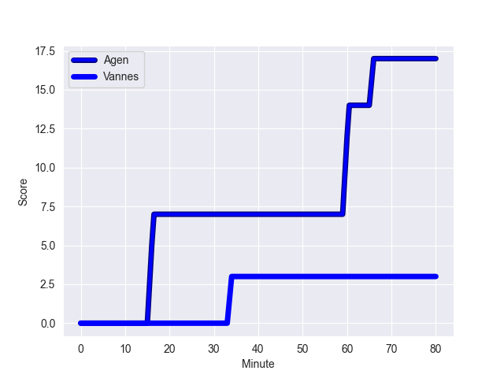
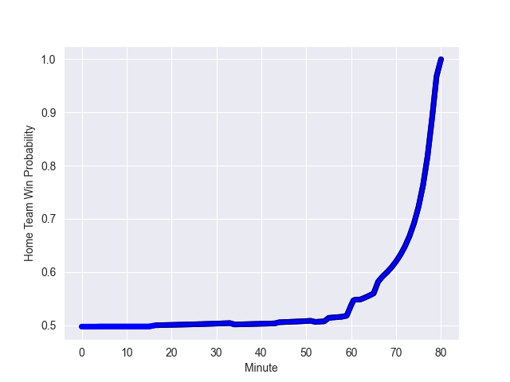

---  
layout: page  
title: Vannes at Agen; 3-17  
date: 2022-10-28 21:00:00 18:00:00 -0500  
categories: match review  
---
# Vannes (1051.63) at Agen (1055.94); 3-17

# Prediction: Agen by 5.4

Agen by 0.4 on a neutral field
## Scores over Time

## Win Probability over Time

# Pre-Match Prediction: Agen by 3.9

Vannes by 1.1 on a neutral pitch

|   Away Minutes | Away Player            |   Away elo |   Away Percentile |   Number |   Home Percentile |   Home elo | Home Player        |   Home Minutes |
|---------------:|:-----------------------|-----------:|------------------:|---------:|------------------:|-----------:|:-------------------|---------------:|
|             44 | Charles-Henri Berguet  |      59.25 |                32 |        1 |                72 |      69.73 | Richard Barrington |             52 |
|             55 | Pat Leafa              |      76.9  |                83 |        2 |                60 |      64.92 | Mike Sosene-Feagai |             52 |
|             55 | John Afoa              |     101.13 |                96 |        3 |                72 |      69.7  | Alex Burin         |             52 |
|             55 | Joe Edwards            |      57.42 |                24 |        4 |                45 |      61.32 | Joe Maksymiw       |             80 |
|             44 | Mattéo Desjeux         |      62.5  |                51 |        5 |                 3 |      48.07 | Evan Olmstead      |             67 |
|             80 | Francisco Gorrissen    |      86.9  |                90 |        6 |                76 |      71.8  | Arnaud Duputs      |             80 |
|              4 | Gregoire Bazin         |      46.52 |                 2 |        7 |                93 |      93.46 | Antoine Erbani     |             80 |
|             80 | Léon Boulier           |      68.16 |                68 |        8 |                85 |      82.51 | Martin Devergie    |             41 |
|             55 | Hugo Zabalza           |      59.04 |                33 |        9 |                12 |      57.19 | Theo Idjellidaine  |             59 |
|             80 | Maxime Lafage          |      57.56 |                22 |       10 |                72 |      73.77 | Raphael Lagarde    |             80 |
|             80 | Romaric Camou          |      76.99 |                84 |       11 |                85 |      77.71 | Iban Etcheverry    |             80 |
|             80 | Andres Vilaseca Hontou |      79.14 |                82 |       12 |                54 |      64.9  | Kolinio Ramoka     |             80 |
|             80 | Nicolas Freitas        |      68.46 |                66 |       13 |                83 |      79.43 | Harry Sloan        |             80 |
|             80 | Nathanael Hulleu       |      62.78 |                51 |       14 |                37 |      59.76 | Tevita Railevu     |             62 |
|             55 | Nick Abendanon         |     102.64 |                97 |       15 |                93 |      94.48 | Mathieu Lamoulie   |             80 |
|             76 | Karl Chateau           |      58.41 |                31 |       16 |                48 |      62.32 | Fotu Lokotui       |             39 |
|             36 | Ximun Bessonart        |      60.66 |                37 |       17 |                13 |      57.14 | Loris Zarantonello |             28 |
|             36 | Myles Edwards          |      53.71 |                11 |       18 |               nan |      61.07 | Théo Sauzaret      |             28 |
|             25 | Dan Hollinshead        |      61.93 |                41 |       19 |                19 |      58.2  | Hans Lombard-Buret |             28 |
|             25 | Ewan Thomas Johnson    |      65.7  |                64 |       20 |                61 |      64.9  | Dorian Bellot      |             21 |
|             25 | Louis-Marie Suta       |      60    |               nan |       21 |                38 |      59.86 | Loris Tolot        |             18 |
|             25 | Will Percillier        |      56.25 |                14 |       22 |                84 |      77.32 | William Demotte    |             13 |
|             25 | Paga Tafili            |      83.74 |                89 |       23 |               nan |     nan    | nan                |            nan |

