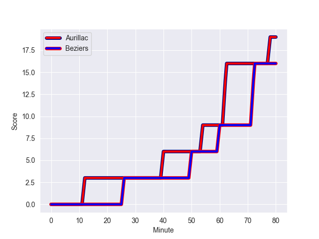
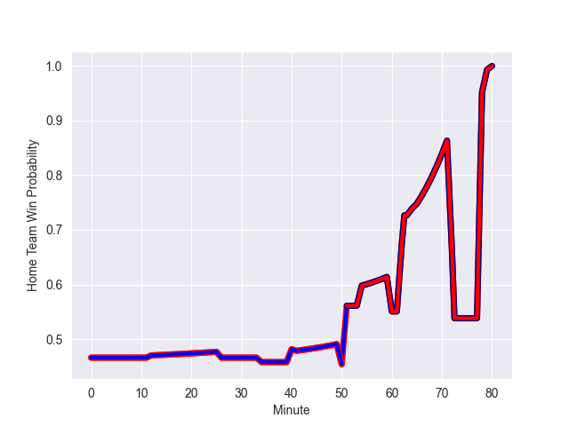

---  
layout: page  
title: Beziers at Aurillac; 16-19  
date: 2022-10-28 19:30:00 18:00:00 -0500  
categories: match review  
---
# Beziers (1415.34) at Aurillac (1392.36); 16-19

# Prediction: Aurillac by 2.7

Beziers by 2.3 on a neutral field
## Scores over Time

## Win Probability over Time

# Pre-Match Prediction: Beziers by 1.5

Beziers by 3.5 on a neutral pitch

|   Away Minutes | Away Player           |   Away elo |   Away Percentile |   Number |   Home Percentile |   Home elo | Home Player           |   Home Minutes |
|---------------:|:----------------------|-----------:|------------------:|---------:|------------------:|-----------:|:----------------------|---------------:|
|             54 | Francisco Fernandes   |      99.59 |                71 |        1 |                80 |     102.42 | Alexandre Plantier    |             54 |
|             63 | Marco Pinto Ferrer    |      92.44 |                30 |        2 |                84 |     103.42 | Luka Nioradze         |             63 |
|             52 | Jamie Hagan           |      90.16 |                17 |        3 |                88 |     105.96 | Giorgi Kartvelishvili |             34 |
|             80 | Pierre Gayraud        |      92.31 |                34 |        4 |                76 |     101.11 | Eoghan Masterson      |             80 |
|             63 | John Madigan          |      96.26 |                54 |        5 |                 7 |      82.58 | Jean-Baptiste Singer  |             41 |
|             80 | Thomas Hoarau         |      93.75 |                38 |        6 |                43 |      94.13 | Beka Shvangiradze     |             80 |
|             80 | Pierrick Gunther      |      87    |                11 |        7 |                13 |      88.11 | Théo Cambon           |             52 |
|             51 | Sias Koen             |      88.83 |                17 |        8 |                85 |     106.8  | Dylan Cretin          |             46 |
|             63 | Mitchell Short        |      95.7  |               nan |        9 |                 6 |      84.82 | David Delarue         |             80 |
|             65 | Adrien Latorre        |      99.47 |                67 |       10 |                16 |      88.98 | Antoine Aucagne       |             52 |
|             80 | Raffaele Costa Storti |      97.44 |                58 |       11 |                64 |      98.38 | AJ Coertzen           |             80 |
|             80 | James Tofa            |      96.46 |                50 |       12 |                 7 |      84.76 | Christa Powell        |             80 |
|             51 | Paul Recor            |      93.43 |                35 |       13 |                 9 |      85.88 | Elijah Niko           |             80 |
|             80 | Watisoni Votu         |      99.27 |                69 |       14 |                38 |      93.51 | Giorgi Gogoladze      |             80 |
|             80 | Charly Malie          |      91.03 |                23 |       15 |                12 |      86.97 | Anderson Neisen       |             80 |
|             29 | Maxence Lemardelet    |      85.53 |                11 |       16 |               nan |      93.61 | Henzo Kiteau          |             46 |
|             29 | Jarrod Poi            |      87.2  |                13 |       17 |                44 |      94.16 | Georgi Javakhia       |             39 |
|             28 | Yannick Arroyo        |     103.5  |               nan |       18 |                 2 |      76.85 | Latuka Maituku        |             34 |
|             26 | Ferdinand Changel     |      91.42 |               nan |       19 |                67 |      99    | Marc Palmier          |             28 |
|             17 | Yvann Lalevee         |      96.53 |               nan |       20 |                28 |      91.81 | Maxime Profit         |             28 |
|             17 | Yassine Maamry        |      84.36 |                 9 |       21 |                40 |      94.09 | Jean-Jacques Gymael   |             26 |
|             17 | Josh Valentine        |     122.79 |                98 |       22 |                 8 |      87.5  | Theo Lachaud          |             17 |
|             15 | Gabin Lorre           |      96.98 |                54 |       23 |               nan |     nan    | nan                   |            nan |

