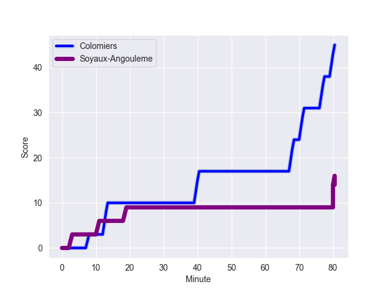

---  
layout: page  
title: Soyaux-Angouleme at Colomiers; 16-45  
date: 2022-10-28 19:30:00 18:00:00 -0500  
categories: match review  
---
# Soyaux-Angouleme (1433.68) at Colomiers (1388.44); 16-45

# Prediction: Colomiers by 2.5

Soyaux-Angouleme by 4.5 on a neutral field
## Scores over Time

## Win Probability over Time

# Pre-Match Prediction: Soyaux-Angouleme by 3.2

Soyaux-Angouleme by 3.8 on a neutral pitch

|   Away Minutes | Away Player          |   Away elo |   Away Percentile |   Number |   Home Percentile |   Home elo | Home Player           |   Home Minutes |
|---------------:|:---------------------|-----------:|------------------:|---------:|------------------:|-----------:|:----------------------|---------------:|
|             59 | Khatchik Vartanov    |     100.49 |                71 |        1 |                 6 |      79.56 | Thomas Dubois         |             49 |
|             49 | Kevin Le Guen        |     100.25 |                63 |        2 |                90 |     110.23 | Thomas Larrieu        |             49 |
|             52 | Seydou Diakité       |     101.17 |                73 |        3 |                68 |      98.83 | Marco Fepulea'i       |             55 |
|             80 | Janse Roux           |      95.49 |                52 |        4 |                16 |      84.54 | Maxime Granouillet    |             80 |
|             80 | Robin Copeland       |     109.37 |                87 |        5 |                69 |      99.52 | Alexandre Ricard      |             16 |
|             58 | Nicolas Martins      |      96    |               nan |        6 |                 1 |      69.34 | Anthony Coletta       |             55 |
|             80 | Germain Burgaud      |      90.58 |                28 |        7 |                54 |      96.35 | Aldric Lescure        |             80 |
|             58 | Yassine Jarmouni     |      82.97 |                10 |        8 |                13 |      83.93 | Yann Peysson          |             55 |
|             60 | Adrien Bau           |      81.82 |                 6 |        9 |                58 |      96.84 | Edoardo Gori          |             55 |
|             80 | Bastien Tugaye       |      97.54 |                55 |       10 |                23 |      89.81 | Romuald Séguy         |             80 |
|             53 | Hugo Le Gall         |      86.33 |                14 |       11 |                59 |      97.08 | Alexis Palisson       |             63 |
|             80 | Mathis Lafon         |     107.34 |                83 |       12 |                81 |     105.95 | Johan Deysel (Jnr)    |             80 |
|             53 | Inaki Ayarza Saporta |      90.72 |                28 |       13 |                84 |     106.89 | Fabien Perrin         |             80 |
|             80 | Kamilieni Raivono    |     100.45 |                70 |       14 |                13 |      86    | Valentin Saurs        |             80 |
|             80 | Rémi Brosset         |      93.46 |                40 |       15 |                10 |      82.25 | Thomas Girard         |             80 |
|             31 | Ole Avei             |     106.61 |                85 |       16 |                42 |      92.91 | Jean Thomas           |             64 |
|             28 | Nolan Pienaar        |      99.02 |                66 |       17 |                42 |      93.07 | Andrew Ready          |             31 |
|             27 | Ledua Mau            |      83.26 |                10 |       18 |                33 |      92.17 | Hugo Djehi            |             31 |
|             27 | Pierre Lafitte       |      95.79 |                51 |       19 |                21 |      88.5  | Pierre-Samuel Pacheco |             25 |
|             22 | Clement Ancely       |      89.39 |                23 |       20 |                13 |      85.81 | Waël Ponpon           |             25 |
|             22 | Ian Kitwanga         |      93.24 |                44 |       21 |                87 |     108.94 | Ugo Seguela           |             25 |
|             21 | Elias El Ansari      |      87.36 |                13 |       22 |                42 |      94.09 | Robin Bellemand       |             25 |
|             20 | Lucas Rubio          |      80.83 |                 5 |       23 |                46 |      94.71 | Peni Rokoduguni       |             17 |

