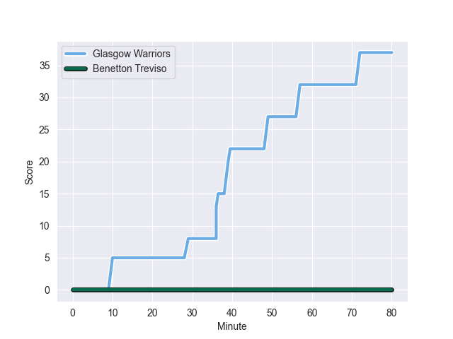
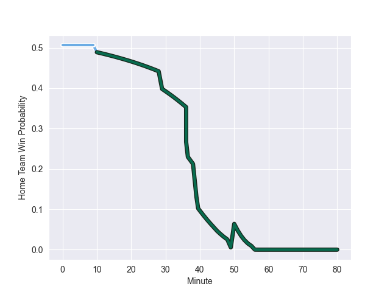

---  
layout: page  
title: Benetton Treviso at Glasgow Warriors; 0-37  
date: 2022-10-28 20:35:00 18:00:00 -0500  
categories: match review  
---
# Benetton Treviso (1431.01) at Glasgow Warriors (1474.18); 0-37

# Prediction: Glasgow Warriors by 11.3

Glasgow Warriors by 4.3 on a neutral field
## Scores over Time

## Win Probability over Time

# Pre-Match Prediction: Glasgow Warriors by 9.8

Glasgow Warriors by 2.8 on a neutral pitch

|   Away Minutes | Away Player           |   Away elo |   Away Percentile |   Number |   Home Percentile |   Home elo | Home Player           |   Home Minutes |
|---------------:|:----------------------|-----------:|------------------:|---------:|------------------:|-----------:|:----------------------|---------------:|
|             40 | Nahuel Tetaz Chaparro |      99.34 |                67 |        1 |                99 |     125.21 | Oli Kebble            |             58 |
|             45 | Federico Zani         |      93.82 |                42 |        2 |                97 |     117.86 | Fraser Brown          |             60 |
|             66 | Tiziano Pasquali      |      97.33 |                60 |        3 |               nan |      94.46 | Murphy Walker         |             58 |
|             62 | Scott Scrafton        |     104.87 |                82 |        4 |                51 |      95.05 | Sintu Manjezi         |             80 |
|             80 | Carl Wegner           |      99.31 |                68 |        5 |               nan |      95    | Alex Samuel           |             66 |
|             56 | Giovanni Pettinelli   |     111.5  |                90 |        6 |                 6 |      79.34 | Ryan Wilson           |             50 |
|             62 | Sebastian Negri       |      85.6  |                13 |        7 |                44 |      92.55 | Gregor Brown          |             80 |
|             80 | Henry Time-Stowers    |      94.66 |                44 |        8 |                16 |      85.88 | Sione Vailanu         |             58 |
|             50 | Dewaldt Duvenage      |     122.29 |                97 |        9 |                16 |      87.51 | Jamie Dobie           |             60 |
|             80 | Giacomo Da Re         |      94.97 |                47 |       10 |                92 |     114.04 | Domingo Miotti        |             80 |
|             80 | Mattia Bellini        |      75.69 |                 3 |       11 |                75 |     102.05 | Rufus McLean          |             80 |
|             80 | Marco Zanon           |     109.25 |                86 |       12 |                73 |     102.47 | Stafford McDowall     |             73 |
|             56 | Joaquin Riera         |      88.76 |                22 |       13 |                54 |      96.47 | Kyle Steyn            |             80 |
|             80 | Ignacio Mendy         |      78.86 |                 5 |       14 |                88 |     109.94 | Sebastian Cancelliere |             80 |
|             80 | Rhyno Smith           |     101.29 |                70 |       15 |                23 |      89.77 | Josh McKay            |             80 |
|             40 | Thomas Gallo          |      99.56 |                69 |       16 |               nan |      95    | Euan Ferrie           |             30 |
|             35 | Manuel Arroyo         |      94.28 |               nan |       17 |               nan |      90.99 | Nathan McBeth         |             22 |
|             30 | Alessandro Garbisi    |      95.23 |                51 |       18 |                19 |      86.03 | JP du Preez           |             22 |
|             24 | Alessandro Izekor     |      82.1  |                 8 |       19 |                65 |      97.06 | Simon Berghan         |             22 |
|             24 | Marcus Watson         |      95.62 |                51 |       20 |                31 |      91.48 | Johnny Matthews       |             20 |
|             18 | Braam Steyn           |      83.01 |                 8 |       21 |               nan |      86.63 | Sean Kennedy          |             20 |
|             18 | Marco Lazzaroni       |      68.73 |                 1 |       22 |                 8 |      79.33 | Lewis Bean            |             14 |
|             14 | Filippo Alongi        |      90.4  |                26 |       23 |                25 |      90.21 | Tom Jordan            |              7 |

