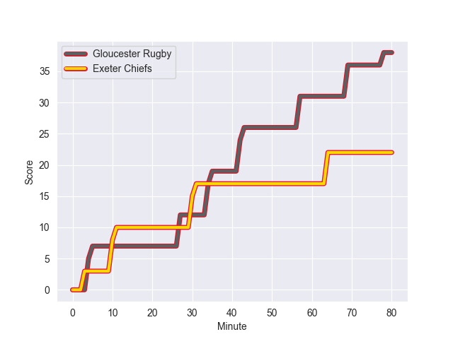
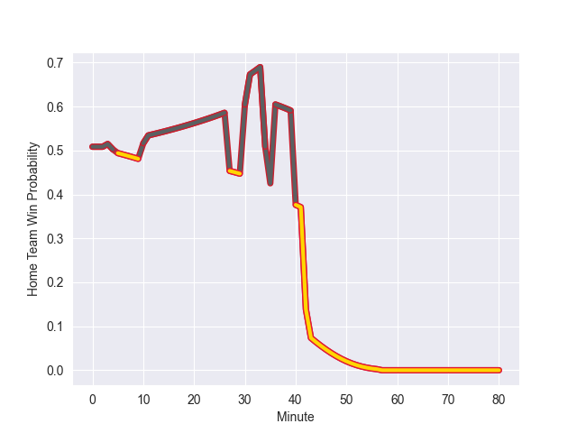

---  
layout: page  
title: Exeter Chiefs at Gloucester Rugby; 22-38  
date: 2022-10-28 14:45:00 18:00:00 -0500  
categories: match review  
---
# Exeter Chiefs (1130.41) at Gloucester Rugby (1145.46); 22-38

# Prediction: Gloucester Rugby by 6.5

Gloucester Rugby by 1.5 on a neutral field
## Scores over Time

## Win Probability over Time

# Pre-Match Prediction: Gloucester Rugby by 5.5

Gloucester Rugby by 0.5 on a neutral pitch

|   Away Minutes | Away Player       |   Away elo |   Away Percentile |   Number |   Home Percentile |   Home elo | Home Player       |   Home Minutes |
|---------------:|:------------------|-----------:|------------------:|---------:|------------------:|-----------:|:------------------|---------------:|
|             58 | Scott Sio         |      70.97 |                75 |        1 |                66 |      65.76 | Harry Elrington   |             80 |
|             58 | Jack Yeandle      |      97.63 |                95 |        2 |                86 |      79.27 | Santiago Socino   |             80 |
|             78 | Harry Williams    |      75.48 |                85 |        3 |                82 |      73.53 | Fraser Balmain    |             64 |
|             66 | Ruben van Heerden |      78.9  |                85 |        4 |                82 |      75.78 | Freddie Clarke    |             80 |
|             80 | Jonny Gray        |      65.51 |                62 |        5 |                48 |      61.93 | Cameron Jordan    |             59 |
|             78 | Dave Ewers        |     116.69 |                99 |        6 |                83 |      79.42 | Ruan Ackermann    |             80 |
|             80 | Lewis Pearson     |      59.74 |                39 |        7 |                84 |      77.61 | Lewis Ludlow      |             80 |
|             80 | Jacques Vermeulen |      72.13 |                75 |        8 |                95 |      96.29 | Ben Morgan        |             59 |
|             58 | Jack Maunder      |      58.91 |                31 |        9 |                60 |      64.68 | Charlie Chapman   |             67 |
|             36 | Harvey Skinner    |      54.31 |                 9 |       10 |                87 |      89.49 | Adam Hastings     |             80 |
|             40 | Olly Woodburn     |      98.1  |                96 |       11 |                87 |      84.96 | Santiago Carreras |             80 |
|             80 | Ian Whitten       |      94.39 |                95 |       12 |                77 |      75.46 | Giorgi Kveseladze |             67 |
|             80 | Rory O'Loughlin   |      81.36 |                85 |       13 |                76 |      74.55 | Chris Harris      |             80 |
|             80 | Josh Hodge        |      58.46 |                29 |       14 |                60 |      64.4  | Louis Rees-Zammit |             80 |
|             80 | Stuart Hogg       |      67.39 |                60 |       15 |                89 |      85.28 | Lloyd Evans       |             80 |
|             22 | Jack Innard       |      59.66 |                24 |       16 |               nan |      64.47 | Henry Walker      |              0 |
|             22 | Alec Hepburn      |      64.88 |                61 |       17 |                42 |      61    | Ciaran Knight     |              0 |
|              2 | Josh Iosefa-Scott |      63.53 |                60 |       18 |                79 |      71.42 | Kirill Gotovtsev  |             16 |
|             14 | Jack Dunne        |      61.78 |                53 |       19 |                90 |      85.82 | Matias Alemanno   |             21 |
|              2 | Christ Tshiunza   |      56.57 |                20 |       20 |                74 |      71.01 | Albert Tuisue     |             21 |
|             22 | Sam Maunder       |      52.08 |                 8 |       21 |                68 |      67.31 | Ben Meehan        |             13 |
|             44 | Joe Simmonds      |      88.05 |                87 |       22 |               nan |      59.56 | Jack Reeves       |             13 |
|             40 | Dan John          |      59.45 |               nan |       23 |                 8 |      53.34 | Tom Seabrook      |              0 |

