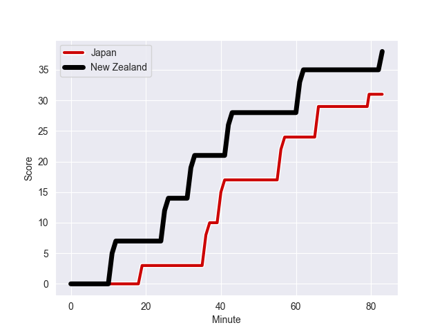
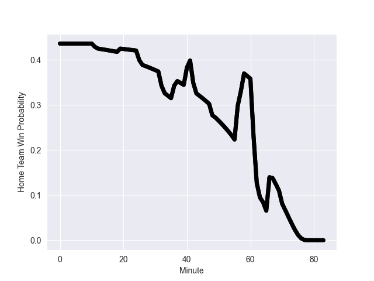

---  
layout: page  
title: New Zealand at Japan; 38-31  
date: 2022-10-28 14:50:00 18:00:00 -0500  
categories: match review  
---
# New Zealand (1618.21) at Japan (1534.45); 38-31

# Prediction: New Zealand by 3.4

New Zealand by 8.4 on a neutral field
## Scores over Time

## Win Probability over Time

# Pre-Match Prediction: New Zealand by 2.9

New Zealand by 7.9 on a neutral pitch

|   Away Minutes | Away Player         |   Away elo |   Away Percentile |   Number |   Home Percentile |   Home elo | Home Player            |   Home Minutes |
|---------------:|:--------------------|-----------:|------------------:|---------:|------------------:|-----------:|:-----------------------|---------------:|
|             55 | George Bower        |      91.3  |                17 |        1 |                95 |     111.8  | Keita Inagaki          |             48 |
|             55 | Samisoni Taukei'aho |     106.22 |                87 |        2 |               nan |      98.81 | Atsushi Sakate         |             83 |
|             55 | Nepo Laulala        |     110.14 |                93 |        3 |               nan |     103.67 | Ji-won Gu              |             83 |
|             83 | Brodie Retallick    |     117.21 |                95 |        4 |               nan |      97.69 | Warner Dearns          |             83 |
|             83 | Tupou Vaa'i         |      97.13 |                60 |        5 |               nan |      98.07 | Jack Cornelsen         |             83 |
|             63 | Shannon Frizell     |      98.96 |                66 |        6 |                97 |     121.51 | Michael Leitch         |             62 |
|             83 | Sam Cane            |     126.37 |                99 |        7 |                82 |     104.53 | Kazuki Himeno          |             83 |
|             67 | Hoskins Sotutu      |     119.84 |                95 |        8 |               nan |      95.7  | Tevita Tatafu          |             49 |
|             62 | Finlay Christie     |     101.16 |                64 |        9 |                90 |     109.11 | Yutaka Nagare          |             62 |
|             83 | Richie Mo'unga      |     124.88 |                97 |       10 |               nan |      94.54 | Takuya Yamasawa        |             49 |
|             83 | Caleb Clarke        |      97.78 |                61 |       11 |                16 |      89.32 | Siosaia Fifita         |             58 |
|             70 | Roger Tuivasa-Sheck |      86.21 |                 9 |       12 |               nan |     101.96 | Ryoto Nakamura         |             83 |
|             65 | Braydon Ennor       |     107.32 |                84 |       13 |               nan |      99.27 | Dylan Riley            |             83 |
|             83 | Sevu Reece          |     114.32 |                92 |       14 |                96 |     118.88 | Kotaro Matsushima      |             83 |
|             83 | Stephen Perofeta    |     106.8  |                83 |       15 |               nan |      94.26 | Ryohei Yamanaka        |             83 |
|             28 | Codie Taylor        |      94.74 |                46 |       16 |               nan |      93.8  | Takeshi Hino           |              0 |
|             28 | Ofa Tu'ungafasi     |     112.55 |                95 |       17 |                78 |     101.93 | Craig Millar           |             35 |
|             28 | Tyrel Lomax         |     106.16 |                89 |       18 |               nan |      95    | Syuhei Takeuchi        |              0 |
|             20 | Patrick Tuipulotu   |     121.76 |                97 |       19 |               nan |      95    | Kanji Shimokawa        |             21 |
|             16 | Dalton Papali'i     |      99.24 |                68 |       20 |               nan |      96.34 | Faulua Makisi          |             34 |
|             21 | Aaron Smith         |     105.64 |                84 |       21 |               nan |      94.15 | Naoto Saito            |             21 |
|             13 | David Havili        |     117.75 |                96 |       22 |                47 |      94.99 | Seungsin Lee           |             34 |
|             18 | Anton Lienert-Brown |     121.21 |                98 |       23 |                98 |     120.98 | Gerhard van den Heever |             25 |

