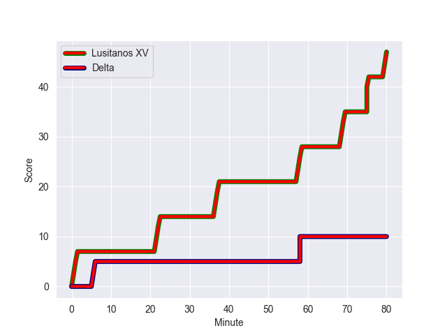
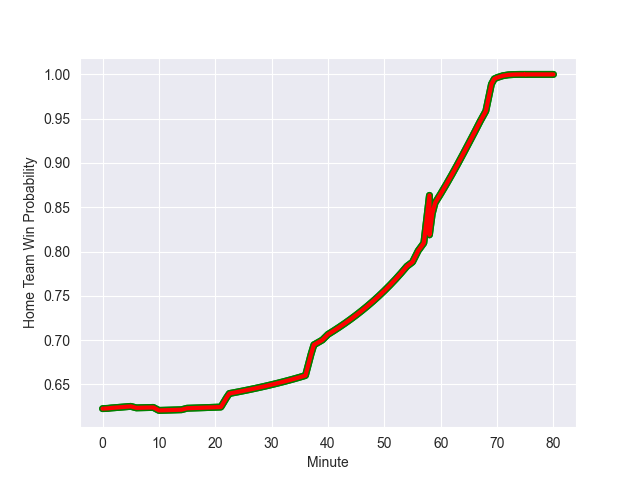

---  
layout: page  
title: Delta at Lusitanos XV; 10-47  
date: 2022-10-28 21:00:00 18:00:00 -0500  
categories: match review  
---
# Delta (1284.14) at Lusitanos XV (1501.67); 10-47

# Prediction: Lusitanos XV by 28.8

Lusitanos XV by 21.8 on a neutral field
## Scores over Time

## Win Probability over Time

# Pre-Match Prediction: Lusitanos XV by 32.2

Lusitanos XV by 25.2 on a neutral pitch

|   Away Minutes | Away Player                  |   Away elo |   Away Percentile |   Number |   Home Percentile |   Home elo | Home Player                     |   Home Minutes |
|---------------:|:-----------------------------|-----------:|------------------:|---------:|------------------:|-----------:|:--------------------------------|---------------:|
|             59 | Ramzi Ouarssani              |      95.09 |                55 |        1 |                70 |     100.17 | Antonio Santos                  |             67 |
|             40 | Jessy Wagemaker              |      93.1  |                42 |        2 |                87 |     107.45 | Duarte Azevedo de Brito Diniz   |             10 |
|             55 | Delano Jansen Van der Sligte |      84.4  |                10 |        3 |                50 |      95.82 | Antonio Prim Da Costa           |             79 |
|             80 | Niels Roelfsema              |      88.06 |                20 |        4 |                64 |      99.32 | Manuel Lima                     |             80 |
|             77 | Toine Van den Bos            |      84.98 |                15 |        5 |                76 |     103.55 | Martim Ruggeroni Roquette Bello |             80 |
|             15 | Max Wierda                   |      86.86 |                16 |        6 |                87 |     109.58 | Antonio Cerejo                  |             77 |
|             80 | Dirk Wierenga                |      87.26 |                17 |        7 |                36 |      92.27 | David Wallis Carvalho           |             78 |
|             80 | Stijn Albers                 |      79.24 |                 6 |        8 |               nan |      95    | Boaventura Almeida              |             56 |
|             80 | Mark Alexander Coebergh      |      87.8  |                19 |        9 |                77 |     103.41 | Pedro Lucas                     |             80 |
|             80 | Kevin Lenssen                |      86.67 |                15 |       10 |                73 |     101.48 | Jeronimo Portela                |             80 |
|             80 | Joran Schoenmaker            |      85.79 |                14 |       11 |               nan |      95    | Francisco Henriques             |             80 |
|             77 | Robin Schut                  |      77.84 |                 4 |       12 |                81 |     105.64 | Francisco Rosa                  |             56 |
|             80 | Toon Van Spaadonk            |      89.24 |                22 |       13 |                81 |     105.19 | Joao Vieira                     |             59 |
|             80 | Daan van der Avoird          |      67.42 |                 0 |       14 |               nan |      92.29 | Fabio Conceicao                 |             80 |
|             80 | Vikas Meijer                 |      95.65 |               nan |       15 |               nan |      96.27 | Domingos Cabral                 |             80 |
|             65 | Liam Stone                   |      84.22 |                10 |       16 |                74 |     101.08 | Frederico Simoes                |             70 |
|             40 | Witze Molenkamp              |      88.13 |                17 |       17 |                89 |     112.57 | Manuel Maria Picao Eusebio      |             24 |
|             25 | Andy Louter                  |      91.55 |                29 |       18 |                60 |      98.54 | Joao Belo                       |             24 |
|             21 | Mike Mbaud                   |      80.41 |               nan |       19 |                87 |     111.4  | Francisco Meneres               |             21 |
|              3 | Hendrikus Hoos               |      94.34 |               nan |       20 |                78 |     102.75 | André Arrojado                  |             13 |
|              3 | Cas Offermans                |      95    |               nan |       21 |                56 |      97.15 | Federico Couto                  |              3 |
|            nan | nan                          |     nan    |               nan |       22 |               nan |      95.21 | Vasco Baptista                  |              2 |
|            nan | nan                          |     nan    |               nan |       23 |               nan |      95    | Antonio Maltez                  |              1 |

