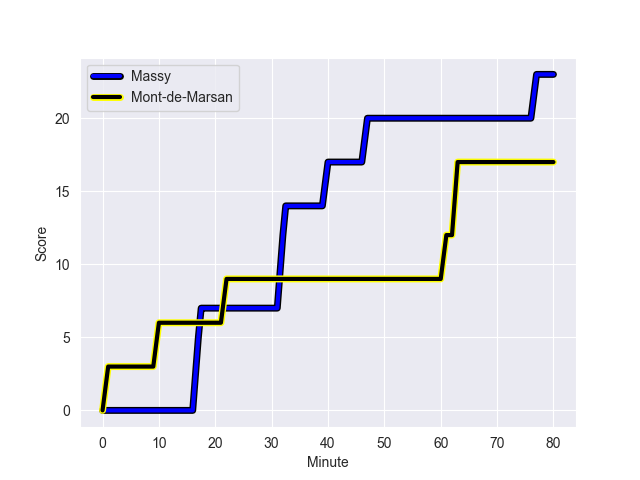
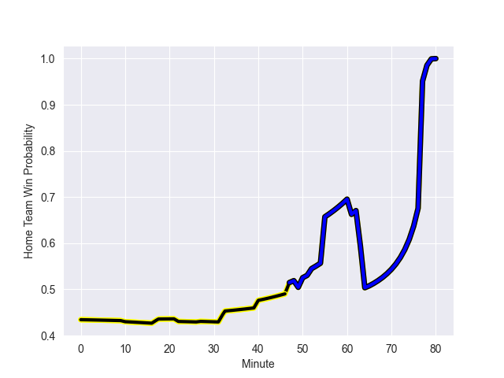

---  
layout: page  
title: Mont-de-Marsan at Massy; 17-23  
date: 2022-10-28 19:30:00 18:00:00 -0500  
categories: match review  
---
# Mont-de-Marsan (1468.44) at Massy (1353.65); 17-23

# Prediction: Mont-de-Marsan by 4.5

Mont-de-Marsan by 11.5 on a neutral field
## Scores over Time

## Win Probability over Time

# Pre-Match Prediction: Mont-de-Marsan by 3.7

Mont-de-Marsan by 10.7 on a neutral pitch

|   Away Minutes | Away Player           |   Away elo |   Away Percentile |   Number |   Home Percentile |   Home elo | Home Player           |   Home Minutes |
|---------------:|:----------------------|-----------:|------------------:|---------:|------------------:|-----------:|:----------------------|---------------:|
|             64 | Jean-Luc Innocente    |      89.14 |                21 |        1 |                 5 |      80.96 | Fernandez Correa      |             50 |
|             52 | Romain Laterrade      |      92.5  |                38 |        2 |                 6 |      81.65 | Corentin Chabeaudie   |             50 |
|             27 | Anthony Alves         |     102.29 |                76 |        3 |                66 |      97.83 | Nicolas Ferrer        |             59 |
|             80 | Nicolas Garrault      |     102.69 |                76 |        4 |                 9 |      81.15 | Andrew Chauveau       |             80 |
|             64 | Leandro Cedaro        |      92.73 |                41 |        5 |                 8 |      78.52 | Dion Evrard Oulai     |             67 |
|             52 | Yann Brethous         |     105.3  |                82 |        6 |                30 |      91.15 | Jean Maurice Decubber |             80 |
|             80 | Léo Banos             |      82.66 |                12 |        7 |                46 |      91.35 | Abongile Nonkontwana  |             55 |
|             80 | Mike Faleafa          |      97.25 |                53 |        8 |                21 |      88.58 | Clement Lanen         |             80 |
|             49 | James Hart            |      72.07 |               nan |        9 |                69 |      97.85 | Gaetan Pichon         |             52 |
|             77 | Willie du Plessis     |     116.13 |                91 |       10 |                69 |      99.82 | Massimo Ortolan       |             80 |
|             80 | Pierre Sayerse        |      90.19 |                25 |       11 |                52 |      96    | Nathan Farissier      |             65 |
|             80 | Jeronimo de la Fuente |     111.3  |                88 |       12 |                10 |      83.03 | Mathieu Guillomot     |             80 |
|             77 | Jules Even            |     101.52 |                71 |       13 |                44 |      94.52 | Victorien Jacomme     |             80 |
|             80 | Simao Broeiro Bento   |      92.52 |                39 |       14 |                12 |      85.3  | Yanis Dit Robaglia    |             80 |
|             80 | Yoann Laousse Azpiazu |     114.56 |                94 |       15 |                26 |      88.49 | Juan Kotze            |             59 |
|             53 | Lasha Macharashvili   |      99.42 |                77 |       16 |                78 |     102.9  | Robin Poipy           |             30 |
|             31 | Martin Doan           |     108.04 |                86 |       17 |                25 |      90.66 | Mamoudou Meite        |             30 |
|             28 | Simon Labouyrie       |      80.22 |                 5 |       18 |                77 |     103.44 | Benjamin Prier        |             28 |
|             28 | Andrei Garbuzov       |      95.05 |                51 |       19 |                13 |      82.79 | Louis Bruinsma        |             25 |
|             16 | Thomas Bultel         |     102.69 |                79 |       20 |                79 |     104.5  | Guiterembi Vickos     |             21 |
|             16 | Romain Durand         |      94.94 |                53 |       21 |                61 |      98.47 | Romain Clouté         |             21 |
|              3 | Joris Pialot          |      91.51 |                39 |       22 |                48 |      94.98 | Kimani Sitauti        |             15 |
|              3 | Simon Desaubies       |      80.71 |                 7 |       23 |               nan |      93.23 | Mehdi Tlili           |             13 |

