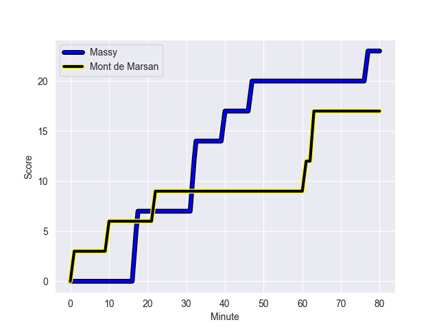
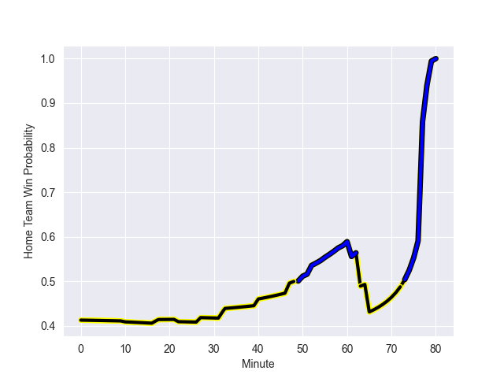

---  
layout: page  
title: Mont de Marsan at Massy; 17-23  
date: 2022-10-28 19:30:00 18:00:00 -0500  
categories: match review  
---
# Mont de Marsan (1042.62) at Massy (890.01); 17-23

# Prediction: Mont de Marsan by 10.3

Mont de Marsan by 15.3 on a neutral field
## Scores over Time

## Win Probability over Time

# Pre-Match Prediction: Mont de Marsan by 11.4

Mont de Marsan by 16.4 on a neutral pitch

|   Away Minutes | Away Player           |   Away elo |   Away Percentile |   Number |   Home Percentile |   Home elo | Home Player           |   Home Minutes |
|---------------:|:----------------------|-----------:|------------------:|---------:|------------------:|-----------:|:----------------------|---------------:|
|             64 | Jean-Luc Innocente    |      53.77 |                10 |        1 |                 4 |      49.62 | Fernandez Correa      |             50 |
|             52 | Romain Laterrade      |      69.65 |                73 |        2 |                 9 |      53.41 | Corentin Chabeaudie   |             50 |
|             27 | Anthony Alves         |      91.84 |                92 |        3 |                22 |      56.96 | Nicolas Ferrer        |             59 |
|             80 | Nicolas Garrault      |      70.96 |                75 |        4 |                 8 |      51.98 | Andrew Chauveau       |             80 |
|             64 | Leandro Cedaro        |      91.69 |                93 |        5 |                50 |      61.87 | Dion Evrard Oulai     |             67 |
|             52 | Yann Brethous         |      76.28 |                83 |        6 |                43 |      60.75 | Jean Maurice Decubber |             80 |
|             80 | Léo Banos             |      58.7  |                42 |        7 |                11 |      52.16 | Abongile Nonkontwana  |             55 |
|             80 | Mike Faleafa          |      62.52 |                50 |        8 |                37 |      59.53 | Clement Lanen         |             80 |
|             49 | James Hart            |      54.26 |               nan |        9 |                63 |      64.8  | Gaetan Pichon         |             52 |
|             77 | Willie du Plessis     |      82.66 |                80 |       10 |                29 |      58.97 | Massimo Ortolan       |             80 |
|             80 | Pierre Sayerse        |      60.54 |                41 |       11 |                59 |      64.18 | Nathan Farissier      |             65 |
|             80 | Jeronimo de la Fuente |      78.97 |                82 |       12 |                38 |      61.11 | Mathieu Guillomot     |             80 |
|             77 | Jules Even            |      63.9  |                52 |       13 |                23 |      57.72 | Victorien Jacomme     |             80 |
|             80 | Simao Broeiro Bento   |      60.26 |                37 |       14 |                30 |      58.58 | Yanis Dit Robaglia    |             80 |
|             80 | Yoann Laousse Azpiazu |      86    |                90 |       15 |                65 |      68.04 | Juan Kotze            |             59 |
|             53 | Lasha Macharashvili   |      69.85 |                80 |       16 |                22 |      57.62 | Robin Poipy           |             30 |
|             31 | Martin Doan           |      60.39 |                40 |       17 |                26 |      58.62 | Mamoudou Meite        |             30 |
|             28 | Simon Labouyrie       |      52.95 |                 7 |       18 |                89 |      88.13 | Benjamin Prier        |             28 |
|             28 | Andrei Ostrikov       |      85.97 |                90 |       19 |                15 |      54.67 | Louis Bruinsma        |             25 |
|             16 | Thomas Bultel         |      67.44 |                70 |       20 |                37 |      61.22 | Guiterembi Vickos     |             21 |
|             16 | Romain Durand         |      60.14 |                41 |       21 |                18 |      56.81 | Romain Clouté         |             21 |
|              3 | Joris Pialot          |      58.88 |                33 |       22 |                21 |      57.23 | Kimani Sitauti        |             15 |
|              3 | Simon Desaubies       |      57.38 |                24 |       23 |               nan |      59.19 | Mehdi Tlili           |             13 |

