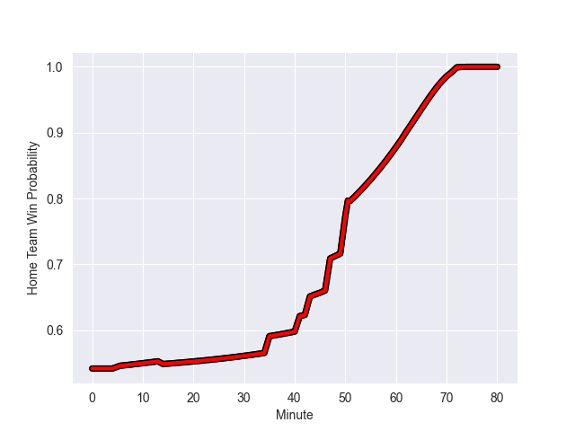

---  
layout: page  
title: Carcassonne at Oyonnax; 3-25  
date: 2022-10-28 19:30:00 18:00:00 -0500  
categories: match review  
---
# Carcassonne (1453.16) at Oyonnax (1510.13); 3-25

# Prediction: Oyonnax by 12.7

Oyonnax by 5.7 on a neutral field
## Scores over Time

## Win Probability over Time

# Pre-Match Prediction: Oyonnax by 8.9

Oyonnax by 1.9 on a neutral pitch

|   Away Minutes | Away Player              |   Away elo |   Away Percentile |   Number |   Home Percentile |   Home elo | Home Player             |   Home Minutes |
|---------------:|:-------------------------|-----------:|------------------:|---------:|------------------:|-----------:|:------------------------|---------------:|
|             41 | Sami Mavinga             |     102.74 |                75 |        1 |                26 |      90.69 | Tommy Raynaud           |             68 |
|             45 | Connor Sa                |      91.9  |                33 |        2 |                40 |      93.48 | Teddy Durand            |             47 |
|             35 | Jérémy Boyadjis          |     111.67 |                94 |        3 |                 7 |      86.21 | Thibault Berthaud       |             41 |
|             51 | Come Clayver Joussain    |      94.54 |               nan |        4 |                11 |      82.88 | Victor Lebas            |             47 |
|             20 | Rynard Landman           |      95.73 |                53 |        5 |                84 |     106.46 | Hugo Fabregue           |             80 |
|             80 | Gregory Annetta          |      84.77 |                23 |        6 |                77 |     104.53 | Kevin Lebreton          |             80 |
|             80 | Stephane Onambele        |      72.36 |                 1 |        7 |                15 |      86.41 | Loïc Credoz             |             80 |
|             80 | Etienne Herjean          |      92.28 |                36 |        8 |                93 |     116.53 | Filimo Taofifenua       |             68 |
|             80 | Samuel Marques           |     113.22 |                93 |        9 |                82 |     105.78 | Charlie Cassang         |             77 |
|             66 | Damien Añon              |     100.9  |                71 |       10 |                75 |     102.09 | Jules Soulan            |             80 |
|             80 | Benoit Jasmin            |     123    |                96 |       11 |                87 |     109.76 | Aurelien Callandret     |             80 |
|             80 | Nick Grigg               |      97.65 |                57 |       12 |                33 |      91.61 | Gaby Lovobalavu         |             80 |
|             80 | Martin Dulon             |     108.12 |                85 |       13 |                24 |      89.63 | Florian Vialelle        |             51 |
|             66 | Simon Désert             |      95    |               nan |       14 |                76 |     102.97 | Joe Ravouvou            |             68 |
|             62 | Maxime Gianet            |     102.19 |                72 |       15 |                89 |     111.42 | Darren Sweetnam         |             80 |
|             60 | Rob Harley               |     111.57 |                92 |       16 |                72 |     101.04 | Justin Bouraux          |             12 |
|             45 | Vakhtangi Akhobadze      |      61.74 |                 0 |       17 |                20 |      90.25 | Manu Leiataua           |             33 |
|             39 | Jules Martinez           |      82.12 |                 7 |       18 |                99 |     143.42 | Tom Murday              |             33 |
|             35 | Luka Petriashvili        |      94.65 |               nan |       19 |                56 |      97.74 | Pedro Bettencourt Avila |             29 |
|             29 | Simon Meka               |      89.49 |                24 |       20 |                 9 |      85.73 | Antoine Abraham         |             12 |
|             18 | Clément Clavières        |      82.2  |                 8 |       21 |                42 |      93.35 | Hugo Hermet             |             12 |
|             14 | Brieuc Plessis-Couillaud |      82.72 |                 8 |       22 |                61 |      98.88 | Yvan David              |              3 |
|             14 | Pierre Pages             |     104.45 |                79 |       23 |                77 |     102.36 | Thomas Laclayat         |             39 |

