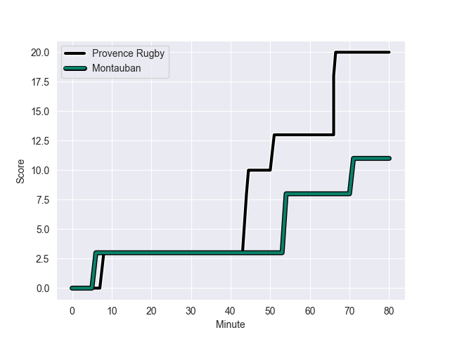
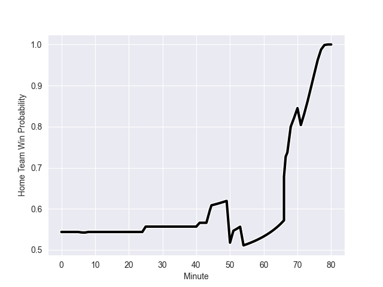

---  
layout: page  
title: Montauban at Provence Rugby; 11-20  
date: 2022-10-28 19:30:00 18:00:00 -0500  
categories: match review  
---
# Montauban (957.05) at Provence Rugby (968.96); 11-20

# Prediction: Provence Rugby by 6.2

Provence Rugby by 1.2 on a neutral field
## Scores over Time

## Win Probability over Time

# Pre-Match Prediction: Provence Rugby by 7.3

Provence Rugby by 2.3 on a neutral pitch

|   Away Minutes | Away Player        |   Away elo |   Away Percentile |   Number |   Home Percentile |   Home elo | Home Player       |   Home Minutes |
|---------------:|:-------------------|-----------:|------------------:|---------:|------------------:|-----------:|:------------------|---------------:|
|             41 | Nicolas Solveyra   |      67.43 |                68 |        1 |                60 |      65.38 | Federico Wegrzyn  |             43 |
|             50 | Kevin Firmin       |      74.1  |                82 |        2 |                26 |      59.19 | German Kessler    |             43 |
|             50 | Mirian Burduli     |      56.87 |                17 |        3 |                50 |      61.79 | Luke Tagi         |             75 |
|             50 | Dimitri Vaotoa     |      45.58 |                 4 |        4 |                13 |      54.34 | Clément Chartier  |             52 |
|             80 | Kevin Gimeno       |      56.99 |                17 |        5 |                29 |      58.18 | Hans N'kinsi      |             80 |
|             80 | Quentin Witt       |      73.41 |                78 |        6 |                34 |      58.35 | Lucas Martin      |             43 |
|             12 | Tjuee Uanivi       |      52.22 |                 9 |        7 |                 0 |      38.91 | Jessy Jegerlehner |             80 |
|             80 | Otar Giorgadze     |      65.44 |                60 |        8 |                89 |      84.92 | Carl Axtens       |             50 |
|             54 | Anthony Meric      |      43.23 |                 1 |        9 |                83 |      76.65 | Jonathan Ruru     |             80 |
|             54 | Tedo Abzhandadze   |      64.95 |                58 |       10 |                60 |      65.69 | Johnny McPhillips |             68 |
|             80 | Jean-Bernard Pujol |      68.29 |                63 |       11 |                66 |      66.21 | Nadir Bouhedjeur  |             80 |
|             25 | Maxime Mathy       |      69.66 |                69 |       12 |                77 |      75.21 | Louis Marrou      |             80 |
|             80 | Paul Bonnefond     |      80.83 |                84 |       13 |                95 |      97    | Peter Betham      |             52 |
|             80 | Semesa Rokoduguni  |      87.89 |                91 |       14 |                73 |      69.81 | Léo Drouet        |             80 |
|             80 | Maxime Salles      |      65.38 |                63 |       15 |                55 |      65.68 | Florent Massip    |             80 |
|             68 | Epeli Momo         |      48.38 |                 3 |       16 |                 1 |      47.77 | Loick Jammes      |             37 |
|             55 | Raphael Sanchez    |      56.87 |                17 |       17 |               nan |      60.16 | Malohi Suta       |             37 |
|             39 | Lucas Seyrolle     |      47.65 |                 3 |       18 |                15 |      55.9  | Julius Nostadt    |             37 |
|             30 | Arnaud Feltrin     |      49.9  |                 3 |       19 |                54 |      61.64 | Nicolas Mousties  |             30 |
|             30 | Kevin Yameogo      |      43.49 |                 1 |       20 |                71 |      67.42 | Jérôme Dufour     |             28 |
|             30 | Alexandre Manukula |      69.63 |                73 |       21 |                14 |      55.82 | Hugo Navizet      |             28 |
|             26 | Jérôme Bosviel     |      83.69 |                83 |       22 |                55 |      63.4  | Joris Cazenave    |             12 |
|             26 | Alexis Bernadet    |      60    |               nan |       23 |                 8 |      52.22 | Thomas Vernet     |              5 |

