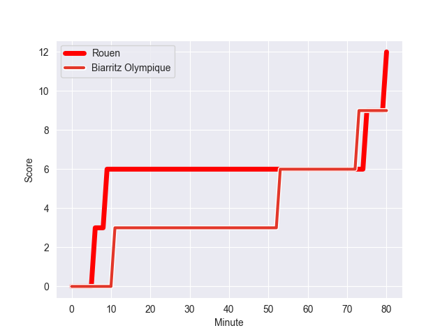
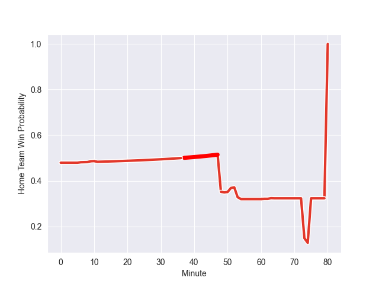

---  
layout: page  
title: Biarritz Olympique at Rouen; 9-12  
date: 2022-10-28 19:00:00 18:00:00 -0500  
categories: match review  
---
# Biarritz Olympique (1480.52) at Rouen (1422.52); 9-12

# Prediction: Rouen by 1.2

Biarritz Olympique by 5.8 on a neutral field
## Scores over Time

## Win Probability over Time

# Pre-Match Prediction: Biarritz Olympique by 8.3

Rouen by 1.3 on a neutral pitch

|   Away Minutes | Away Player         |   Away elo |   Away Percentile |   Number |   Home Percentile |   Home elo | Home Player        |   Home Minutes |
|---------------:|:--------------------|-----------:|------------------:|---------:|------------------:|-----------:|:-------------------|---------------:|
|             80 | Baptiste Erdocio    |      97.47 |                57 |        1 |                78 |     103.01 | Antoine Fournier   |             49 |
|             64 | Thomas Sauveterre   |      98.36 |                65 |        2 |                91 |     110.6  | Mathieu Bonnot     |             54 |
|             80 | Guy Millar          |     113.3  |                94 |        3 |                28 |      91.81 | Mohamed Boughanmi  |             48 |
|             20 | Johnny Dyer         |      76.66 |                 5 |        4 |                 0 |      55.16 | John-Charles Astle |             80 |
|             80 | Josh Tyrell         |      98.44 |                64 |        5 |                54 |      95.84 | Toby Salmon        |             80 |
|             80 | Simon Augry         |      91.82 |                33 |        6 |                71 |     100.51 | Willy N'Diaye      |             51 |
|             80 | Thomas Hebert       |     101.18 |                72 |        7 |                 0 |      66.32 | Abdelkarim Fofana  |             51 |
|             80 | Tornike Jalagonia   |     102.14 |                71 |        8 |                12 |      83.28 | Tino Mapapalangi   |             80 |
|             64 | Kerman Aurrekoetxea |      85.63 |                12 |        9 |                28 |      91.61 | Joris Lezat        |             63 |
|             71 | Baptiste Germain    |      92.5  |                37 |       10 |                19 |      88.47 | Franck Pourteau    |             80 |
|             80 | Yohann Artru        |      89.03 |                19 |       11 |                88 |     110.43 | Benito Masilevu    |             80 |
|             80 | Auguste Cadot       |     103.81 |                77 |       12 |                70 |     103.34 | Alex Luatua        |             80 |
|             80 | Joe Tomane          |     117.57 |                94 |       13 |                56 |      97.26 | Opetera Peleseuma  |             54 |
|             80 | Baptiste Fariscot   |     101.18 |                72 |       14 |                79 |     104.51 | Malcolm Bertschy   |             64 |
|             64 | Joe Jonas           |      99.18 |                64 |       15 |                95 |     118.04 | Peter Lydon        |             80 |
|             41 | Johan Aliouat       |     104.18 |                80 |       16 |                73 |     101.17 | Cody Thomas        |             32 |
|             19 | Charlie Francoz     |      99.17 |                61 |       17 |                85 |     106.9  | Soulemane Camara   |             31 |
|             16 | Clement Renaud      |      94.81 |                45 |       18 |                52 |      95.85 | Lucas Costa        |             29 |
|             16 | Barnabe Couilloud   |      89.45 |                19 |       19 |                55 |      96.52 | Jean Leleu         |             29 |
|             16 | Darly Domvo         |      84.21 |                10 |       20 |                19 |      90.03 | Efitusi Ma'afu     |             26 |
|              9 | Gilles Bosch        |      54.57 |                 0 |       21 |                16 |      86.35 | JT Jackson         |             26 |
|            nan | nan                 |     nan    |               nan |       22 |               nan |      95    | Adrien Brissard    |             17 |
|            nan | nan                 |     nan    |               nan |       23 |                29 |      91.16 | Paul Surano        |             16 |

