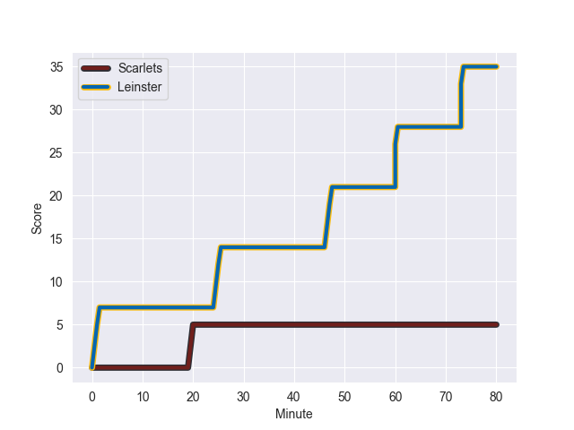
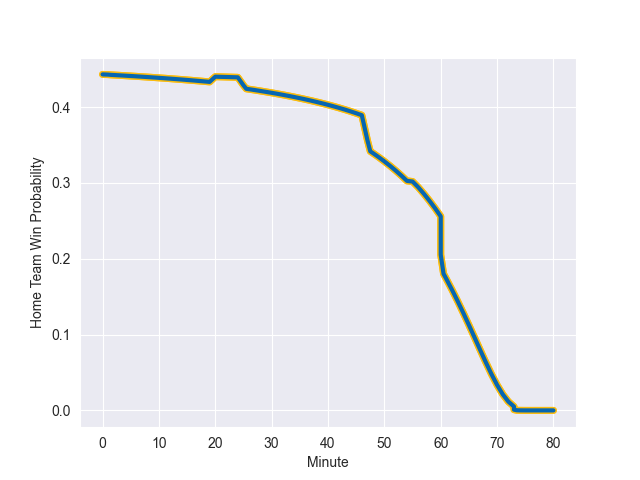

---  
layout: page  
title: Leinster at Scarlets; 35-5  
date: 2022-10-28 20:35:00 18:00:00 -0500  
categories: match review  
---
# Leinster (1535.5) at Scarlets (1442.0); 35-5

# Prediction: Leinster by 4.4

Leinster by 9.4 on a neutral field
## Scores over Time

## Win Probability over Time

# Pre-Match Prediction: Leinster by 7.1

Leinster by 12.1 on a neutral pitch

|   Away Minutes | Away Player    |   Away elo |   Away Percentile |   Number |   Home Percentile |   Home elo | Home Player      |   Home Minutes |
|---------------:|:---------------|-----------:|------------------:|---------:|------------------:|-----------:|:-----------------|---------------:|
|             56 | Ed Byrne       |     109.69 |                93 |        1 |                17 |      90.23 | Steffan Thomas   |             57 |
|             56 | John McKee     |      94.39 |               nan |        2 |                19 |      88.23 | Dafydd Hughes    |             56 |
|             56 | Tom Clarkson   |      94.75 |               nan |        3 |                18 |      90.24 | Harri O'Connor   |             57 |
|             80 | Ross Molony    |     109.82 |                91 |        4 |                51 |      95.42 | Jac Price        |             80 |
|             56 | Jason Jenkins  |      93.87 |                44 |        5 |                 1 |      73.97 | Tom Price        |             64 |
|             80 | Rhys Ruddock   |     119.6  |                95 |        6 |                85 |     106.78 | Aaron Shingler   |             59 |
|             80 | Scott Penny    |     101.13 |                73 |        7 |                76 |     101.88 | Daniel Thomas    |             80 |
|             80 | Max Deegan     |     108.16 |                87 |        8 |                36 |      93.61 | Sione Kalamafoni |             80 |
|             55 | Luke McGrath   |     114.6  |                95 |        9 |                24 |      91.92 | Gareth Davies    |             80 |
|             71 | Ross Byrne     |      99.09 |                68 |       10 |                76 |     102.67 | Dan Jones        |             69 |
|             70 | Dave Kearney   |     109.1  |                87 |       11 |                25 |      91.8  | Ryan Conbeer     |             80 |
|             61 | Charlie Ngatai |     108.84 |                87 |       12 |                89 |     110.38 | Jonathan Davies  |             80 |
|             80 | Liam Turner    |      98.87 |                68 |       13 |                82 |     105.6  | Steffan Evans    |             80 |
|             80 | Rob Russell    |      93.93 |                46 |       14 |                28 |      92.15 | Tom Rogers       |             74 |
|             80 | Chris Cosgrave |      95    |               nan |       15 |                68 |     101.15 | Johnny McNicholl |             80 |
|             25 | Nick McCarthy  |      93.8  |                49 |       16 |               nan |      94.52 | Kemsley Mathias  |             23 |
|             24 | Tadgh McElroy  |      92.76 |               nan |       17 |                83 |     103.14 | WillGriff John   |             23 |
|             24 | Michael Milne  |      94.01 |               nan |       18 |                 7 |      86.1  | Shaun Evans      |             24 |
|             24 | Vakh Abdaladze |      94.59 |               nan |       19 |               nan |      95    | Iwan Shenton     |             21 |
|             24 | Brian Deeny    |      94.01 |               nan |       20 |                97 |     123.21 | Rhys Patchell    |             11 |
|             19 | Ben Brownlee   |      95    |               nan |       21 |               nan |      95    | Archie Hughes    |              6 |
|             10 | Harry Byrne    |     109.95 |                87 |       22 |                 8 |      82.64 | Morgan Jones     |             16 |
|              9 | Charlie Tector |      95    |               nan |       23 |               nan |     nan    | nan              |            nan |

