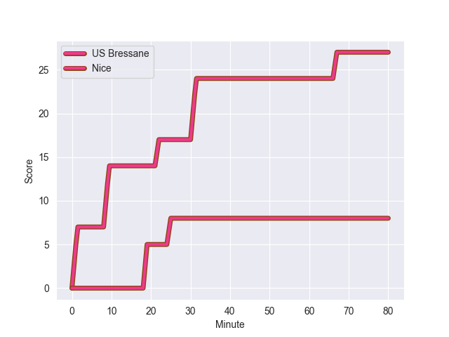
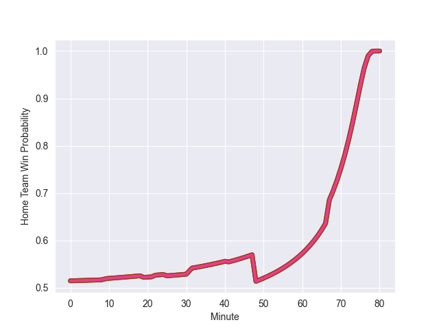

---  
layout: page  
title: Nice at US Bressane; 8-27  
date: 2022-10-28 19:30:00 18:00:00 -0500  
categories: match review  
---
# Nice (1452.72) at US Bressane (1478.43); 8-27

# Prediction: US Bressane by 9.6

US Bressane by 2.6 on a neutral field
## Scores over Time

## Win Probability over Time

# Pre-Match Prediction: US Bressane by 10.5

US Bressane by 3.5 on a neutral pitch

|   Away Minutes | Away Player         |   Away elo |   Away Percentile |   Number |   Home Percentile |   Home elo | Home Player               |   Home Minutes |
|---------------:|:--------------------|-----------:|------------------:|---------:|------------------:|-----------:|:--------------------------|---------------:|
|             48 | Sunia Vola          |      97.04 |                39 |        1 |                27 |      91.51 | Teo Bordenave             |             41 |
|             48 | Jemal Shatirishvili |      89.46 |                18 |        2 |                95 |     115.32 | Sione Anga'aelangi        |             41 |
|             48 | James Johnston      |      99.35 |                67 |        3 |                88 |     107.7  | Erich de Jager            |             41 |
|             41 | Jérôme Mondoulet    |      82.4  |                11 |        4 |                58 |      97.13 | Thomas Déliance           |             53 |
|             48 | Martin Freytes      |      93.31 |                24 |        5 |                54 |      96.19 | Koen Bloemen              |             80 |
|             80 | Nicolas Tachat      |      98.03 |                62 |        6 |                39 |      92.73 | Adrien Buatier            |             59 |
|             80 | Arthur Vignolles    |     101.91 |                67 |        7 |                74 |     101.82 | Lucas Lyons               |             80 |
|             48 | Steffon Armitage    |     116.43 |                93 |        8 |                19 |      88.06 | Loic Baradel              |             68 |
|             80 | Louis Peutin        |      95    |               nan |        9 |                94 |     120.53 | Nicolas Faure             |             80 |
|             80 | Mathis Viard        |      95.22 |                48 |       10 |                27 |      91.02 | Sebastian Poet            |             52 |
|             80 | David Odiete        |      97.91 |                61 |       11 |                55 |      96.68 | Kavekini Tabu             |             80 |
|             59 | Julien Fritz        |     112.02 |                89 |       12 |                65 |      99.46 | Parataiso Silafai-Lea'ana |             80 |
|             80 | Jens Torfs          |     103.08 |                74 |       13 |                61 |      98.48 | Maile Mamao               |             71 |
|             80 | Hugo Martin         |      94.54 |               nan |       14 |                68 |      99.53 | Audric Sanlaville         |             80 |
|             41 | Loic Le Gal         |      79.08 |                 6 |       15 |                92 |     114.45 | Pierre Berard             |             80 |
|             32 | Nicolas Lemaire     |     106.19 |                85 |       16 |                 7 |      81.94 | Vazha Kapanadze           |             39 |
|             32 | Badri Alkhazashvili |      88.12 |                16 |       17 |                17 |      88.5  | Clement Jullien           |             39 |
|             32 | Jeronimo Negrotto   |      88.95 |                20 |       18 |                22 |      89.56 | Willem Johannes Harmse    |             39 |
|             39 | Thibaud Rey         |      99.07 |                67 |       19 |                58 |      97.34 | Wael May                  |             27 |
|             32 | Marvin Woki         |     104.72 |                82 |       20 |                 3 |      74.28 | TJ Ioane                  |             21 |
|             32 | Paul Farret         |      92.27 |                36 |       21 |               nan |      96.4  | Romain Falcoz             |             12 |
|             21 | Luca Cutayar        |      91.4  |                25 |       22 |                43 |      93.89 | Jeremy Valencot           |             28 |
|             39 | Alban Conduche      |      81.9  |                 8 |       23 |                 2 |      71.02 | Benjamin Doy              |              9 |

