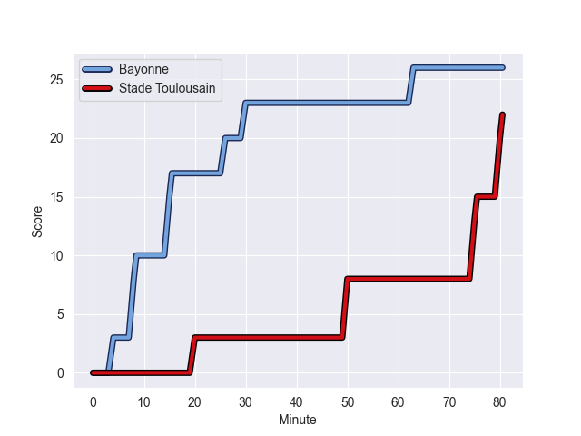
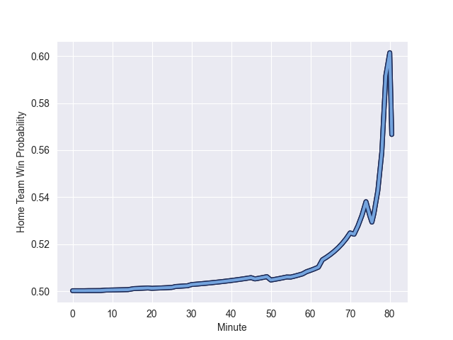

---  
layout: page  
title: Stade Toulousain at Bayonne; 22-26  
date: 2022-10-29 21:05:00 18:00:00 -0500  
categories: match review  
---
# Stade Toulousain (1511.07) at Bayonne (1517.04); 22-26

# Prediction: Bayonne by 7.6

Bayonne by 0.6 on a neutral field
## Scores over Time

## Win Probability over Time

# Pre-Match Prediction: Bayonne by 6.2

Stade Toulousain by 0.8 on a neutral pitch

|   Away Minutes | Away Player       |   Away elo |   Away Percentile |   Number |   Home Percentile |   Home elo | Home Player             |   Home Minutes |
|---------------:|:------------------|-----------:|------------------:|---------:|------------------:|-----------:|:------------------------|---------------:|
|             46 | David Ainu'u      |      95.83 |                51 |        1 |                88 |     107.36 | Swan Cormenier          |             52 |
|             46 | Guillaume Cramont |      93.8  |                48 |        2 |                68 |      98.83 | Facundo Bosch           |             59 |
|             59 | Dorian Aldegheri  |     108.69 |                90 |        3 |                49 |      95.38 | Pascal Cotet            |             59 |
|             54 | Joshua Brennan    |     101.4  |                75 |        4 |                96 |     117.25 | Denis Marchois          |             52 |
|             59 | Emmanuel Meafou   |     101.52 |                74 |        5 |                88 |     108.81 | Thomas Ceyte            |             80 |
|             80 | Yannick Youyoutte |      98.76 |                64 |        6 |                12 |      85.47 | Pierre Huguet           |             80 |
|             80 | Selevasio Tolofua |     103.55 |                76 |        7 |               nan |      90.36 | Robin Dione             |             52 |
|             80 | Theo Ntamack      |      96.85 |               nan |        8 |                81 |     106.26 | Uzair Cassiem           |             80 |
|             71 | Arthur Retiere    |     101.44 |                73 |        9 |                73 |     101.66 | Guillaume Rouet Piffard |             55 |
|             46 | Edgar Retiere     |      97.54 |                55 |       10 |                97 |     128.71 | Camille Lopez           |             80 |
|             80 | Lucas Tauzin      |     106.17 |                83 |       11 |                58 |      97.31 | Remy Baget              |             80 |
|             80 | Sofiane Guitoune  |      93.88 |                41 |       12 |                21 |      88.24 | Eneriko Buliruarua      |             63 |
|             80 | Dimitri Delibes   |      99.74 |                65 |       13 |                52 |      96.7  | Sireli Maqala           |             80 |
|             59 | Arthur Bonneval   |      95.11 |                49 |       14 |                79 |     103.73 | Martin Bogado           |             80 |
|             80 | Juan Cruz Mallia  |     105.72 |                79 |       15 |                68 |      99.68 | Gaetan Germain          |             80 |
|             34 | Paul Graou        |     119.99 |                97 |       16 |                65 |      98.45 | OJ Noa                  |             28 |
|             34 | Ian Boubila       |      91.99 |                36 |       17 |                 2 |      73.55 | Matis Perchaud          |             28 |
|             34 | Cyril Baille      |     112.07 |                94 |       18 |                83 |     105.55 | Manuel Leindekar        |             28 |
|             26 | Clement Verge     |      95    |               nan |       19 |                67 |      99.11 | Maxime Machenaud        |             25 |
|             21 | Joel Merkler      |     107.05 |                87 |       20 |                25 |      89.52 | Pieter Scholtz          |             21 |
|             21 | Marco Trauth      |      96.35 |                51 |       21 |                78 |     102.95 | Torsten van Jaarsveld   |             21 |
|             21 | Paul Costes       |      95    |               nan |       22 |                92 |     114.79 | Peyo Muscarditz         |             17 |
|              9 | Eto Bainivalu     |      95    |               nan |       23 |               nan |     nan    | nan                     |            nan |

