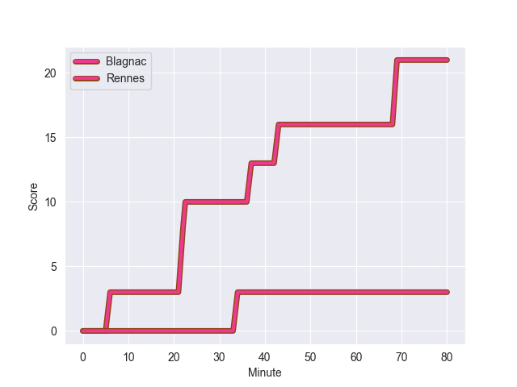
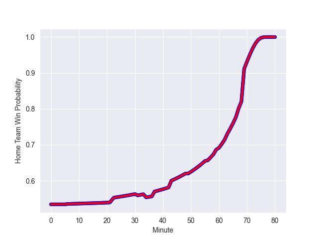

---  
layout: page  
title: Rennes at Blagnac; 3-21  
date: 2022-10-29 18:00:00 18:00:00 -0500  
categories: match review  
---
# Rennes (1351.14) at Blagnac (1411.15); 3-21

# Prediction: Blagnac by 9.0

Blagnac by 6.0 on a neutral field
## Scores over Time

## Win Probability over Time

# Pre-Match Prediction: Blagnac by 11.7

Blagnac by 8.7 on a neutral pitch

|   Away Minutes | Away Player          |   Away elo |   Away Percentile |   Number |   Home Percentile |   Home elo | Home Player           |   Home Minutes |
|---------------:|:---------------------|-----------:|------------------:|---------:|------------------:|-----------:|:----------------------|---------------:|
|             49 | Baptiste Le Jallé    |      89.62 |                31 |        1 |                31 |      91.85 | Jean-Baptiste Martin  |             49 |
|             49 | Alexandre Fau        |      87.68 |                18 |        2 |                48 |      94.47 | Florian Bertrand      |             59 |
|             80 | Luvuyo Pupuma        |      94.65 |                46 |        3 |                13 |      87.73 | Fabien Lorenzon       |             63 |
|             80 | Pierre Algans        |      86.61 |                20 |        4 |                65 |      99.16 | Nikita Bekov          |             80 |
|             80 | Alexandre Gueroult   |      85.98 |                17 |        5 |                 7 |      79.04 | Lucas Tolofua         |             49 |
|             49 | Guillaume Cazette    |      88.3  |                29 |        6 |                71 |     101.71 | Ianis Ponsole         |             49 |
|             49 | Luca Di Salvatore    |      90.43 |                30 |        7 |                64 |      99.33 | Mateo Ibanez          |             80 |
|             80 | Téo Gazin            |      95.73 |                51 |        8 |                39 |      93.13 | Mathieu Vachon        |             80 |
|             60 | Lucas Ollion         |      83.66 |                10 |        9 |                46 |      94.57 | Paul Ravier           |             56 |
|             80 | Yvan Leroyer         |      86.34 |                16 |       10 |                72 |     102.01 | Valentin Delpy        |             56 |
|             80 | Vaha Ma'afu          |      95.97 |                51 |       11 |                 2 |      73.9  | Benjamin Daurau Bedin |             67 |
|             31 | Ryan Dubois          |      83.29 |                12 |       12 |                18 |      86.76 | Aurelien Labau        |             80 |
|             80 | Alexis François      |      91.88 |                35 |       13 |                18 |      86.83 | Clément Vareilles     |             80 |
|             68 | Alexandre Nicoue     |      81.33 |                 8 |       14 |                79 |     104.45 | Dorian Terrou         |             80 |
|             80 | Enzo Salvai          |      91.17 |                33 |       15 |                82 |     108.14 | Jean-Andre Vernetti   |             80 |
|             31 | Grégory Querin       |      90.04 |                23 |       16 |                56 |      97.81 | Alexis Decaux         |             31 |
|             31 | Atonio Ulutuipalelei |      95.25 |                54 |       17 |                78 |     103.71 | Leeroy Cloostermans   |             21 |
|             31 | Gabriel Quesmel      |      97.34 |                57 |       18 |                58 |      97.94 | Sphekahle Dube        |             17 |
|             31 | Vincent Wenger       |      93.1  |                40 |       19 |                25 |      88.88 | Vincent Mutel         |             31 |
|             20 | Maxime Le Viavant    |      94.9  |               nan |       20 |               nan |      95.74 | Baptiste Collet       |             31 |
|             49 | Hypolite Cornu       |      93.93 |               nan |       21 |               nan |      94.92 | Pierre Ferrari        |             24 |
|             12 | Mateo Carrere        |      91.63 |                31 |       22 |                24 |      89.91 | Ugo Seunes            |             24 |
|            nan | nan                  |     nan    |               nan |       23 |                42 |      93.55 | Guilhem Graulle       |             13 |

