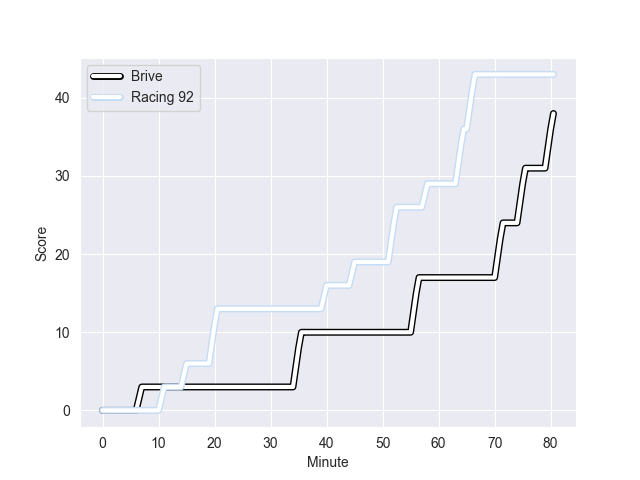

---  
layout: page  
title: Racing 92 at Brive; 43-38  
date: 2022-10-29 17:00:00 18:00:00 -0500  
categories: match review  
---
# Racing 92 (1519.53) at Brive (1411.66); 43-38

# Prediction: Racing 92 by 3.8

Racing 92 by 10.8 on a neutral field
## Scores over Time

## Win Probability over Time

# Pre-Match Prediction: Racing 92 by 1.2

Racing 92 by 8.2 on a neutral pitch

|   Away Minutes | Away Player         |   Away elo |   Away Percentile |   Number |   Home Percentile |   Home elo | Home Player           |   Home Minutes |
|---------------:|:--------------------|-----------:|------------------:|---------:|------------------:|-----------:|:----------------------|---------------:|
|             46 | Hassane Kolingar    |      86.78 |                16 |        1 |                16 |      87.28 | Daniel Brennan        |             47 |
|             46 | Janick Tarrit       |      85.82 |                11 |        2 |                34 |      91.97 | Vano Karkadze         |             47 |
|             46 | Cedate Gomes Sa     |      94.21 |                43 |        3 |                47 |      94.74 | Marcel van der Merwe  |             56 |
|             80 | Boris Palu          |     103.15 |                78 |        4 |                22 |      88.61 | Julien Delannoy       |             56 |
|             80 | Fabien Sanconnie    |      68.54 |                 1 |        5 |                88 |     108.29 | Lucas Paulos          |             68 |
|             80 | Wenceslas Lauret    |     114.13 |                92 |        6 |                24 |      89.59 | Esteban Abadie        |             80 |
|             53 | Baptiste Chouzenoux |      91.4  |                32 |        7 |                25 |      89.94 | Sasha Gue             |             80 |
|             46 | Anthime Hemery      |      97.91 |                55 |        8 |                77 |     104.63 | Abraham Papali'i      |             43 |
|             66 | Nolann Le Garrec    |      94.37 |                46 |        9 |                47 |      94.53 | Vaso Lobzhanidze      |             80 |
|             80 | Finn Russell        |     119.53 |                93 |       10 |                90 |     114.71 | Enzo Herve            |             55 |
|             80 | Juan Imhoff         |     117.42 |                93 |       11 |                82 |     105.97 | Axel Muller           |             80 |
|             63 | Henry Chavancy      |     122.18 |                96 |       12 |                18 |      86.96 | Guillaume Galletier   |             53 |
|             80 | Francis Saili       |      94.92 |                45 |       13 |                52 |      96.58 | Seta Tuicuvu          |             80 |
|             80 | Christian Wade      |     101.28 |                72 |       14 |                39 |      92.7  | Joris Jurand          |             80 |
|             66 | Max Spring          |      94.75 |                48 |       15 |               nan |      79.53 | Mathis Ferté          |             80 |
|             34 | Maxime Baudonne     |      96.09 |                61 |       16 |                40 |      93.43 | Mesu Kunavula         |             37 |
|             34 | Camille Chat        |     108.67 |                89 |       17 |                54 |      96.05 | Motu Matu'u           |             33 |
|             34 | Trevor Nyakane      |     106.4  |                86 |       18 |                24 |      90.13 | Malino Vanai          |             33 |
|             34 | Eddy Ben Arous      |     124.49 |                98 |       19 |                31 |      91.7  | Stuart Olding         |             27 |
|             27 | Anton Bresler       |     109.35 |                88 |       20 |                 6 |      81.5  | Leo Carbonneau        |             25 |
|             17 | Inia Tabuavou       |      94.22 |                43 |       21 |                53 |      94.12 | Oskar Rixen           |             24 |
|             14 | Warrick Gelant      |     107.38 |                81 |       22 |                37 |      93.02 | Pietro Ceccarelli     |             24 |
|             14 | Antoine Gibert      |      98.26 |                71 |       23 |                 7 |      78.84 | Andres Zafra Tarazona |             12 |

