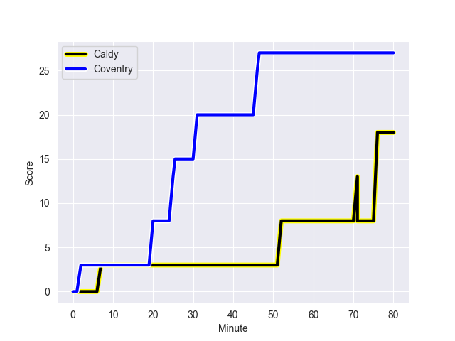
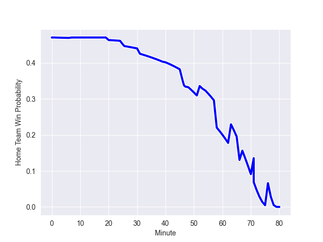

---  
layout: page  
title: Coventry at Caldy; 27-18  
date: 2022-10-29 16:00:00 18:00:00 -0500  
categories: match review  
---
# Coventry (1456.96) at Caldy (1417.58); 27-18

# Prediction: Caldy by 3.1

Coventry by 3.9 on a neutral field
## Scores over Time

## Win Probability over Time

# Pre-Match Prediction: Coventry by 4.0

Coventry by 3.0 on a neutral pitch

|   Away Minutes | Away Player           |   Away elo |   Away Percentile |   Number |   Home Percentile |   Home elo | Home Player         |   Home Minutes |
|---------------:|:----------------------|-----------:|------------------:|---------:|------------------:|-----------:|:--------------------|---------------:|
|             54 | Toby Trinder          |      97    |                55 |        1 |                54 |      96.62 | Adam Aigbokhae      |             57 |
|             80 | Suva Ma'asi           |      97.28 |                60 |        2 |                49 |      94.5  | Oliver Hearn        |             58 |
|             54 | Harry Seward          |     100.76 |                72 |        3 |                 1 |      70.66 | Andrew Darlington   |             48 |
|             67 | James Tyas            |      85.51 |                15 |        4 |                75 |     102.03 | Sam Dickinson       |             80 |
|             80 | Adam Peters           |     100.82 |                70 |        5 |                37 |      92.21 | Thomas Sanders      |             80 |
|             57 | Thomas Dodd           |     107.92 |                86 |        6 |                67 |      99.21 | Martin Gerrard      |             66 |
|             80 | Josh Bainbridge       |     101.43 |                73 |        7 |                36 |      92.34 | Callum Ridgway      |             48 |
|             80 | Fred Betteridge       |      87.96 |                20 |        8 |                42 |      94.34 | Josiah Dickinson    |             80 |
|             63 | Will Chudley          |     125.89 |                98 |        9 |                50 |      95    | Chris Pilgrim       |             48 |
|             80 | Patrick Pellegrini    |      97.68 |                56 |       10 |                49 |      95.58 | Ezra Hinchcliffe    |             57 |
|             80 | Shea Cornish          |      97.08 |                57 |       11 |                31 |      92.79 | Benjamin Jones      |             80 |
|             65 | Lucas Titherington    |      93.91 |                45 |       12 |                64 |      99.18 | Michael Barlow      |             80 |
|             80 | Will Rigg             |      94.92 |                45 |       13 |                41 |      93.81 | Dan Bibby           |             80 |
|             80 | William Talbot-Davies |      88.39 |                19 |       14 |                39 |      93.19 | Nick Royle          |             40 |
|             57 | Louis Brown           |      94.68 |                47 |       15 |                59 |      97.77 | Elliott Gourlay     |             80 |
|             26 | Danny Southworth      |      94.67 |               nan |       16 |               nan |      95    | Louis Beer          |             40 |
|             26 | Ollie Andrews         |      95.49 |               nan |       17 |                28 |      91.42 | Harrison Crowe      |             32 |
|             23 | Tom Ball              |      98.92 |                62 |       18 |                40 |      94.39 | Ryan Higginson      |             32 |
|             23 | Louis James           |      87.33 |                17 |       19 |                53 |      97.66 | Anerin (Nye) Thomas |             32 |
|             17 | Will Lane             |      95.22 |                51 |       20 |                23 |      90.33 | Rhys Hayes          |             23 |
|             15 | Evan Mitchell         |      85.9  |                13 |       21 |                30 |      93.47 | Nathan Rushton      |             23 |
|             13 | George Smith          |      91.22 |                32 |       22 |               nan |      95.2  | Ethan Caine         |             22 |
|            nan | nan                   |     nan    |               nan |       23 |               nan |      96.3  | Thomas Parry        |             14 |

